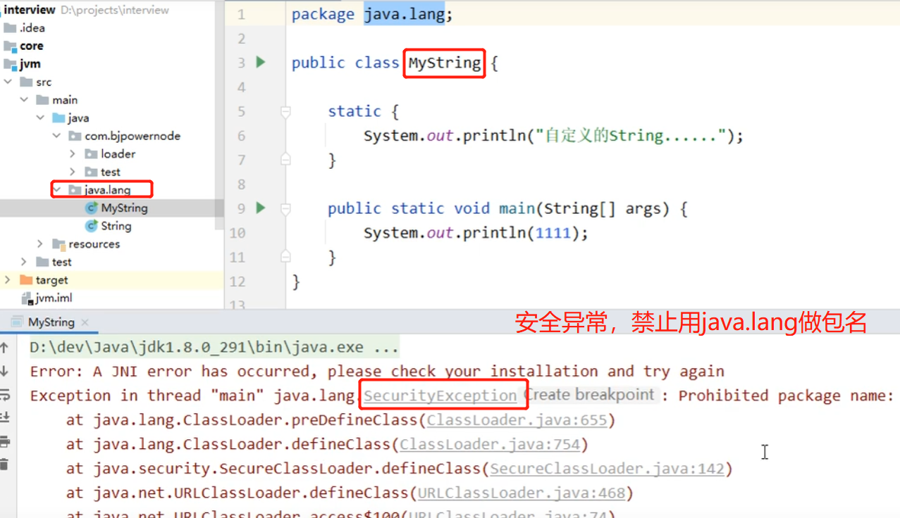
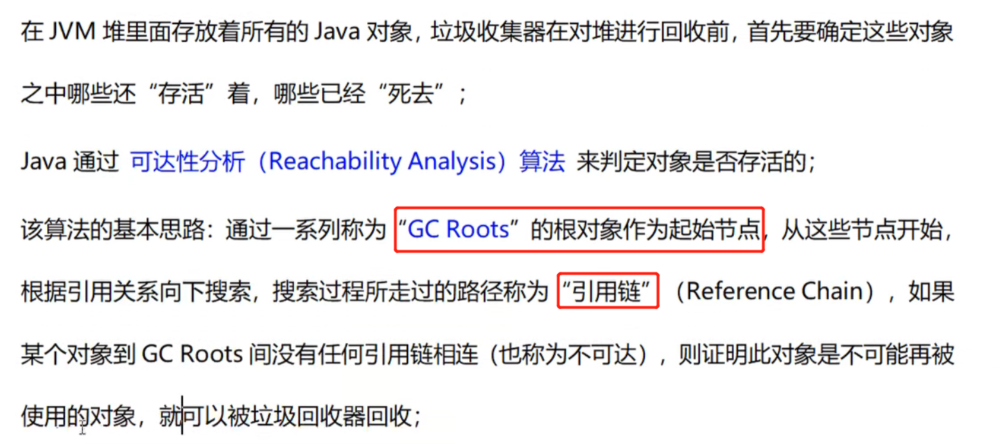
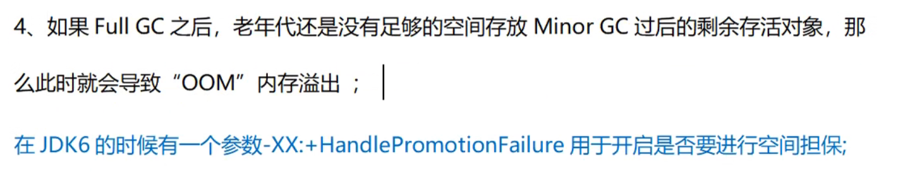
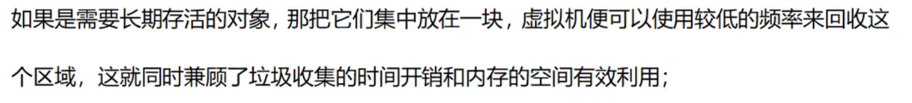
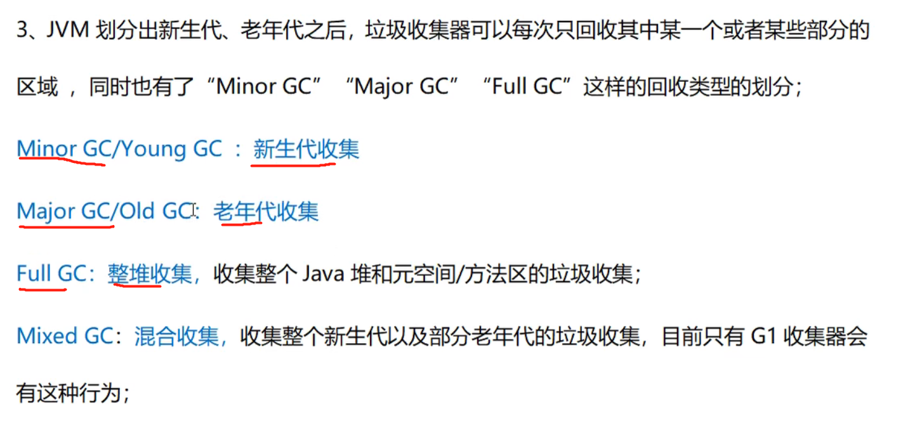
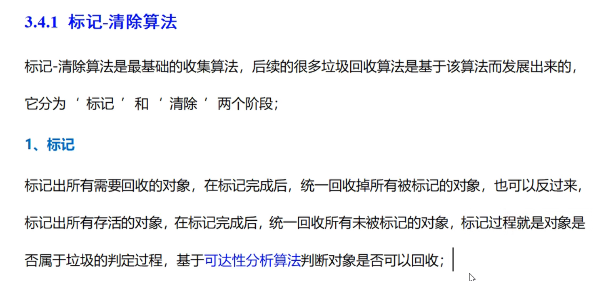
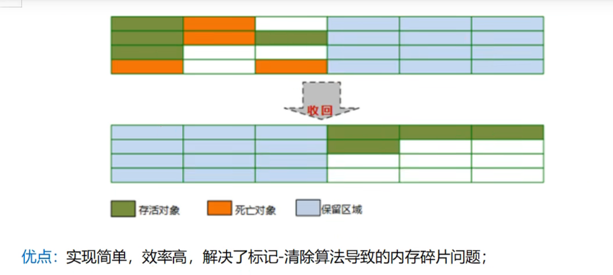
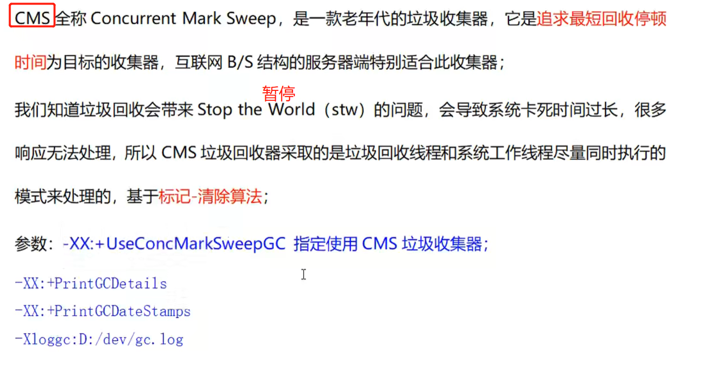
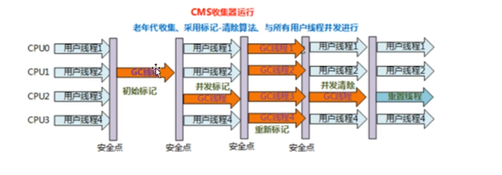
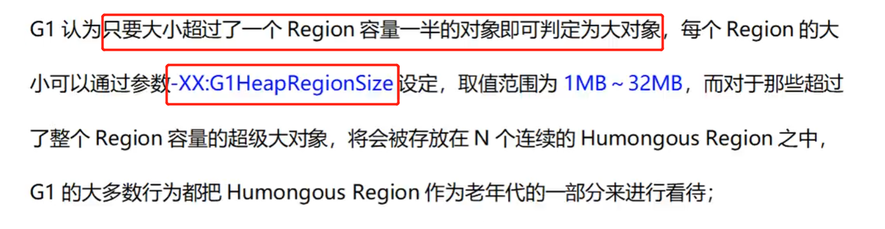

# JVM

~~~text
jvm java程序运行环境（JAVA 二进制字节码的运行环境）

优点：

跨平台性：一次编译，处处运行
垃圾回收机制，自动内存管理
~~~

* KB MB GB
~~~text
 1 KB = 1024 byte
 1 MB（兆） = 1024 KB
 1 GB = 1024 MB  
~~~

## JVM、JRE、JDK 区别

~~~text
JRE = jvm + 基础类库
JDK = jvm + 基础类库 + 编译环境
~~~

## JVM内存模型

# java运行时类何时被加载？

# JVM类加载过程

## 加载

## 验证
~~~text
验证Class文件中的字节流符合约束
~~~

## 准备
~~~text
类变量赋默认初始值，int为0，long为0l，boolean为false，引用类型为null，常量赋正式值
~~~

## 解析
~~~text
把 符号引用 翻译为 直接引用
~~~

##初始化

* 一个类被加载的过程？ 初始化顺序
~~~java
public class test01 {

    // 静态常量 准备阶段 赋值
    public static final String URL = "静态常量";

    //静态变量 准备阶段 赋值为null，初始化阶段 赋值
    public static String URL2 = "静态变量";

    //变量 初始化赋值
    public String URL3 = "变量";

    //静态代码块 准备阶段赋值
    static {
        System.out.println(URL);
        System.out.println(URL2);
        System.out.println("静态代码块");
    }

    //普通代码块 初始化赋值
    {
//        System.out.println(URL2);
        System.out.println(URL3);
        System.out.println("普通代码块");
    }

    //构造器 初始化赋值
    public test01(){
        System.out.println("构造器");
    }

    public static void main(String[] args) {

        new test01();
    }
}
~~~

* 继承时父子类的初始化顺序是怎样的？

* 先静后动，先父后子

父类

~~~java
public class Fu {
    // 静态常量 准备阶段 赋值
    public static final String URL = "父类 静态常量";

    //变量 初始化赋值
    public String URL3 = "父类 变量";

    //静态代码块 准备阶段赋值
    static {
        System.out.println(URL);
        System.out.println("父类 静态代码块");
    }

    //普通代码块 初始化赋值
    {
        System.out.println(URL3);
        System.out.println("父类 普通代码块");
    }

    //构造器 初始化赋值
    public Fu(){
        System.out.println("父类 构造器");
    }
}
~~~

子类
~~~java
public class So extends Fu{

    // 静态常量 准备阶段 赋值
    public static final String URL = "子类 静态常量";

    //变量 初始化赋值
    public String URL3 = "子类 变量";

    //静态代码块 准备阶段赋值
    static {
        System.out.println(URL);
        System.out.println("子类 静态代码块");
    }

    //普通代码块 初始化赋值
    {
        System.out.println(URL3);
        System.out.println("子类 普通代码块");
    }

    //构造器 初始化赋值
    public So(){
        System.out.println("子类 构造器");
    }

    public static void main(String[] args) {
        new So();
    }
}
~~~

##卸载

# JVM有哪些类加载器

# JVM中不同的类加载器加载哪些文件

## 启动类加载器 （根的类加载器）

## 扩展类加载器

## 应用程序类（系统的类加载器）

* 自己写的类和maven里面的jar包，都是被 ApplicationClassLoader 静态内部类加载

# JVM三层类加载器之间是继承关系吗？

~~~text
不是，首先三个加载器都在jdk的 rt.jar/sun/misc/Launcher 类下的静态内部类，他们都继承 URLClassLoader 间接继承 ClassLoader

而且根的类加载器是由C++写成的

自定义类加载器直接继承 ClassLoader
~~~

# JVM类加载的双亲委派机制

# JDK为什么要设计双亲委派模型 

# 可以打破JVM双亲委派模型吗

# 如何自定义类加载器

# JVM内存模型

# JVM内存划分

# 堆中存什么？栈中存什么

* 数据类型
~~~text
Java虚拟机中，数据类型可以分为两类：基本类型和引用类型。基本类型的变量保存原始值，即：他代表的
值就是数值本身；而引用类型的变量保存引用值。“引用值”代表了某个对象的引用，而不是对象本身，对象
本身存放在这个引用值所表示的地址的位置

基本类型包括：byte,short,int,long,char,float,double,Boolean,returnAddress
引用类型包括：类类型，接口类型和数组
~~~

* 栈是运行时的单位，而堆是存储的单位
~~~text
栈解决程序的运行问题，即程序如何执行，或者说如何处理数据；堆解决的是数据存储的问题，即数据怎么放、放在哪儿
~~~

* 堆中存什么？栈中存什么？
~~~text
堆中存的是对象。栈中存的是基本数据类型和堆中对象的引用。

一个对象的大小是不可估计的，或者说是可以动态变化的，但是在栈中，一个对象只对应了一个4btye的引用（堆栈分离的好处）

为什么不把基本类型放堆中呢？

因为其占用的空间一般是1~8个字节——需要空间比较少，而且因为是基本类型，所以不会出现动态增长的情况——长度固定，因此栈中存储就够了，如果把他存在堆中是没有什么意义的（还会浪费空间，后面说明）。
可以这么说，基本类型和对象的引用都是存放在栈中，而且都是几个字节的一个数，因此在程序运行时，他们的处理方式是统一的。但是基本类型、对象引用和对象本身就有所区别了，
因为一个是栈中的数据一个是堆中的数据。最常见的一个问题就是，Java中参数传递时的问题
~~~

# JVM 哪些区域 线程私有 线程共享

~~~text
堆和元空间线程共享，其他都是私有
~~~

# 程序计数器

~~~text
线程执行的字节码的行号指示器

内存较小 忽略不计 线程私有 互不影响

没有内存溢出和垃圾回收
~~~

# 栈
~~~text
存储 基本类型和对象的引用
栈是运行时单位，解决程序的运行问题，即程序如何执行，或者说如何处理数据
栈空间一般很小，不设置默认为1M，设置通过 -Xss1M 命令
方法执行入栈，执行完毕出栈（先进后出），随线程而灭
不会GC回收，线程私有
~~~

#本地方法栈

# 堆
~~~text
存储 对象和数组
~~~

# 对象如何在 堆内存 中分配

# 堆内存对象布局

# JVM发生 堆内存溢出？

# JVM如何判断对象可以被回收

## 哪些对象可以做 GC Roots?

~~~text
1、栈内存中的 对象的引用 
    例如：ArrayList list = new ArrayList()，如果list=null，那么该对象就会被垃圾回收
    
2、方法区中静态属性 对象的引用
    例如：饿汉模式中：
    private static A a;
    public static synchronized A getInstance(){
    
        if(a == null){
            a = new A();
        }
    }
    
3、方法区中常量 对象的引用
    例如：
    private final A a = new A();
~~~

# JAVA的引用类型 

# JVM内存分代模型

# JVM堆中新生代的垃圾回收过程 

# JVM动态年龄判断

# 老年代空间分配担保机制

# 什么情况下对象会进入老年代

# 元空间

# JVM本机直接内存

#JVM本机直接内存溢出

# 说几个和JVM内存相关的核心参数？

# 如何计算对象的大小？

# 堆 为什么要分为年轻代和老年代

# JVM堆的年轻代为什么有两个Survivor区

# Eden区 和 S0 S1 空间大小为什么是 8:1:1

# JVM中垃圾回收算法？

# JVM垃圾收集器

