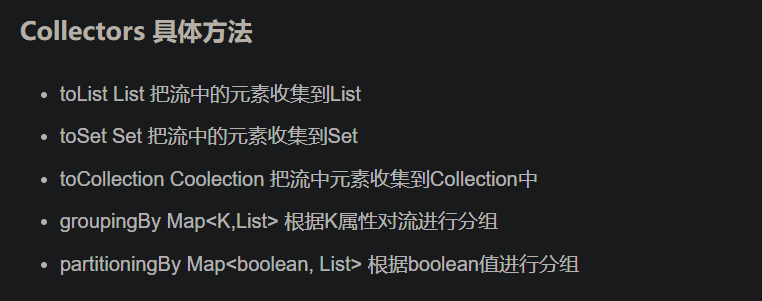
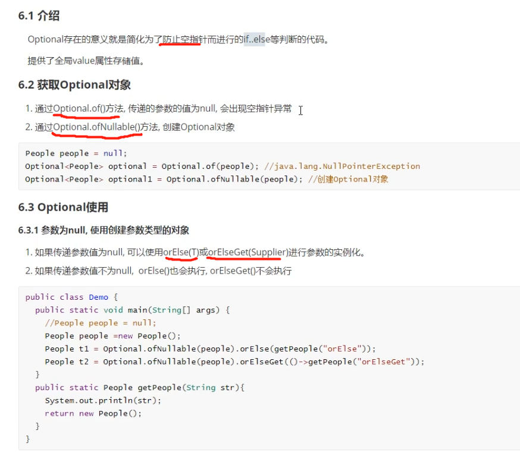
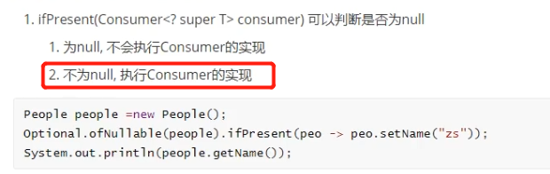

# JDK 1.8

# lambda表达式

~~~text
lambda是一种匿名函数（不是匿名内部类），简化匿名内部类，简单的说，它没有声明的方法，没有访问修饰符、返回值和名字，属于函数式编程
使用lambda表达式要求：接口有且只有一个抽象方法

~~~

~~~java
public class LambdaTest2 {
    public static void main(String[] args) {

        // 匿名内部类
        Fuu f = new Fuu() {
            @Override
            public void add() {
                System.out.println("匿名内部类方式 调用add()方法");
            }
        };
        f.add();
        
        // lambda表达式 参数类型可以省略
        Fuu fuu = (m,n) ->{
            return m+n;
        };
        int i = fuu.add(1, 2);
        System.out.println("i = "+i);
    }
}

interface Fuu{
    int add(int m,int n);
}
~~~

# 函数式接口

~~~text
函数式接口：接口中只能有一个抽象方法，其他的可以有default、static、Object里继承的方法等

作用：想使用lambda表达式，接口必须为函数式接口

JDK8专门提供了 @FunctionalInterface 注解，用来进行编译检查是否式函数式接口
~~~

## list.forEach 遍历

* 函数式接口使用场景1 list.forEach 遍历

~~~java
public class LambdaTest3 {
    public static void main(String[] args) {

        List<Integer> list = new ArrayList<>();
        Collections.addAll(list,1,2,3,4,5,6,7);

        System.out.println("------------匿名内部类方式 遍历-----------");

        //匿名内部类
        Consumer<Integer> con = new Consumer<Integer>() {
            @Override
            public void accept(Integer i) {
                System.out.println(i);
            }
        };

        list.forEach(con);

        System.out.println("------------lambda表达式方式 遍历 -----------");

        //lambda表达式
        Consumer<Integer> con1 = (i)->{
            System.out.println(i);
        };
        list.forEach(con1);

        System.out.println("------------ lambda表达式方式 遍历 升级1 -----------");
        Consumer<Integer> con2 = i2-> System.out.println(i2);
        list.forEach(con2);

        System.out.println("------------ lambda表达式方式 遍历 升级2 -----------");
        list.forEach(i2-> System.out.println(i2));

    }
}
~~~

## list.removeIf 判断

* 函数式接口使用场景2 list.removeIf 断言式

~~~java
public class LambdaTest4 {
    public static void main(String[] args) {
        List<Integer> list = new ArrayList<>();
        Collections.addAll(list, 1, 2, 3, 4, 5, 6, 7);

        System.out.println("------------匿名内部类方式 -----------");
        Predicate<Integer> pre = new Predicate<Integer>() {
            @Override
            public boolean test(Integer integer) {
                return integer > 4;
            }
        };

        System.out.println("------------lambda表达式方式-----------");
        Predicate<Integer> pre2 = (i) -> {
            return i < 4;
        };

        System.out.println("------------lambda表达式方式 升级1-----------");
        Predicate<Integer> pre3 = i -> i < 4;

        System.out.println("------------lambda表达式方式 升级2-----------");
        list.removeIf(i -> i < 4);

//        list.removeIf(pre);
//        list.removeIf(pre2);

        list.forEach(i -> System.out.println(i));
    }
}
~~~

# Stream

~~~text
对容器功能的增强，便利高效的聚合操作或大批量数据操作

借助lambda表达式提高编程效率和程序可读性，提供串行和并行两种模式进行汇聚操作，并发模式能够充分利用多核处理器优势，
使用fork/join并行方式来拆分任务和加速处理过程，所以java.util.stream是函数式语言+多核时代的产物
~~~

## 常用 中间操作 终止操作

~~~java
public class StreamTest {
    public static void main(String[] args) {

        //需求：排序 去重
        List<Integer> list = new ArrayList<>();
        Collections.addAll(list,5,2,78,64,24,1,56,2,5);

        //获取Stream对象
        Stream<Integer> stream = list.stream();

        /** 中间操作 */
        stream = stream.sorted()//排序 默认升序
                .sorted((x,y)->Integer.compare(y,x)) //排序降序
                .distinct()//去重
                .limit(4)//截取
                .skip(0)//跳过
                .map(x->x+2)//操作数组中每个值
                .filter(x->x>7)//过滤

        ;
        
        /** 终止操作 */
        stream.forEach(x-> System.out.println(x));//遍历输出
        stream.count();//统计元素个数
        stream.findFirst().get();//Optional[80] 返回被Optional封装的第一个元素，get()取到元素
        stream.max(Comparator.comparingInt(x->x)).get(); //返回最大值
        stream.min(Comparator.comparingInt(x->x)).get();
        stream.collect(Collectors.toList()); //把流中的元素收集到List
        
//        System.out.println(stream.min(Comparator.comparingInt(x->x)).get());
    }
}

~~~

## 终止操作 collect() Collectors具体方法

## 并行流

~~~text
并行流就是把一个内容分成多个数据块，并在不同的线程分别处理每个数据块的流。
Stream API可以声明性的通过 parallel() 和 sequential() 在并行流与串行流之间切换
~~~

~~~java
public class StreamTest02 {
    public static void main(String[] args) {

        // 创建Stream方式1 串行流 list、set 直接调用stream()方法
        List<Integer> list = new ArrayList<>();
        Collections.addAll(list,1,2,3,3);
        Stream<Integer> stream1 = list.stream();

        //创建Stream方式2 串行流 基本数据类型数组 调用Arrays.stream()
        int[] arr = {1,2,3,4,5,6,7,};
        IntStream stream = Arrays.stream(arr);

        //创建Stream方式3 并行流，调用 parallelStream() 方法，底层采用 ForkJoin 框架，结果并不按照集合原有顺序输出
        Stream<Integer> integerStream = list.parallelStream();
    }
~~~

## fork/join框架

~~~text
将一个大任务，进行拆分（fork）成若干个小任务（拆到不可再拆），再将一个一个小任务的运算结果进行join汇总。
~~~

# Optional对象

~~~text
为了防止空指针而进行的if...else判断
提供了全局value属性存储值
~~~

## get()

~~~java
获取Optional存储的值
        
Optional.get()
~~~

##  ifPresent()

~~~text
判断传递的参数是否为空
~~~

# 新时间日期 API

