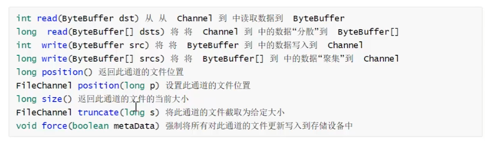
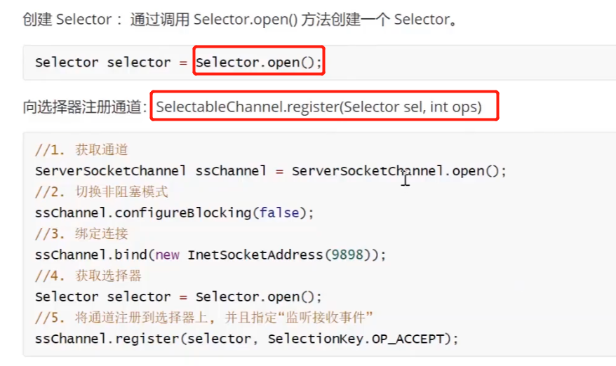

# NIO概述

## NIO和BIO比较

## NIO三大核心

NIO三大核心图示及理解

# 缓冲区（Buffer）

## Buffer类及其子类

## 缓冲区基本属性

缓冲区基本属性图示

## Buffer常见方法

## 缓冲区的数据操作

## 直接缓冲区和非直接缓冲区

# 通道（Channel） 

## 通道概述

## 通道常用实现类

## FileChannel类

## FileChannel类常用方法

### 例1：本地文件写数据

~~~java
    @Test
    public void test01(){

        try {
            //字节输出流通向文件
            FileOutputStream fos = new FileOutputStream("data01.txt");
            //定义通道
            FileChannel channel = fos.getChannel();
            //分配缓冲区
            ByteBuffer buffer = ByteBuffer.allocate(1024);
            buffer.put("hello,java !!!".getBytes());
            //切换写模式
            buffer.flip();
            channel.write(buffer);
            channel.close();;
            System.out.println("写出成功");
        } catch (Exception e) {
            e.printStackTrace();
        }
    }
~~~

### 例2：本地文件读数据

~~~java
    @Test
public void read() throws Exception {

        //定义 文件字节输入流 与源文件接通
        FileInputStream fis = new FileInputStream("data01.txt");
        //定义通道
        FileChannel channel = fis.getChannel();
        //定义缓冲区
        ByteBuffer buffer = ByteBuffer.allocate(1024);
        //读取数据到缓冲区
        channel.read(buffer);
        //更改为写操作
        buffer.flip();
        //读取出缓冲区数据
        String s = new String(buffer.array(),0,buffer.remaining());
        String s1 = new String(buffer.array(),0,buffer.limit());
        System.out.println(s);
        System.out.println(s1);

        }
~~~

### 例3：文件复制

~~~java
@Test
public void copy() throws Exception {

        //源文件
        File srcFile = new File("C:\\Users\\13717\\Desktop\\ABC.txt");//输出文件，需要读出
        File destFile = new File("C:\\Users\\13717\\Desktop\\123.txt");//输入文件，需要写入

        //定义字节输入流
        FileInputStream inputStream = new FileInputStream(srcFile);
        //定义字节输出流
        FileOutputStream outputStream = new FileOutputStream(destFile);

        //定义通道
        FileChannel inputStreamChannel = inputStream.getChannel();
        FileChannel outputStreamChannel = outputStream.getChannel();

        //定义一个缓冲区Buffer
        ByteBuffer buffer = ByteBuffer.allocate(1024);

        while (true){
        //先清空缓存池，再把数据放入缓冲区
        buffer.clear();

        //读取一次
        int flag = inputStreamChannel.read(buffer);
        if (flag == -1){
        break;
        }
        //已读取进通道，写出数据
        buffer.flip();
        outputStreamChannel.write(buffer);
        }
        inputStreamChannel.close();
        outputStreamChannel.close();
        System.out.println("复制成功");

        }
~~~

### 例4：分散（Scatter）和聚集（Gather）

~~~java
    @Test
public void test3() throws Exception {
        //字节管道
        FileInputStream inputStream = new FileInputStream("data01.txt");
        FileOutputStream outputStream = new FileOutputStream("data02.txt");

        //管道
        FileChannel inputStreamChannel = inputStream.getChannel();
        FileChannel outputStreamChannel = outputStream.getChannel();

        //定义多个缓冲区做数据分散
        ByteBuffer buffer1 = ByteBuffer.allocate(4);
        ByteBuffer buffer2 = ByteBuffer.allocate(1024);
        ByteBuffer[] buffers = {buffer1,buffer2};

        //从管道中读取数据分散到各个缓冲区
        inputStreamChannel.read(buffers);

        //查询各个缓冲区是否读取到数据
        for (ByteBuffer buffer : buffers) {
        buffer.flip();
        System.out.println(new String(buffer.array(),0,buffer.remaining()));
        }
        //聚合写入通道
        outputStreamChannel.write(buffers);
        inputStreamChannel.close();
        outputStreamChannel.close();
        System.out.println("分散 聚合 成功");
        }
~~~

### 例5：通道数据复制 transferFrom transferTo

~~~java
    @Test
public void test4() throws Exception {
        //字节管道
        FileInputStream inputStream = new FileInputStream("data01.txt");
        FileOutputStream outputStream = new FileOutputStream("data02.txt");

        //管道
        FileChannel ic = inputStream.getChannel();
        FileChannel oc = outputStream.getChannel();

        //复制管道信息
//        oc.transferFrom(ic,ic.position(),ic.size());
        ic.transferTo(ic.position(),ic.size(),oc);
        ic.close();
        oc.close();

        }
~~~

# 选择器（Selector）

## 选择器概述

## 选择器的应用

## 网络通信入门案例

### 客户端 案例实现

~~~java
public class Client {
    public static void main(String[] args) throws Exception {

        //获取通道
        SocketChannel sChannel = SocketChannel.open(new InetSocketAddress("127.0.0.1", 9999));
        //切换非阻塞模式
        sChannel.configureBlocking(false);
        //分配指定缓冲区大小
        ByteBuffer buf = ByteBuffer.allocate(1024);
        //发送数据给服务端
        Scanner sc = new Scanner(System.in);
        while (true){
            System.out.println("请说：");
            String s = sc.nextLine();
            buf.put(("波仔："+s).getBytes());
            buf.flip();
            sChannel.write(buf);
            buf.clear();
        }
    }
}
~~~

### 服务端 案例实现

~~~java
public class Server {
    public static void main(String[] args) throws Exception {

        System.out.println("----服务端启动----");
        //获取通道
        ServerSocketChannel ssChannel = ServerSocketChannel.open();
        //配置非阻塞模式
        ssChannel.configureBlocking(false);
        //绑定连接端口
        ssChannel.bind(new InetSocketAddress(9999));
        //获取选择器 Selector
        Selector selector = Selector.open();
        //将通道注册到选择器上并开始监听接收事件
        ssChannel.register(selector, SelectionKey.OP_ACCEPT);

        //使用选择器中所注册的通道中已经就绪好的事件
        while (selector.select() > 0){
            System.out.println("---开始一轮事件处理---");
            Iterator<SelectionKey> it = selector.selectedKeys().iterator();
            //遍历准备好的事件
            while (it.hasNext()){
                SelectionKey sk = it.next();

                //判断具体事件是什么
                if (sk.isAcceptable()){
                    //获取当前接入的客户端通道
                    SocketChannel sChannel = ssChannel.accept();
                    //设置为通道为非阻塞模式
                    sChannel.configureBlocking(false);
                    //将本客户端通道注册到选择器中
                    sChannel.register(selector,SelectionKey.OP_READ);
                }else if (sk.isReadable()){
                    //获取当前选择器上的读就绪事件
                    SocketChannel sChannel = (SocketChannel) sk.channel();
                    //读取数据
                    ByteBuffer buf = ByteBuffer.allocate(1024);
                    int len = 0;
                    while ((len = sChannel.read(buf)) > 0){
                        buf.flip();
                        System.out.println(new String(buf.array(),0,len));
                        buf.clear();
                    }
                }
                it.remove();//处理完毕需要移除当前事件
            }
        }
    }
}
~~~

## 群聊系统案例

## 服务端群聊实现

~~~java
public class Server {

        //定义成员属性：选择器、服务器通道、端口
        private Selector selector;
        private ServerSocketChannel ssChannel;
        private static final int PORT = 9999;

        //构造器 定义初始化逻辑
        public Server(){
            try {
                //创建选择器对象
                selector = Selector.open();
                //创建通道对象
                ssChannel = ServerSocketChannel.open();
                //开启通道非阻塞模式
                ssChannel.configureBlocking(false);
                //通道绑定监听客户端端口
                ssChannel.bind(new InetSocketAddress(PORT));
                //把通道注册到选择器上，并且指定 "监听接收事件"
                ssChannel.register(selector, SelectionKey.OP_ACCEPT);
            } catch (IOException e) {
                e.printStackTrace();
            }
        }
        /**
         * 开始监听
         * */
        private void listen() {
            try {
                while (selector.select() > 0){
                    //获取选择器中所有就绪事件
                    Iterator<SelectionKey> it = selector.selectedKeys().iterator();
                    //遍历事件
                    while (it.hasNext()){
                        //获取事件
                        SelectionKey sk = it.next();
                        //判断事件类型
                        if (sk.isAcceptable()){
                            //客户端接入请求
                            //获取当前客户端通道
                            SocketChannel schannel = ssChannel.accept();
                            //也注册成非阻塞模式
                            schannel.configureBlocking(false);
                            //注册给选择器，监听读事件
                            schannel.register(selector,SelectionKey.OP_READ);
                        }else if (sk.isReadable()){
                            //处理客户端消息，接收并实现转发
                            readClientData(sk);

                        }
                        it.remove();//处理完后需要移除当前事件

                    }
                }

            }catch (Exception e){
                e.printStackTrace();
            }
        }

        /**
         * 接收当前客户通道信息，转发给其他全部客户端通道
         * */
        private void readClientData(SelectionKey sk) {
            SocketChannel sChannel = null;
            try {
                //直接得到当前客户端通道
                sChannel = (SocketChannel) sk.channel();
                //创建缓冲区对象 接收客户端通道数据
                ByteBuffer buf = ByteBuffer.allocate(1024);
                int count = sChannel.read(buf);
                if (count > 0){
                    buf.flip();
                    //提取读取的数据
                    String msg = new String(buf.array(), 0, buf.remaining());
                    System.out.println("接收到了客户端消息："+msg);
                    //把这个消息推送给全部客户端接收
                    sendMsgToAllClient(msg,sChannel);

                }

            }catch (Exception e){
                try {
                    System.out.println("有人离线了："+sChannel.getRemoteAddress());
                    //当前客户端离线
                    sk.channel();//取消注册
                    sChannel.close();
                } catch (IOException ioException) {
                    ioException.printStackTrace();
                }
            }

        }
        /**
         * 把当前客户端的消息数据推送给当前全部在线注册的channel通道
         * */
        private void sendMsgToAllClient(String msg, SocketChannel sChannel) throws IOException {
            System.out.println("服务端开始转发消息，当前线程："+ Thread.currentThread().getName());
            for (SelectionKey key : selector.keys()) {
                Channel channel = key.channel();
                //不能把信息发送给自己
                if (channel instanceof SocketChannel && channel != sChannel){
                    ByteBuffer buffer = ByteBuffer.wrap(msg.getBytes());
                    ((SocketChannel)channel).write(buffer);
                }
            }
        }

    public static void main(String[] args) {
            //创建服务端对象
            Server server = new Server();
            //开始监听客户端的各种消息事件：连接、群聊消息、离线消息
            server.listen();
        }
}
~~~

### 群聊客户端逻辑

~~~java
public class Client {

    //客户端属性
    private Selector selector;
    private SocketChannel sChannel;
    private static int PORT = 9999;

    //初始化客户端信息
    public Client(){
        try {
            //创建选择器
            selector = Selector.open();
            //创建通道，链接服务端
            sChannel = SocketChannel.open(new InetSocketAddress("127.0.0.1",PORT));
            //设置通道为非阻塞模式
            sChannel.configureBlocking(false);
            //选择器监听读事件
            sChannel.register(selector, SelectionKey.OP_READ);
            System.out.println("---客户端准备完成---");
        } catch (IOException e) {
            e.printStackTrace();
        }
    }

    public static void main(String[] args) {
        Client client = new Client();
        //定义一个线程专门负责监听服务端发送过来的读消息事件
        new Thread(new Runnable() {
            @Override
            public void run() {
                try {
                    client.readInfo();
                } catch (Exception e) {
                    e.printStackTrace();
                }
            }
        }).start();

        Scanner sc = new Scanner(System.in);
        while (sc.hasNextLine()){
            String msg = sc.nextLine();
            client.sendMsgToServer(msg);
        }

    }

    private void sendMsgToServer(String msg) {
        try {
            sChannel.write(ByteBuffer.wrap(("波妞说："+msg).getBytes()));
        } catch (IOException e) {
            e.printStackTrace();
        }
    }

    private void readInfo() throws IOException {
        while (selector.select() > 0){
            Iterator<SelectionKey> iterator = selector.selectedKeys().iterator();
            while (iterator.hasNext()){
                SelectionKey key = iterator.next();
                if (key.isReadable()){
                    SocketChannel sc = (SocketChannel) key.channel();
                    ByteBuffer buffer = ByteBuffer.allocate(1024);
                    sc.read(buffer);
                    System.out.println(new String(buffer.array()));
                }
            }
            iterator.remove();
        }
    }
}
~~~

# AIO

# 总结

