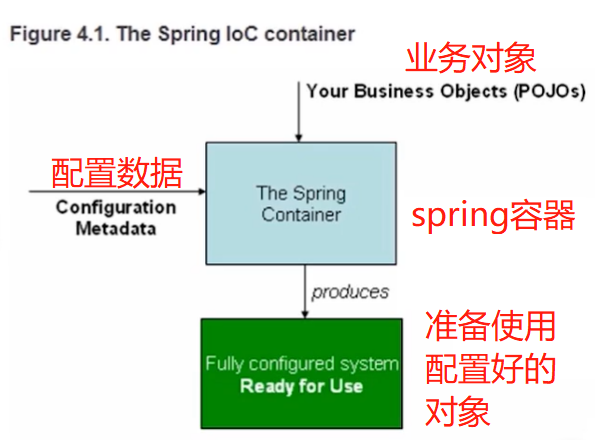

# spring

* 概述
~~~text
Spring是一个开源框架，为了解决企业应用开发的复杂性而创建

是一个轻量级的控制反转（IOC）和面向切面（AOP）的容器框架
    - 从大小和开销而言Spring都是轻量级的
    - 通过控制反转（IOC）达到解耦合
    - 提供了面向切面编程的丰富支持，允许通过分离应用的业务逻辑与和系统级服务进行内聚性开发
    - 包含并管理应用对象的配置和生命周期，这个意义上又是容器
    - 将简单的组件配置、组合成为复杂的应用，这个意义上是框架
~~~

* spring的作用
~~~text
容器
提供了对多种技术的支持
    - JMS
    - MQ支持
    - UnitTest
AOP（事务管理、日志等）
提供了众多方便应用的辅助类（JDBC Template等）
对主流框架（Hibernate等）提供了良好的支持
~~~

* 适用范围
~~~text
创建企业应用（SpringMVC + Spring + Hibernate/Mybatis）
单独使用Bean容器（Bean管理）
单独使用AOP进行切面管理
其他功能，如：对消息的支持等

~~~

* 什么是框架
~~~text
框架特点
    - 半成品
    - 封装了特定的处理流程和控制逻辑
    - 成熟的、不断升级的软件

框架与类库的区别
    - 框架一般是封装了逻辑、高内聚的，类库则是松散的工具组合
    - 框架专注于某一领域，类库则更加通用
~~~

* 什么是接口
~~~text
用于沟通的中介物的抽象
实体把自己提供给外界的一种抽象化说明，用以内部操作分离出外部沟通方法，使其能被修改内部而不影响外界其他实体与其交互的方式
对应接口即声明，声明了那些方法是对外提供的
在java8中，接口可以拥有方法体
~~~

* 面向接口编程
~~~text
结构设计中，分清层次及调用关系，每层只向外（上层）提供一组功能接口，各层次仅依赖接口而非实现类
接口实现的变动并不影响各层次间的调用，这点在公用服务中尤为重要
“面向接口编程” 中的 “接口” 是用于隐藏具体实现和实现多态性的组件
~~~

## IOC

* 什么是IOC
~~~text
IOC 控制反转：控制权的转移，应用程序本身不负责依赖对象的创建和维护，而是由外部容器负责创建和维护

DI 依赖注入：是IOC的一种实现方式

目的：创建对象并且组装对象之间的关系
~~~

