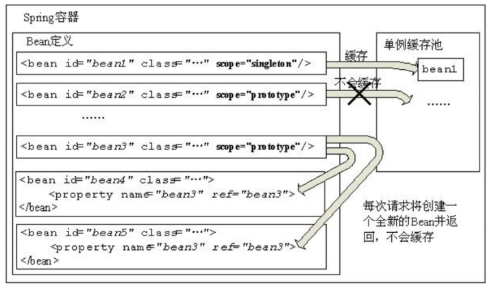
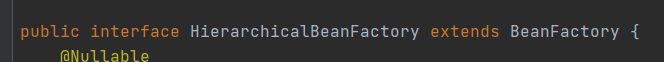
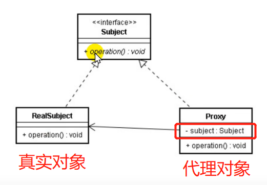

# spring

* 学习内容
~~~text
Spring IOC 控制反转、依赖注入
Spring AOP 面向切面编程
Spring JDBC + 事务
Spring Task 定时调度
Spring Mail 邮件发送
~~~

* Spring的作用
~~~text
Controller层
    Servlet（接收请求、响应数据、地址配置、页面转发）
    对应框架：Spring MVC

Service层
    Spring框架并不是针对service层的业务逻辑的，service没有适合框架

DAO层
    JDBC操作
    对应的框架：MyBatis
~~~

* Spring基于分布式的应用程序
~~~text
基于轻量级的框架
    配置管理
    Bean对象的实例化-IOC

集成第三方框架
    MyBatis、Hibernate（持久层框架）
    Spring MVC
    Spring Security权限
    Quartz时钟框架（定时任务处理）
    Elastic search 搜索引擎

自带服务
    Mail邮件发送
    Task定时任务处理-定时调度（定时短信、定时任务）
    消息处理（异步处理）
~~~

* Spring模块划分
~~~text
Spring IOC模块：Bean对象的实例化，Bean的创建
Spring AOP模块：面向切面编程，动态代理
Spring JDBC + 事务模块
Spring Web模块
~~~

# bean对象实例化

## bean对象实例化 模拟

* 定义工具类UserDao和测试方法test（）
~~~java
public class UserDao {
    public void test(){
        System.out.println("UserDao类");
    }
}
~~~

* 配置xml文件
~~~xml
<?xml version="1.0" encoding="UTF-8"?>
<beans >
    <bean id="userDao" clazz="com.zh.dao.UserDao"></bean>
    <bean id="userService" clazz="com.zh.service.UserService"></bean>
</beans>
~~~

* 定义Bean实体类，存放id和class的值
~~~java
/**
 * @description: Bean属性对象，用来存放配置文件中的bean标签和class属性值
 */
@Data
@AllArgsConstructor
@NoArgsConstructor
public class MyBean {
    private String id;
    private String clazz;
}
~~~

* 定义一个工厂接口 BeanFactory 和抽象方法 getBean()
~~~java
//工厂模式：自定义工具类
public interface MyFactory {
    //通过id属性值获取实例化对象
    public Object getBean(String id);
}
~~~

* 定义工厂接口实现类MyClassPathXmlApplication，实现MyFactory工厂接口
~~~java
/**
 * @author zh
 * @date 2022/3/25 11:53
 * @description:说明 工厂接口实现类
 * 1. 通过构造器的形参传递要解析的配置文件
 * 2. 解析配置文件，得到对应的bean标签的 id与class的属性值，并设置到对应的bean对象中，存放到List集合
 * 3. 遍历List集合，得到每个Bean对象，得到class属性对应的实例化对象，并设置到map中，通过id实例化bean对象
 * 4. 通过getBean方法，从map对象中通过id获取指定value，value就是实例化的对象
 */
public class MyClassPathXmlApplication implements MyFactory{

    //定义map对象，用来存放id属性与对应class属性实例化好的bean对象
    private Map<String,Object> beanMap = new HashMap<>();

    //定义List集合，用来存放myBean对象（myBean是用来存放bean标签的id和对应的class属性值）
    private List<MyBean> beanList = null;

    /**
     * 有参构造
     * 1. 通过构造器的形参传递要解析的配置文件名
     *
     * */
    public MyClassPathXmlApplication(String fileName) {

        /*解析配置文件方法*/
        parseXml(fileName);

        /*得到实例化对象*/
        instanceBean();
    }
    
    /**
     * 2. 解析配置文件，得到对应的bean标签的id与class的属性值，并设置到对应的bean对象中，存放到List集合
     *
     * */
    private void parseXml(String fileName) {

        try {
            //得到解析器
            SAXReader reader = new SAXReader();
            //得到配置文件对应的URL
            URL url = this.getClass().getClassLoader().getResource(fileName);
            //解析配置文件，得到Document对象
            Document document = reader.read(url);
            //XPath 使用路径表达式来选取 XML文档中的节点或节点集；定义XPath语法，获取beans标签下的所有子元素bean标签
            XPath xPath = document.createXPath("beans/bean");
            //通过xpath语法，得到对应的bean标签，返回Element集合
            List<Element> elementList = xPath.selectNodes(document);
            //判断集合是否为空
            if (elementList != null && elementList.size() > 0){
                //实例化List集合
                beanList = new ArrayList<>();
                //遍历Element集合，得到Element对象，得到对应的属性值
                for (Element element : elementList) {
                    String id = element.attributeValue("id");
                    String clazz = element.attributeValue("clazz");
                    //将id、clazz放入MyBean对象
                    MyBean myBean = new MyBean(id, clazz);
                    beanList.add(myBean);
                }
            }

        } catch (DocumentException e) {
            e.printStackTrace();
        }
    }
    /**
     * 3. 遍历List集合，得到每个Bean对象，得到class属性对应的实例化对象，并设置到map中，通过id实例化bean对象
     *
     * */
    private void instanceBean() {
        try {
            //判断beanList是否为空，并遍历
            if (beanList != null && beanList.size() > 0){
                for (MyBean myBean : beanList) {
                    String id = myBean.getId();
                    String clazz = myBean.getClazz();
                    //通过反射，实例化指定class属性值对应的Bean对象
                    Object object = Class.forName(clazz).newInstance();
                    //将id值与实例化好的bean对象，设置到map中
                    beanMap.put(id,object);
                }
            }
        }catch (Exception e){
            e.printStackTrace();
        }

    }

    /**
     * 4. 通过getBean方法，从map对象中通过id获取指定value，value就是实例化的对象
     *
     * */
    @Override
    public Object getBean(String id) {
        //通过id，从map对象获取对应的实例对象
        Object object = beanMap.get(id);
        return object;
    }
}
~~~

* 实现类
~~~java
public class Starter {
    public static void main(String[] args) {

        //得到spring上下文环境，ApplicationContext接口代表Spring IOC容器，并负责实例化，配置和组装Bean
        BeanFactory ac = new ClassPathXmlApplicationContext("spring.xml");

        //得到被实例化的对象
        UseService us = (UseService) ac.getBean("useService");

        us.test1();
    }
}
~~~

## Bean对象实例化

### 构造器实例化

* 设置配置文件 spring.xml
~~~xml
<?xml version="1.0" encoding="UTF-8"?>
<beans xmlns="http://www.springframework.org/schema/beans"
       xmlns:xsi="http://www.w3.org/2001/XMLSchema-instance"
       xsi:schemaLocation="http://www.springframework.org/schema/beans http://www.springframework.org/schema/beans/spring-beans.xsd">

    <bean id="useService" class="com.zh.service.UseService"></bean>
    
</beans>
~~~

* 获取实例化对象
~~~java
    //注明：使用默认构造器创建 空构造方法必须存在 否则创建失败
    
    //得到spring上下文环境，ApplicationContext接口代表Spring IOC容器，并负责实例化，配置和组装Bean
    BeanFactory ac = new ClassPathXmlApplicationContext("spring.xml");
    //得到被实例化的对象
    UseService us = (UseService) ac.getBean("useService");
    us.test1();
~~~

### 静态方法实例化

~~~text
当我们指定Spring使用静态工厂方法创建Bean对象时，Spring将先解析配置文件，并根据配置文件指定的信息，通过反射调用静态工厂类的静态工厂方法，并将该静态方法的返回值作为Bean实例。
在这个过程中，Spring不再负责创建Bean实例，Bean实例是由用户提供的静态工厂方法提供的。
~~~

* 定义静态工厂类 StaticFactory.java
~~~java
public class StaticFactory {

    /**
     *@描述 定义静态方法，返回需要实例化的Bean对象
     */
    public static AccountService accountService(){
        return new AccountService();
    }
}
~~~

* xml文件中，注明工厂实例化方法
~~~xml
    <!--静态工厂实例化 加载Bean对象-->
    <bean id="accountService" class="com.zh.factory.StaticFactory" factory-method="accountService"/>
~~~

### 实例化工厂实例化

* 区别
~~~text
工厂方法为非静态方法
需要配置工厂bean，并在业务bean中配置factory-bean，factory-method属性
~~~

* 定义工厂类
~~~java
public class InstanceFactory {

    public UseService useService(){
        return new UseService();
    }
}
~~~

* xml文件实例化，以com.zh.factory.InstanceFactory为例
~~~xml

<!--定义实例化工厂bean，引用bean 指定工厂方法（方法为非静态）-->
<bean id="instanceFactory" class="com.zh.factory.InstanceFactory"></bean>
<bean id="useService" factory-bean="instanceFactory" factory-method="useService"></bean>
~~~

# 依赖注入 DI

## 手动注入

### set方法 注入bean对象

* 定义TypeDao.java
~~~java
public class TypeDao {

    public void test1() {
        System.out.println("TypeDao...");
    }
}
~~~

* 定义TypeService.java，service层set方法 手动注入bean对象
~~~java
public class TypeService {

    //bean对象
    private TypeDao typeDao;

    /**
     * set方法注入，需要给属性字段提供set方法
     * */
    public void setTypeDao(TypeDao typeDao) {
        this.typeDao = typeDao;
    }

    public void test() {
        System.out.println("TypeService....业务类");
        typeDao.test1();
    }
}
~~~

* 对应spring02.xml配置
~~~xml
<?xml version="1.0" encoding="UTF-8"?>
<beans xmlns="http://www.springframework.org/schema/beans"
       xmlns:xsi="http://www.w3.org/2001/XMLSchema-instance"
       xsi:schemaLocation="http://www.springframework.org/schema/beans http://www.springframework.org/schema/beans/spring-beans.xsd">

    <bean id="typeDao" class="com.zh.dao.TypeDao"/>
    <bean id="typeService" class="com.zh.service.TypeService">
        <!--set方法注入，通过property属性实现set方法注入-->
        <property name="typeDao" ref="typeDao"/>
    </bean>
</beans>
~~~

### 构造函数 注入bean对象

~~~text
构造器注入存在循环依赖的问题（两个bean对象互相注入），最好使用set方法注入
~~~

* service类定义有参构造函数
~~~java
public class TypeService {

    //bean对象
    private TypeDao typeDao;

    //构造器注入
    public TypeService(TypeDao typeDao) {
        this.typeDao = typeDao;
    }
    /**
     * set方法注入，需要给属性字段提供set方法
     * */
    public void setTypeDao(TypeDao typeDao) {
        this.typeDao = typeDao;
    }
    public void test() {
        System.out.println("TypeService....业务类");
        typeDao.test1();
    }
}
~~~

* xml配置文件的bean标签内添加 constructor-arg 构造函数标签
~~~xml
<?xml version="1.0" encoding="UTF-8"?>
<beans xmlns="http://www.springframework.org/schema/beans"
       xmlns:xsi="http://www.w3.org/2001/XMLSchema-instance"
       xsi:schemaLocation="http://www.springframework.org/schema/beans http://www.springframework.org/schema/beans/spring-beans.xsd">

    <bean id="typeDao" class="com.zh.dao.TypeDao"/>
    
    <bean id="typeService" class="com.zh.service.TypeService">
        <!--构造函数注入bean对象-->
        <constructor-arg name="typeDao" ref="typeDao"/>
    </bean>
</beans>
~~~

## 自动注入

### @Resource

* 注解方式注入bean
~~~text
对于bean的注入，除了使用xml配置外，可以使用注解配置。注解的配置，可以简化配置文件，提高开发速度，使程序看上去更加简洁。
对于注解的解释，Spring对于注解的解释有专门的解释器，对定义的注解进行解析，实现对应bean对象的注入。通过反射技术实现。
~~~

* @Resource 实现bean对象自动注入
~~~text
默认会根据bean标签的id属性值查找（属性字段名与bean标签的属性值相同）
如果属性名称未找到，会根据类型（class）查找
如果注入的是接口，接口只有一个实现类时，能正常注入；如果接口有多个实现类，则需要使用name属性设置对应id值
~~~

UserDao01.java UserDao02.java 实现 IUserDao 接口

* xml文件配置
~~~xml
<bean id="userDao01" class="com.zh.dao.UserDao01"/>
<bean id="userDao02" class="com.zh.dao.UserDao02"/>
~~~

* service层配置
~~~java
@Resource(name = "userDao02")
private IUserDao iUserDao;
~~~

### @Autowired

~~~text
默认通过类型（Class）查找Bean对象，与属性字段的名称无关
属性可以提供set方法，也可以不提供set方法
注解可以声明在属性级别或set方法级别
可以添加 @Qualifier 结合使用，通过value属性值查找bean对象（value属性值必须设置，且值要与bean标签的id属性值对应）
~~~

* service层定义 bean对象别名
~~~java
    //bean对象
    @Autowired
    @Qualifier("td")
    private TypeDao typeDao;
~~~

* xml文件配置
~~~xml
<bean id="td" class="com.zh.dao.TypeDao"/>
~~~

# IOC扫描器（自动实例化）

* 扫描器说明
~~~text
作用：bean对象统一进行管理，简化开发配置，提高开发效率

1. 设置自动化扫描的范围
    如果bean对象未在指定包范围，即使声明了注解，也无法实例化

2. 使用指定的注解（声明在类级别）  bean对象的id属性默认是：类的首字母小写
    DAO层：@Repository
    Service层：@Service
    Controller：@Controller
    任意类：@Component
~~~

* 在xml配置 自动扫描IOC的bean对象
~~~xml
    <!--开启自动扫描，设置扫描包的范围-->
    <context:component-scan base-package="com.zh"/>
~~~

#bean对象作用域和生命周期

## singleton 单例作用域
~~~text
默认情况下，Spring容器中加载Bean对象都是单例作用域。
Spring容器在启动时会实例化bean对象，并将对象设置到单例缓存池中，下次获取时直接从缓存池中得到。
~~~

~~~xml
<bean id="typeDao" class="com.zh.dao.TypeDao" scope="singleton" lazy-init="false"/>
~~~

* 懒加载
~~~text
lazy-init属性，表示懒加载，默认为false，即Spring容器启动时实例化
如果为true，表示容器在启动时不会自动实例化这个Bean对象，而是在程序调用时才会去实例化
~~~

* 验证懒加载
~~~xml
<!--
添加init-method属性，当该bean对象被实例化时调用的方法

lazy-init=“true” 开启懒加载
-->

<bean id="typeDao" class="com.zh.dao.TypeDao" scope="singleton" init-method="test1" lazy-init="true"/>
~~~

当bean对象typeDao被初始化时，init-method后面定义的方法就会被调用

* lazy-init属性默认为false的好处?
~~~text
可以提前发现配置的潜在问题
Bean对象存在于缓存中，使用时不用再去实例化bean，加快程序运行效率
~~~

* 什么对象适合做单例？
~~~text
一般来说对于无状态或状态不可改变的对象适合做单例模式。（不存在会改变对象状态的成员变量）比如controller层、service层、dao层
~~~

* 什么是无状态或状态不可改变的对象？
~~~text
对象中不存在改变当前对象的状态的成员变量。
实际上对象状态的变化往往均是由于属性值的变化而引起的，比如User类 姓名属性会有变化，属性姓名的变化一般会引起user对象状态的变化。
对于我们程序而言，无状态对象没有实例对象的存在，证明了线程的安全性，service层业务对象即是无状态对象，线程是安全的。
~~~

## prototype 原型作用域
~~~text
Spring容器启动时会实例化bean对象，不会将对象设置到单例缓存池中，每次请求都会重新创建一个新的Bean对象。
~~~

~~~xml
<!--原型作用域-->
<bean id="typeDao" class="com.zh.dao.TypeDao" scope="prototype" lazy-init="false"/>
~~~

* 原型作用域，实例化两次bean对象，获得两个bean对象

## bean对象生命周期

~~~text
在Spring中，Bean的生命周期包括Bean的定义、初始化、调用、销毁 4个阶段
~~~

### bean初始化 方式一

* 在bean标签配置 init-method属性 来指定初始化时调用的方法
~~~java
public class TypeDao {
    //定义初始化时被调用的方法
    public void test1() {
        System.out.println("TypeDao...");
    }
}
~~~

* xml配置文件 bean标签
~~~xml
<!--通过init-method属性指定初始化方法-->
<bean id="typeDao" class="com.zh.dao.TypeDao" scope="singleton" init-method="test1" lazy-init="true"/>
~~~

### bean初始化 方式二

* 实现 import org.springframework.beans.factory.InitializingBean 接口

~~~java
public class TypeDao implements InitializingBean {

    @Override
    public void afterPropertiesSet() throws Exception {
        System.out.println("实现 InitializingBean 初始化Bean ，重写afterPropertiesSet方法，初始化Bean");
    }
}
~~~

### bean调用

* BeanFactory 或 ApplicationContext
~~~java
//得到spring上下文环境
BeanFactory beanFactory = new ClassPathXmlApplicationContext("spring04.xml");

ApplicationContext applicationContext = new ClassPathXmlApplicationContext("spring04.xml");
~~~

* ApplicationContext 接口间接继承 BeanFactory

### bean销毁

* bean标签添加 destroy-method 属性，指定销毁方法
~~~xml
<!--bean对象销毁方法 destroy-method-->
<bean id="typeDao" class="com.zh.dao.TypeDao" destroy-method="destroy"/>
~~~

* 通过 AbstractApplicationContext 接口，close方法销毁bean对象
~~~java
AbstractApplicationContext aac = new ClassPathXmlApplicationContext("spring04.xml");
aac.close();
~~~

# spring Task 定时任务

## xml

* 定义定时任务类
~~~java
@Component //将该对象交给IOC容器进行实例化
public class TaskJob {

    public void job1(){
        System.out.println("job1时间："+new SimpleDateFormat("yyyy-MM-dd HH:mm:ss").format(new Date()));
    }

    public void job2(){
        System.out.println("job2时间："+new SimpleDateFormat("yyyy-MM-dd HH:mm:ss").format(new Date()));
    }
}
~~~

* 在beans标签添加Task规范
~~~xml
<?xml version="1.0" encoding="UTF-8"?>
<beans xmlns="http://www.springframework.org/schema/beans"
       xmlns:xsi="http://www.w3.org/2001/XMLSchema-instance"
       xmlns:context="http://www.springframework.org/schema/context"
       xmlns:task="http://www.springframework.org/schema/task"
       xsi:schemaLocation="http://www.springframework.org/schema/beans
       http://www.springframework.org/schema/beans/spring-beans.xsd
       http://www.springframework.org/schema/context
       http://www.springframework.org/schema/context/spring-context.xsd
       http://www.springframework.org/schema/task
       http://www.springframework.org/schema/task/spring-task.xsd">

    <!--开启自动扫描，设置扫描包的范围-->
    <context:component-scan base-package="com.zh"/>

    <!--定义定时任务-->
        <task:scheduled-tasks>
            <task:scheduled ref="taskJob" method="job1" cron="0/2 * * * * ?"/>
            <task:scheduled ref="taskJob" method="job2" cron="0/5 * * * * ?"/>
        </task:scheduled-tasks>
</beans>
~~~

## @Scheduled

* xml 开启定时任务驱动
~~~xml
<!--开启定时任务驱动，spring识别@Scheduled注解-->
<task:annotation-driven/>
~~~

* 定义在定时类方法上
~~~java
@Component //将该对象交给IOC容器进行实例化
public class TaskJob02 {

    @Scheduled(cron="0/2 * * * * ?")
    public void job1(){
        System.out.println("job01时间："+new SimpleDateFormat("yyyy-MM-dd HH:mm:ss").format(new Date()));
    }

    @Scheduled(cron="0/5 * * * * ?")
    public void job2(){
        System.out.println("job02时间："+new SimpleDateFormat("yyyy-MM-dd HH:mm:ss").format(new Date()));
    }
}
~~~

# Spring AOP

## 代理模式
~~~text
为某一个对象（委托类）提提供一个代理（代理类），用来控制这个对象的访问。委托类和代理类有一个共同的父类或父接口。代理类会对请求做预处理、过滤，将请求分配给指定对象

代理模式在java开发中是一种比较常见的设计模式。设计目的旨在为服务类和客户类之间插入其他功能，插入的功能对于调用者是透明的，起到伪装控制的作用。
如住房的例子：房客、中介、房东；对应于代理模式中即：客户类、代理类、委托类（类代理类）
~~~

* 代理模式设计原则
~~~text
代理类 和 委托类 具有相似的行为（共有）
代理类 增强 委托类的行为
~~~

## 静态代理
~~~text
某个对象提供一个代理，代理角色固定，以控制对这个对象的访问。代理类和委托类有共同的父类或父接口，这样在任何使用委托类对象的地方都可以用代理对象替代。
代理类负责请求的预处理、过滤，将请求分派给委托类处理、以及委托类执行完请求后的后续处理。
~~~

* 静态代理 父类或父接口
~~~java
public interface RentHouse {

    public void toRentHouse();
}
~~~

* 目标对象
~~~java
public class You implements RentHouse{
    @Override
    public void toRentHouse() {
        System.out.println("目标对象，租到房子");
    }
}
~~~

* 代理对象
~~~java
// 1. 实现行为
// 2. 增强目标对象行为
public class AgencyProxy implements RentHouse{

    //目标对象
    private RentHouse rentHouse;
    //有参构造函数，传入目标对象
    public AgencyProxy(RentHouse rentHouse) {
        this.rentHouse = rentHouse;
    }

    @Override
    public void toRentHouse() {
        System.out.println("中介找房");
        rentHouse.toRentHouse();
        System.out.println("中介收钱");
    }
}
~~~

* 测试类
~~~java
public class StarterProxy {
    public static void main(String[] args) {

        AgencyProxy proxy = new AgencyProxy(new You());
        proxy.toRentHouse();
    }
}
~~~

* 测试结果
  

## 动态代理

~~~text
相比于静态代理，动态代理在创建代理对象上更加灵活，动态代理类的字节码在程序运行时，由Java反射机制动态产生。
它会根据需要，通过反射机制在程序运行期，动态的为目标对象创建代理对象，无需程序员手动编写源码。动态代理不仅简化了编程工作，
而且提高了软件系统的可扩展性，因为反射机制可以生成任意类型的动态代理类。代理的行为可以代理多个方法，即满足产生需要的同时又达到代码通用的的目的。
~~~

* 动态代理特点
~~~text
1. 目标对象不固定
2. 在应用程序执行时动态创建目标对象
3. 代理对象会增强目标对象的行为
~~~

### JDK动态代理 

* newProxyInstance

~~~text
Proxy类是专门完成代理的操作类，可以通过此类为一个或多个接口动态地生成实现类，此类提供了如下操作方法
~~~

~~~java
public static Object newProxyInstance(ClassLoader loader,Class<?>[] interfaces,InvocationHandler h)
~~~

* 解释

~~~text
返回一个指定接口的代理类的实例方法调用分派到指定的调用处理程序，（返回代理对象）
    loader：一个ClassLoader对象，定义了由哪个ClassLoader对象来对生成的代理对象加载
    interfaces：一个Interface对象的数组，表示的是我将要给我需要代理的对象提供一组什么接口，如果我提供了一组接口给它，
        那么这个代理对象就宣称实现了该接口（多态），这样我就能调用这组接口中的方法
    h：一个InvocationHandler接口，表示代理实例的调用处理程序实现的接口。每个代理实例都具有一个关联的调用处理程序。对代理实例调用方法时，
        将对方法调用进行编码并将其指派到它的调用处理程序的 invoke 方法（传入InvocationHandler接口）
~~~

