# 设计模式七大原则

* 设计模式的目的

~~~text
软件开发一直面临 耦合性、聚合性，可扩展性，复用性等挑战，如何让软件具有更好的

1、代码复用性（即：相同功能的代码，不用多次编写）
2、可读性（便于阅读和理解）
3、可扩展性（方便添加新需求，可维护性强）
4、可靠性（增加的功能对原有的功能不影响）
5、低耦合 高内聚 特征
~~~

1. 单一职责 原则

* 单一职责

* 举例
~~~java
public class test03 {
    public static void main(String[] args) {

        Vehicle3 ve = new Vehicle3();
        ve.runAir("飞机");
        ve.runRoad("汽车");
        ve.runWriter("游艇");
    }
}

/**
 * 方式3 在类级别 并没有遵循 单一职责原理 只是对方法进行增加
 *      在方法级别 遵循 单一职责原理
 *
 * */
class Vehicle3{
    public void runRoad(String s){
        System.out.println(s + " 在公路上跑");
    }

    public void runAir(String s){
        System.out.println(s + " 在天上飞");
    }

    public void runWriter(String s){
        System.out.println(s + " 在水里游");
    }

}
~~~

* 总结

2. 接口隔离 原则

3. 依赖倒转 原则

*案例

~~~java
/**
 * 问题：如果我们获取的对象是 短信 微信等，则需要新增类，同时Person也要重载方法
 *
 * 解决：引入一个抽象接口 IReceiver，表示接收者，这样Person类与接口IReceiver发生依赖，
 *      因为短信、微信属于接收的范围，他们可以各自实现IReceiver接口就ok，符合依赖倒转
 */
public class Test01 {
    public static void main(String[] args) {

        Person person = new Person();
        person.getInfo(new Email());

    }
}

class Person{
    public void getInfo(Email email){
        System.out.println(email.send());
    }
}

class Email{
    public String send(){
        return "Email 发送消息";
    }
}
~~~

* 优化

~~~java
public class Test02 {
    public static void main(String[] args) {

        Person2 person = new Person2();
        person.getInfo(new Email2());
        person.getInfo(new Weixin());

    }
}

//定义接口
interface IReceiver {
    String getInfo();
}

//定义实现类 Email
class Email2 implements IReceiver{

    @Override
    public String getInfo() {
        return "Email 发送消息";
    }
}

//定义实现类 Weixin
class Weixin implements IReceiver{

    @Override
    public String getInfo() {
        return "Weixin 发送消息";
    }
}

//定义Person类与接口IReceiver发生依赖
class Person2 {
    public void getInfo(IReceiver iReceiver){
        System.out.println(iReceiver.getInfo());
    }
}
~~~

 依赖关系传递的三种方式

~~~text
1、接口传递
2、构造器传递
3、set方法传递
~~~

* 接口传递
~~~java
public class Test03 {
    public static void main(String[] args) {
        C c = new C();
        B b = () ->{
            System.out.println("testB 被自定义实现");
        };
        c.testA(b);
    }
}

interface A {
    void testA(B b);
}

interface B {
    //正在被实现的方法
    void testB();
}

class C implements A {
    @Override
    public void testA(B b) {
        b.testB();
    }
}
~~~

* 构造器传递
~~~java
public class Test04 {
    public static void main(String[] args) {

        B2 b2 =() ->{
            System.out.println("B2 接口实现 testB2方法 ");
        };
        C2 c2 = new C2(b2);
        c2.testA2();

    }
}

interface A2 {
    void testA2();
}

interface B2 {
    //要实现的类
    void testB2();
}

class C2 implements A2 {

    private B2 b2;

    //构造器
    public C2(B2 b2) {
        this.b2 = b2;
    }

    @Override
    public void testA2() {
        this.b2.testB2();
    }
}

~~~

* set方法传递
~~~java
public class Test05 {
    public static void main(String[] args) {

        //用于扩展的类
        B3 b3 =() ->{
            System.out.println("B3 接口实现 testB3方法 ");
        };
        C3 c3 = new C3();
        c3.setB3(b3);
        c3.testA3();
    }
}

interface A3 {
    void testA3();
}

interface B3 {
    //要实现的类
    void testB3();
}

class C3 implements A3 {

    private B3 b3;

    //set方法
    public void setB3(B3 b3) {
        this.b3 = b3;
    }

    //重写方法
    @Override
    public void testA3() {
        this.b3.testB3();
    }
}
~~~

4. 里式替换 原则

* 优化前
~~~java
public class test01 {
    public static void main(String[] args) {

        A a = new A();
        int a1 = a.add(1, 2);

        B b = new B();
        int a2 = b.add(1, 2);

        System.out.println(a1);
        System.out.println(a2);
    }

}

class A {

    public int add(int n,int m){
        return n+m;
    }
}

//B继承A，重写方法
class B extends A {

    @Override
    public int add(int n, int m) {
        return n-m;
    }
}
~~~

*优化后
~~~java
public class test02 {
    public static void main(String[] args) {

        B1 b1 = new B1();
        B1 b2 = new B1();
        int i1 = b1.add(10, 1);//调用父类加法方法
        int i2 = b2.addA1(10, 1);//调用A1减法方法

        System.out.println(i1);
        System.out.println(i2);
    }

}

//Fu基类 加法
class Fu{

    public int add(int m,int n){
        return n+m;
    }
}

//A1重写 为减法
class A1 extends Fu{
    @Override
    public int add(int m, int n) {
        return m-n;
    }
}

//B1不重写，可以用父类方法，但也想用A1方法
class B1 extends Fu{

    private A1 a1 = new A1();

    @Override
    public int add(int m, int n) {
        return super.add(m, n);
    }

    public int addA1(int a,int b){
        return this.a1.add(a,b);
    }
}
~~~

5. 开闭 原则

~~~java
public class Test01 {
    public static void main(String[] args) {

        Use use = new Use();
        use.useFa(new A());

    }
}

//调用类 使用方（修改关闭）
class Use{
    //根据基类调用子类
    public void useFa(Father f){
            f.show();
    }
}

//基类 c抽象类
abstract class Father{
    int type;
    public abstract void show();

}

//子类 A
class A extends Father{

    @Override
    public void show() {
        System.out.println("子类A 实现父类方法 show()");
    }
}

//子类 B
class B extends Father{

    @Override
    public void show() {
        System.out.println("子类B 实现父类方法 show()");
    }
}

//子类 扩展类 提供方（扩展开放）
class K extends Father{

    @Override
    public void show() {
        System.out.println("子类B 实现父类方法 show()");
    }
}
~~~

6. 迪米特 原则

7. 合成复用 原则

# UML类图

1. 依赖关系（产生关系）
~~~text
只要再类中用到了对方，就产生依赖关系

表示方式：虚线箭头
~~~

2. 泛化关系（继承）
~~~text
泛化关系就是继承关系，属于依赖关系的特例

表示方式：用实线空心箭头表示
~~~

3. 实现关系（接口实现）
~~~text
类实现接口属于实现关系，也是依赖关系的特例

表示方式：用虚线空心三角形箭头表示，实现类指向接口
~~~

4. 关联关系（一对多 多对多）

5. 聚合关系（整体和部分可分）

6. 组合关系（整体和部分不可分）

# 设计模式开始

# 创建型模式

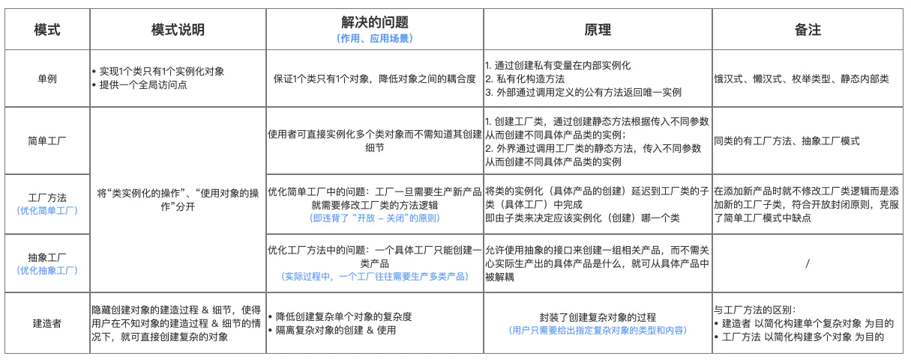

## 单例模式 (Singleton)

~~~text
所谓类的单例设计模式，就是采取一定的方法保证在整个的系统中，对某个类 【只能存在一个对象实例】，并且该类只提供一个取得其对象实例的方法（静态方法）

比如Hibernate的SessionFactory，它充当数据存储源的代理，并负责创建Session对象。SessionFactory并不是轻量级的，一般情况下，一个项目通常只需要一个SessionFactory就够，这里就用到单例模式
~~~

* 八种单例模式
~~~text
1.饿汉式（静态变量）
2.饿汉式（静态代码块）

3.懒汉式（线程不安全）
4.懒汉式（线程安全，同步方法）
5.懒汉式（线程安全，同步代码块）

6.双重检查锁
7.静态内部类
8.枚举
~~~

* 单例模式分为两种
~~~text
饿汉式：类加载就会导致该单实例对象被创建
懒汉式：类加载不会导致该单实例对象被创建，而是首次使用该对象时才会创建
~~~

### 饿汉式（静态变量）

~~~java
public class Test01 {
    public static void main(String[] args) {

        A instance1 = A.getInstance();
        A instance2 = A.getInstance();

        System.out.println(instance1 == instance2);//true

    }
}

class A{

    //构造器私有化，确保不能通过 new 实例化对象
    private A(){}

    //static修饰 在类加载时创建本类的实例对象
    private static final A a = new A();

    //提供公有静态方法，让外界获取该对象
    public static A getInstance(){
        return a;
    }
}
~~~

* 优缺点
~~~text
1）优点：写法简单，就是在类装载的时候实现实例化，避免线程同步问题
2）缺点：在类装载的时候就完成实例化，没有完成 Lazy loading 的效果。如果从始至终从未使用这个实例，会造成内存浪费

3）这种方式基于classloader机制避免了多线程的同步问题，不过，instance在类装载时就实例化，在单例模式中大多数都是调用getInstance方法，
但是导致类装载的原因有很多种，因此不能确定有其他的方式（或者其他的静态方法）导致类装载，这时初始化instance就没有达到 lazy loading 的效果

4)结论：这种单例模式可用，可能造成内存浪费
~~~

* Runtime源码

~~~java
public class Runtime {
    private static Runtime currentRuntime = new Runtime();
    
    public static Runtime getRuntime() {
        return currentRuntime;
    }
    
    private Runtime() {
    }

}
~~~

### 饿汉式（静态代码块）

~~~java
public class Test02 {
    public static void main(String[] args) {

        A1 instance = A1.getInstance();
    }
}

class A1{

    //构造器私有化
    private A1(){}

    //声明 本类类型 变量
    private static A1 a1;

    //静态代码块 赋值
    static {
        a1 = new A1();
    }

    //静态方法 用于外界获取本类对象
    public static A1 getInstance(){
        return a1;
    }
}
~~~

### 懒汉式（线程不安全）

~~~java
/**
 * 懒汉式一 把创建实例化对象放在静态方法中 线程不安全 符合懒加载
 * */
public class Test01 {
    public static void main(String[] args) {

        A instance = A.getInstance();
        System.out.println(instance);
    }
}

class A {

    //构造器 私有化
    private A(){}

    //声明 该类类型的变量
    private static A a;

    //提供公有静态方法 将该类对象赋值给变量
    public static A getInstance(){
        if (a == null){
            a = new A();
        }
        return a;
    }
}
~~~

* 懒汉式（线程不安全）优缺点说明
~~~text
1）起到了 Lazy loading的效果，但是只能在单线程下使用
2）如果在多线程下，一个线程进入了 if(a == null)判断语句块，还未来得及往下执行，另外一个线程也通过了这个判断语句，这时便会产生多个实例。
    所以在多线程环境下不可使用这种方式
3）结论：在实际开发中，不能使用这种方式
~~~

### 懒汉式（线程安全，同步方法）

~~~java
/**
 * 懒汉式二 把静态代码块用 synchronized 修饰，做成同步方法，线程安全
 * 
 * 问题：每次执行getInstance的时候都需要同步，效率太低
 *      其实只需要在第一次加载的时候实例化对象，后面只需要调用该对象；
 * */
public class Test01 {
    public static void main(String[] args) {

        A instance = A.getInstance();
        System.out.println(instance);
    }
}

class A {

    //构造器 私有化
    private A(){}

    //实例化A
    private static A a;

    //提供公有静态方法
    public static synchronized A getInstance(){
        if (a == null){
            a = new A();
        }
        return a;
    }
}
~~~

*　懒汉式（同步方法，线程安全）优缺点
~~~text
1）解决了线程不安全问题
2）效率太低，每个线程都想获得类的实例的时候，执行getInstance()方法都要进行同步，而其实这个方法只执行一次实例化代码就够，
    后面的想获得该类实例，直接return就行了。方法进行同步效率太低
3）结论：在实际开发中，不推荐使用这种方式
~~~

### 懒汉式（线程不安全，同步代码块）

### 双重检查锁

~~~java
public class Test01 {
    public static void main(String[] args) {
        A instance = A.getInstance();
    }
}

class A {

    private A(){}

    private static volatile A a;

    /**
     * 双重检查锁
     *
     * 1、第一次多个线程通过第一个if判断，其中一个线程走同步代码块，a==null，赋值实例对象
     * 2、第一个线程走完，其他线程判断同步代码块的第二个if，a!=null
     * 3、再有线程调用，走第一个if就会判断为 a!=null，也就不用走同步代码块
     *
     * 结论：解决线程安全，懒加载问题，同时也保证效率
     * */
    public static A getInstance(){
        if (a == null){
            synchronized (A.class){
                if (a == null){
                    a = new A();
                }
            }
        }
        return a;
    }
}
~~~

* 双重检查锁 优缺点
~~~text
1）Double-Check 概念是多线程开发中常使用到的，如代码中所示，我们进行了两次if(a == null)检查，这样就可以保证线程安全
2）这样，实例化代码只用执行一次，后面再访问时，判断if(a == null)，直接return实例化对象，也避免反复进行方法同步
3）线程安全，延迟加载，效率较高
4）结论：实际开发中，推荐使用这种单例模式
~~~

* 存在问题
~~~text
在多线程的情况下，可能会出现空指针问题，出现问题的原因是JVM在实例化对象的时候进行优化和指令重排序操作。
要解决双重检查锁模式带来空指针异常的问题，只需要使用 volatile 关键字，该关键字可以保证可见性和有序性
~~~

### 静态内部类

~~~java
public class Test01 {
    public static void main(String[] args) {

        A instance = A.getInstance();
        System.out.println(instance);
    }
}

class A {

    private A(){}

    /**
     * 静态内部类
     * 1、类加载时不会被实例化
     * 2、第一次调用静态内部类中的静态属性，进行类的初始化，JVM会保证线程安全
     *
     * 结论：即保证 懒加载 线程安全 效率高
     * */
    private static class AInstance{
        private static final A INSTANCE = new A();
    }

    //静态方法，方法静态内部类中实例化对象
    public static A getInstance(){
        return AInstance.INSTANCE;
    }
}
~~~

* 静态内部类 优缺点
~~~text
1）这种方式采用了类装载的机制来保证初始化实例时只有一个线程
2）静态内部类方式在A类被装载时并不会立即实例化，而是在需要实例化时，调用getInstance方法，才会装载AInstance类，完成A的实例化
3）类的静态属性只会在第一次加载类时初始化，所以在这里，JVM帮助我们保证了线程安全性，在类进行初始化时，别的线程是无法进入的
4）优点：避免了线程不安全，利用静态内部类特点来实现延迟加载，效率高
~~~

### 枚举

~~~java
public class Test01 {
    public static void main(String[] args) {
        A instance = A.INSTANCE;
        A instance1 = A.INSTANCE;
        System.out.println(instance == instance1);
        System.out.println(instance.hashCode());
        System.out.println(instance1.hashCode());

    }
}

enum A{ //枚举类
    INSTANCE;//属性
    public void say(){
        System.out.println("hello");
    }
}
~~~

* 优缺点 
~~~text
枚举类实现单例模式是极力推荐的单例模式，因为枚举类型是线程安全的，并且只会装载一次，设计者充分利用了枚举这个特征来实现单例模式，
枚举的写法非常简单，而且枚举类型是所有单例实现中唯一一种不会被破坏的单例实现模式
~~~

* 单例总结

~~~text
1）单例模式保证了系统内存中该类只存在一个对象，节省了系统资源，对于一些需要频繁创建销毁的对象，使用单例模式可以提高系统性能
2）当想实例化一个单例类的时候，必须要记住使用相应的获取对象的方法，而不是使用new
3）单例模式使用的场景：需要频繁的进行创建和销毁的对象、创建对象时耗时过多或耗费资源过多（即：重量级对象），但又经常用到的对象、工具类对象、频繁访问数据库或文件的对象（比如数据库、session工厂等）
~~~

### 破坏单例模式

* 通过序列化破坏单例模式

~~~java
public class Test02 {
    public static void main(String[] args) throws Exception{

        //写数据
//        writeObjectToFile();

        //读 两次读取出的对象不同
        readObjectFromFile();
        readObjectFromFile();
    }

    //向文件中写数据
    public static void writeObjectToFile() throws Exception {
        //获取单例对象
        A instance = A.getInstance();
        //创建输出流
        ObjectOutputStream oos = new ObjectOutputStream(new FileOutputStream("C:\\Users\\13717\\Desktop\\A.txt"));
        //写
        oos.writeObject(instance);
        //释放资源
        oos.close();
    }

    //读出文件中数据
    public static void readObjectFromFile() throws Exception {
        //输入流
        ObjectInputStream ois = new ObjectInputStream(new FileInputStream("C:\\Users\\13717\\Desktop\\A.txt"));
        //读
        A a  = (A) ois.readObject();
        System.out.println(a);
        ois.close();
    }
}
~~~

* 解决
~~~text
在类添加 readResolve()，在反序列化时被反射调用，如果定义该方法，就会返回该方法的返回值，不会返回新new出来的对象
~~~

~~~java
class A implements Serializable {

    private A(){}

    private static class AInstance{
        private static final A INSTANCE = new A();
    }

    //静态方法，方法静态内部类中实例化对象
    public static A getInstance(){
        return AInstance.INSTANCE;
    }

    //当进行反序列化时，会自动调用该方法，将静态内部类的变量返回
    public Object readResolve() {
        return AInstance.INSTANCE;
    }
}
~~~

* 反射方式破解单例问题

~~~java
import org.omg.PortableInterceptor.INACTIVE;

class A implements Serializable {

    private A() {

        /**
         * 反射破解单例模式需要添加的代码
         * */
        if (INACTIVE == null){
            throw new RuntimeException();
        }
    }

    private static class AInstance {
        private static final A INSTANCE = new A();
    }

    //静态方法，方法静态内部类中实例化对象
    public static A getInstance() {
        return AInstance.INSTANCE;
    }

}

~~~

## 工厂模式

### 简单工厂模式（Simple Factory）

* 简单工厂模式介绍
~~~text
简单工厂模式又叫静态方法模式（因为工厂类定义了一个静态方法）
现实生活中，工厂是负责生产产品的；同样在设计模式中，简单工厂模式我们可以理解为负责生产对象的一个类，称为 工厂类

模式组成：抽象产品（接口或抽象类）、具体产品（实现类）、工厂类
~~~

* 解决的问题
~~~text
将 类实例化的操作 与 使用对象的操作 分开，让使用者不用知道具体参数就可以实例化出所需要的 产品 类，从而避免了在客户端代码中显式指定，实现了解耦
~~~

* UML类图

* 结合实际情况
~~~text
一个工厂生产产品，推出几款产品
~~~

* 使用步骤

~~~text
创建抽象产品类 & 定义具体产品的公共接口；
创建具体产品类（继承抽象产品类） & 定义生产的具体产品；
创建工厂类，通过创建静态方法根据传入不同参数从而创建不同具体产品类的实例；
外界通过调用工厂类的静态方法，传入不同参数从而创建不同具体产品类的实例
~~~

1. 创建抽象产品类，定义具体产品的公共接口

~~~java
abstract class Product{
    public abstract void Show();
}
~~~

2. 创建具体产品类（继承抽象产品类），定义生产的具体产品
~~~java
//具体产品类A
class  ProductA extends  Product{

    @Override
    public void Show() {
        System.out.println("生产出了产品A");
    }
}

//具体产品类B
class  ProductB extends  Product{

    @Override
    public void Show() {
        System.out.println("生产出了产品C");
    }
}

//具体产品类C
class  ProductC extends  Product{

    @Override
    public void Show() {
        System.out.println("生产出了产品C");
    }
}
~~~

3. 创建工厂类，通过创建静态方法从而根据传入不同参数创建不同具体产品类的实例
~~~java
class  Factory {
    public static Product getInstance(String ProductName){
//工厂类里用switch语句控制生产哪种商品；
//使用者只需要调用工厂类的静态方法就可以实现产品类的实例化。
        switch (ProductName){
            case "A":
                return new ProductA();

            case "B":
                return new ProductB();

            case "C":
                return new ProductC();

            default:
                return null;

        }
    }
}
~~~

4. 客户端通过调用工厂类的静态方法，传入不同参数从而创建不同具体产品类的实例
~~~java
//客户端
public class Client {
    public static void main(String[] args){
        Factory mFactory = new Factory();

        //客户要产品A
        try {
        //调用工厂类的静态方法 & 传入不同参数从而创建产品实例
            mFactory.Manufacture("A").Show();
        }catch (NullPointerException e){
            System.out.println("没有这一类产品");
        }
    }
}
~~~

* 优点
~~~text
将创建对象的过程与使用对象的工作分开，使用者不必关心类对象如何创建，实现了解耦
把初始化实例对象放到工厂里进行，使代码更容易维护。 更符合面向对象的原则 & 面向接口编程，而不是面向实现编程
~~~

* 缺点
~~~text
工厂类集中了所有实例（产品）的创建逻辑，一旦这个工厂不能正常工作，整个系统都会受到影响
违背 开放闭原则，一旦添加新产品就不得不修改工厂类的逻辑，这样就会造成工厂逻辑过于复杂
~~~

* 应用场景
~~~text
客户如果只知道传入工厂类的参数，对于如何创建对象的逻辑不关心时
当工厂类负责创建的对象（具体产品）比较少时
~~~

### 工厂方法模式 (Factory Method)

* 定义
~~~text
工厂方法模式，又称工厂模式、多态工厂模式和虚拟构造器模式，通过定义工厂父类负责定义创建对象的公共接口，而子类则负责生成具体的对象

将类的实例化（具体产品的创建）延迟到工厂类的子类（具体工厂）中完成，即由子类来决定应该实例化（创建）哪一个类
~~~

* 解决的问题
~~~text
简单工厂模式的缺点：工厂一旦需要生产新产品就需要修改工厂类的逻辑，违背了 开闭原则

之所以可以解决简单工厂的问题，是因为工厂方法模式把具体产品的创建推迟到工厂类的子类（具体工厂）中，此时工厂类不再负责所有产品的创建，
而只是给出具体工厂必须实现的接口，这样工厂方法模式在添加新产品的时候就不修改工厂类逻辑而是添加新的工厂子类，符合开放封闭原则，克服了简单工厂模式中缺点
~~~

1. 创建抽象产品类
~~~java
abstract class Product{
    public abstract void show();
}
~~~

2. 创建具体产品类（继承抽象产品类）
~~~java
//具体产品A类
class  ProductA extends  Product{
    @Override
    public void show() {
        System.out.println("生产出了产品A");
    }
}

//具体产品B类
class  ProductB extends  Product{

    @Override
    public void show() {
        System.out.println("生产出了产品B");
    }
}
~~~

3. 创建抽象工厂类
~~~java
abstract class Factory{
    public abstract Product getInstance();
}
~~~

4. 创建具体工厂类（继承抽象工厂类）
~~~java
//工厂A类 - 生产A类产品
class  FactoryA extends Factory{
    @Override
    public Product Manufacture() {
        return new ProductA();
    }
}

//工厂B类 - 生产B类产品
class  FactoryB extends Factory{
    @Override
    public Product Manufacture() {
        return new ProductB();
    }
}
~~~

5. 客户端通过调用具体工厂类的方法
~~~java
//生产工作流程
public class Client {
    public static void main(String[] args){

        //客户要产品A 通过工厂A 得到产品A对象
        FactoryA factoryA = new FactoryA();
        //通过方法getInstance() 得到产品A对象
        Product instance = factoryA.getInstance();
        instance.show();
    }
}
~~~

* 优点
~~~text
更符合开闭原则：新增一种产品时，只需要增加相应的具体产品类和相应的工厂子类即可
在保留了简单工厂的封装优点的同时，让扩展变得简单，让继承变得可行，增加了多态性的体现
~~~ 

* 缺点
~~~text
添加新产品时，除了增加新产品类外，还要提供与之对应的具体工厂类，系统类的个数将成对增加，在一定程度上增加了系统的复杂度；同时，有更多的类需要编译和运行，会给系统带来一些额外的开销；
由于考虑到系统的可扩展性，需要引入抽象层，在客户端代码中均使用抽象层进行定义，增加了系统的抽象性和理解难度，且在实现时可能需要用到DOM、反射等技术，增加了系统的实现难度。
虽然保证了工厂方法内的对修改关闭，但对于使用工厂方法的类，如果要更换另外一种产品，仍然需要修改实例化的具体工厂类；
一个具体工厂只能创建一种具体产品
~~~

* 总结
~~~text
当一个类不知道它所需要的对象的类时
在工厂方法模式中，客户端不需要知道具体产品类的类名，只需要知道所对应的工厂即可；
当一个类希望通过其子类来指定创建对象时
在工厂方法模式中，对于抽象工厂类只需要提供一个创建产品的接口，而由其子类来确定具体要创建的对象，利用面向对象的多态性和里氏代换原则，在程序运行时，子类对象将覆盖父类对象，从而使得系统更容易扩展。
将创建对象的任务委托给多个工厂子类中的某一个，客户端在使用时可以无须关心是哪一个工厂子类创建产品子类，需要时再动态指定，可将具体工厂类的类名存储在配置文件或数据库中。
~~~

### 抽象工厂模式 (Abstract Factory)

* 定义
~~~text
提供一个创建一系列相关或相互依赖对象的接口，而无须指定它们具体的类；具体的工厂负责实现具体的产品实例

抽象工厂模式与工厂方法模式最大的区别：抽象工厂中每个工厂可以创建多种类的产品；而工厂方法每个工厂只能创建一类
~~~

* 模式组成

1. 创建抽象工厂类
~~~java
abstract class Factory{
    public abstract Product ManufactureContainer();
    public abstract Product ManufactureMould();
}
~~~

2. 创建抽象产品族类
~~~java
abstract class AbstractProduct{
    public abstract void Show();
}
~~~

3. 创建抽象产品类
~~~java
//容器产品抽象类
abstract class ContainerProduct extends AbstractProduct{
    @Override
    public abstract void Show();
}

//模具产品抽象类
abstract class MouldProduct extends AbstractProduct{
    @Override
    public abstract void Show();
}

~~~

4. 创建具体产品类
~~~java
//容器产品A类
class ContainerProductA extends ContainerProduct{
    @Override
    public void Show() {
        System.out.println("生产出了容器产品A");
    }
}

//容器产品B类
class ContainerProductB extends ContainerProduct{
    @Override
    public void Show() {
        System.out.println("生产出了容器产品B");
    }
}

//模具产品A类
class MouldProductA extends MouldProduct{

    @Override
    public void Show() {
        System.out.println("生产出了模具产品A");
    }
}

//模具产品B类
class MouldProductB extends MouldProduct{

    @Override
    public void Show() {
        System.out.println("生产出了模具产品B");
    }
}
~~~

5. 创建具体工厂类
~~~java
//A厂 - 生产模具+容器产品
class FactoryA extends Factory{

    @Override
    public Product ManufactureContainer() {
        return new ContainerProductA();
    }

    @Override
    public Product ManufactureMould() {
        return new MouldProductA();
    }
}

//B厂 - 生产模具+容器产品
class FactoryB extends Factory{

    @Override
    public Product ManufactureContainer() {
        return new ContainerProductB();
    }

    @Override
    public Product ManufactureMould() {
        return new MouldProductB();
    }
}
~~~

6. 客户端通过实例化具体的工厂类
~~~java
//生产工作流程
public class AbstractFactoryPattern {
    public static void main(String[] args){
        FactoryA mFactoryA = new FactoryA();
        FactoryB mFactoryB = new FactoryB();
        //A厂当地客户需要容器产品A
        mFactoryA.ManufactureContainer().Show();
        //A厂当地客户需要模具产品A
        mFactoryA.ManufactureMould().Show();

        //B厂当地客户需要容器产品B
        mFactoryB.ManufactureContainer().Show();
        //B厂当地客户需要模具产品B
        mFactoryB.ManufactureMould().Show();

    }
}
~~~

* 优点
~~~text
降低耦合
抽象工厂模式将具体产品的创建延迟到具体工厂的子类中，这样将对象的创建封装起来，可以减少客户端与具体产品类之间的依赖，从而使系统耦合度低，这样更有利于后期的维护和扩展

符合开-闭原则
新增一种产品类时，只需要增加相应的具体产品类和相应的工厂子类即可

~~~

* 缺点
~~~text
抽象工厂模式很难支持新种类产品的变化
这是因为抽象工厂接口中已经确定了可以被创建的产品集合，如果需要添加新产品，此时就必须去修改抽象工厂的接口，这样就涉及到抽象工厂类的以及所有子类的改变，这样也就违背了“开发——封闭”原则
~~~

* 应用场景

~~~text
一个系统不要求依赖产品类实例如何被创建、组合和表达的表达，这点也是所有工厂模式应用的前提。
这个系统有多个系列产品，而系统中只消费其中某一系列产品
系统要求提供一个产品类的库，所有产品以同样的接口出现，客户端不需要依赖具体实现。
~~~

## 原型模式

* 概述 
~~~text
用一个已经创建的实例作为原型，通过复制该原型对象来创建一个和原型对象相同的新对象
~~~

* 结构
~~~text
抽象原型类：规定了具体原型对象必须实现的clone()方法
具体原型类：实现抽象原型类的clone()方法，它是可复制对象
访问类：使用具体原型类中的clone()方法来复制新的对象
~~~

* 类图

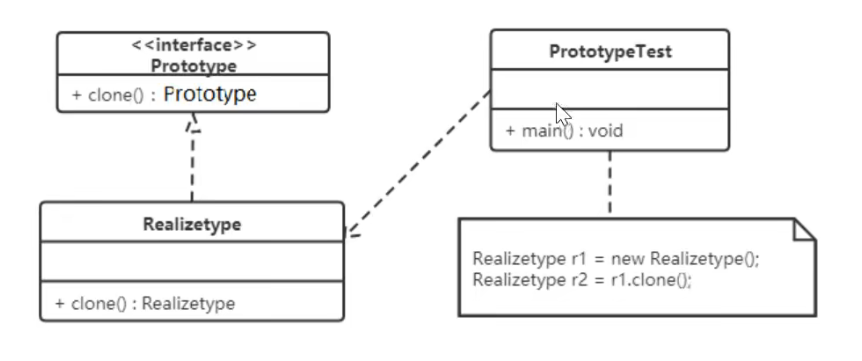

* 原型模式的克隆分为浅克隆和深克隆

~~~text
浅克隆：创建一个新对象，新对象的属性和原来对象完全相同，对于非基本数据类型，仍指向原有属性所指向的对象的内存地址
深克隆：创建一个新对象，属性中引用的其他对象也会被克隆，不再指向原有对象地址
~~~

~~~text
Java中的Object类中提供了 clone() 方法来实现浅克隆。Cloneable接口是上面的类图中的抽象原型类，而实现了Cloneable
接口的子实现类就是具体的原型类，代码如下：
~~~

* Realizetype(具体的原型类)
~~~java
public class Realizetype implements Cloneable{

    public Realizetype(){
        System.out.println("具体的原型对象创建完成");
    }

    //重写clone方法
    @Override
    public Realizetype clone() throws CloneNotSupportedException {
        System.out.println("具体原型复制成功");
        return (Realizetype) super.clone();
    }
}

//测试类
public class Client {
    public static void main(String[] args) throws CloneNotSupportedException {

        Realizetype realizetype = new Realizetype();
        Realizetype clone = realizetype.clone();
        System.out.println("原型对象和克隆出来的是否是同一个对象？"+(realizetype == clone));//false
    }
}
~~~

* 案例

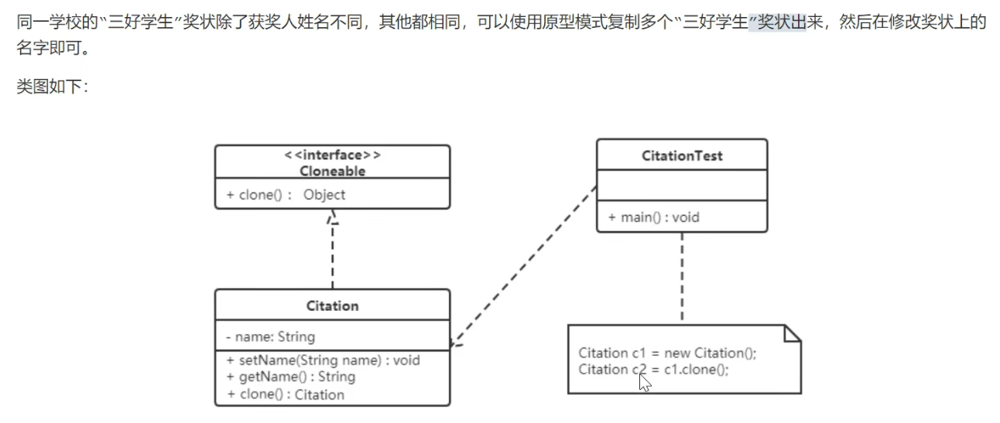

*　具体原型类
~~~java
import lombok.Data;

@Data
public class Citation implements Cloneable{

    private String name;

    @Override
    public Citation clone() throws CloneNotSupportedException {
        return (Citation) super.clone();
    }

    public void show(){
        System.out.println(name + "同学，获得奖状");
    }
}
~~~

＊ 测试类
~~~java
public class CitationTest {
    public static void main(String[] args) throws CloneNotSupportedException {

        Citation citation = new Citation();// 1）创建原型对象

        Citation clone = citation.clone();
        clone.setName("张三");//张三同学，获得奖状
        clone.show();

        Citation clone1 = citation.clone();
        clone1.setName("李斯");
        clone1.show();//李斯同学，获得奖状
    }
}
~~~

* 使用场景
~~~text
对象的创建非常复杂，可以使用原型模式快捷的创建对象。性能和安全要求比较高。
~~~

* **深克隆** 后续再看

~~~text
将上面的三好学生奖状的案例中Citation类的name属性修改为Student类型的属性
~~~

* 代码如下
~~~java
public class CitationStuTest {
    public static void main(String[] args) throws CloneNotSupportedException {

        CitationStu cs = new CitationStu();
        
        //创建对象stu
        Student stu = new Student();
        stu.setName("张三");
        cs.setStu(stu);
        
        cs.show();//张三同学，获得奖状

        //获取克隆对象
        CitationStu clone = cs.clone();
        
        //获取对象stu1
        Student stu1 = clone.getStu();
        stu1.setName("李四");

        System.out.println("stu 和 stu1 是否是同一个对象："+ (stu == stu1)); //true

        cs.show();//李四同学，获得奖状
        clone.show();//李四同学，获得奖状
    }
}
~~~

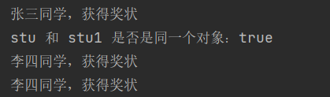

* 说明
~~~text
stu和stu1是同一个对象，就会产生将stu1对象中name属性修改为“李四”，两个Citation（奖状）对象中显示的都是李四。
这就是浅克隆的效果，对具体原型类（Citation）中引用类型的属性进行引用的复制。这种情况需要深克隆，而进行深克隆需要用到对象流。
~~~

## 建造者模式 (Builder)

* 概述

~~~textmate
将一个复杂对象的构建与表示分离，使得相同的构建过程可以创建不同的表示。

1. 分离了部件的 构造（由Builder来负责）和 装配 （由Builder负责）。从而可以构造出复杂的对象。这个模式适用于：某个对象的构造过程复杂的情况（台式电脑组装过程就类似于复杂对象的创建）
2. 由于实现了构造和装配的解耦。不同的构造器，相同的装配，也可以做出不同的对象；相同的构造器，不同的装配顺序也可以做出不同的对象。也就是实现了构建算法、装配算法的解耦，实现了更好的复用。
3. 建造者模式可以将部件和其组装过程分开，一步一步创建一个复杂的对象。用户只需要指定复杂对象的类型就可以得到该对象，而无须知道其内部的具体构造细节。
~~~

* 建造者模式结构
~~~text
1. 产品（Product）：要创建的复杂对象

2. 抽象建造者（Builder）：这个接口规定要实现复杂对象的哪些部分的创建，并不涉及具体的部件对象的创建  
3. 具体建造者（ConcreteBuilder）：实现Builder接口，完成复杂产品的各个部件的具体创建方法。在创建过程完成后，提供产品的实例

4. 抽象 指挥者（Director）：调用具体建造者来创建复杂对象的各个部分，在指导者中不涉及具体产品的信息，只负责保证对象各部分完整创建或按某种顺序创建
5. 具体 客户端（Client）：通过抽象指挥者，传入具体建造者，得到具体产品
~~~

* 类图

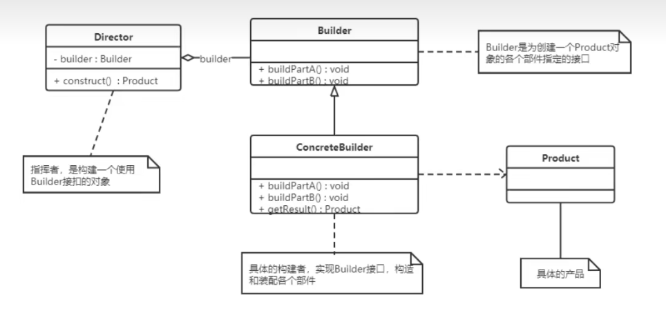

* 实例：创建自行车

~~~text
生产自行车是一个复杂的过程，包含 车架、车座等组件的生产；而车架又有碳纤维、铝合金等材质，车座有橡胶、真皮等材质。

这里的Bike是产品，包含车架，车座等组件；Builder是抽象建造者，MobikeBuilder和OFOBuilder是具体的构建者；Director是指挥者；
~~~

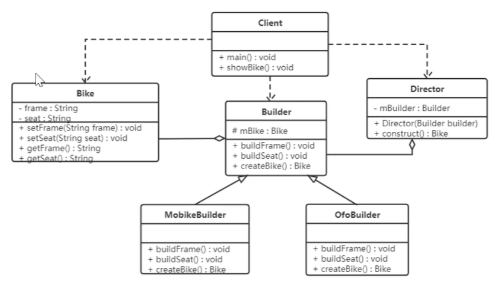

* 优点
~~~text
1.建造者模式的封装性很好。
    使用建造者模式可以有效的封装变化，在使用建造者模式的场景中，一般产品类和建造者类是比较稳定的，因此，将主要业务逻辑封装在指挥者类中对整体而言可以取得比较好的稳定性。
    
2.在建造者模式中，客户端不必知道产品内部组成的细节，将产品本身与产品的创建过程解耦，使得相同的创建过程可以创建不同的产品对象。

3.可以更加精细的控制产品的创建过程。
    将复杂产品的创建步骤分解在不同的方法中，使得创建过程更加清晰，也方便使用程序来控制创建过程。
    
4.建造者模式很容易进行扩展。
    如果有新的需求，通过实现一个新的建造者类就可以完成，基本上不用修改之前已经测试通过的代码，因此也就不会对原有功能引入风险，
~~~

* 缺点
~~~text
建造者模式所创建的产品一般具有较多的共同点，其组成部分相似，如果产品之间差异性很大，则不适合使用建造者模式，使用范围有一定局限
~~~

*　使用场景
~~~text
建造者（builder）模式创建的是复杂对象，其产品的各个部分经常面临着剧烈的变化，但将他们组合在一起的算法却相对稳定，所以通常在以下场景使用：

1.创建的对象较复杂，由多个部件构成，各部件面临着复杂的变化，但构建的创建顺序是稳定的。
2.创建复杂对象的算法独立于该对象的组成部分以及他们的装配方式，即产品的构架过程和最终的表示是独立的。
~~~

* 模式对比

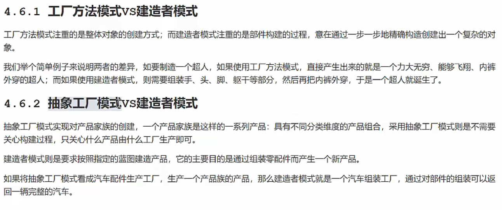

# 结构型模式

* 概述
~~~text
结构性模式描述如何将类或对象按某种布局组成更大的结构，它分为类结构性模式和对象结构性模式，前者采用继承机制来组织接口和类，
后者采用组合和聚合来组合对象。

由于组合关系或聚合关系比继承关系耦合度低，满足 '合成复用原则'，所以对象结构性模式比类结构性模式具有更大的灵活性
~~~

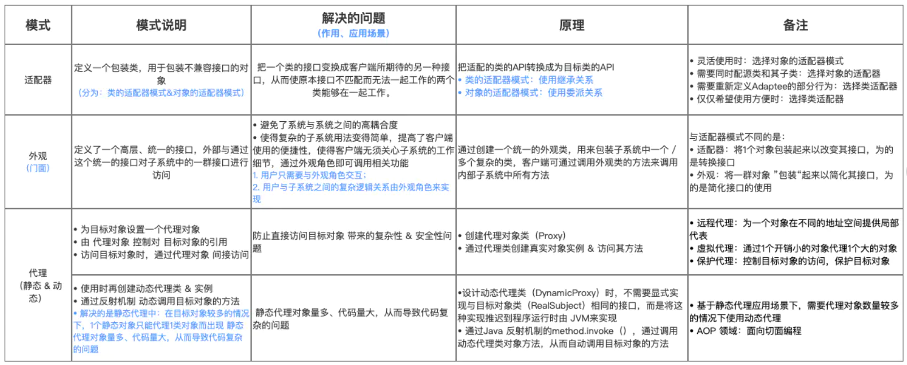

## 代理模式 (Proxy)

* 代理模式分为三种角色
~~~text
抽象主题类（Subject）：通过接口或抽象类声明真实主题和代理对象实现的业务方法
真实主题类（Real Subject）：实现了抽象主题中的具体业务，是代理对象所代表的真实对象，是最终要引用的对象
代理对象（Proxy）：提供了与真实主题相同的接口，其内部含有对真实主题的引用，它可以访问、控制或扩展真实主题的功能
~~~

### 静态代理

* 例：火车站买票：火车站是目标对象，代售点是代理对象

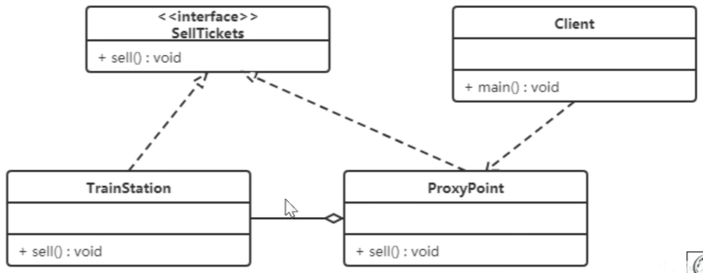

### JDK动态代理

* 代理类和目标类实现同样的接口

* 动态代理工厂类：获取代理对象

~~~java
public class ProxyFactory {

    private Object target;
    //传递目标对象
    public ProxyFactory(Object target) {
        this.target = target;
    }

    //代理工厂，返回代理对象
    public Object getProxyObject(){
        Object obj =  Proxy.newProxyInstance(
                target.getClass().getClassLoader(),
                target.getClass().getInterfaces(),
                new InvocationHandler() {
                    @Override
                    public Object invoke(Object proxy, Method method, Object[] args) throws Throwable {
                        /**
                         *  反射 invoke方法 调用目标对象方法
                         *  方法名.invoke(对象,方法需所需参数)
                         * */
                        Object object = method.invoke(target, args);
                        return object;
                    }
                }
        );
        return obj;
    }
}
~~~

### CGLIB动态代理

* CGLIB是一个功能强大，高性能的代码生成器。它为没有实现接口的类提供代理，为JDK的动态代理提供了很好的补充。

* 实现过程

~~~java
/**
 * 代理对象工厂，用来生成代理对象
 * **/
public class ProxyFactory implements MethodInterceptor {

    //目标对象(父类)
    private Object target;

    public ProxyFactory(Object target) {
        this.target = target;
    }

    /**
     * 获取代理对象方法
     * 1.调用 Enhancer类的 setSuperclass()方法，设置目标对象为代理对象父类
     * 2.调用 Enhancer类的 create()方法，生成代理对象
     * **/
    public Object getProxyObject(){
        //类似JDK代理中的Proxy类
        Enhancer enhancer = new Enhancer();
        //指定父类
        enhancer.setSuperclass(target.getClass());
        //设置回调函数
        enhancer.setCallback(this);
        //创建代理对象
        Object proxyObject = enhancer.create();
        return proxyObject;
    }

    //重写拦截器，调用目标方法，实现功能增强
    @Override
    public Object intercept(Object o, Method method, Object[] objects, MethodProxy methodProxy) throws Throwable {
        System.out.println("代理方法执行！！");
        //调用目标对象方法
        Object obj = method.invoke(target, objects);
        return obj;
    }
}
~~~

## 适配器模式 (Adapter)

* 概述
~~~text
将一个类的接口转换成客户希望的另外一个接口，使得原本由于接口不兼容而不能一起工作的那些类一起工作。
适配器模式分为 类适配器 和 对象适配器模式，前者类之间的耦合度比后者高，且要求程序员了解现有组件库中相关组件的内部结构，所以相对应用较少
~~~

* 结构
~~~text
目标接口（Target）：当前系统业务所期待的接口，可以是抽象类或接口

适配者类（Adaptee）：是被访问和适配的现存组件库的组件接口

适配器类（Adapter）：是一个转换器，通过继承或引用适配器的对象，把适配器接口转换成目标对象，让客户按目标对象的格式访问适配者
~~~

### 类适配器模式

* 定义
~~~text
定义一个适配器类来实现当前系统的业务接口，同时又继承现有组件库中已经存在的组件
~~~

* 例：读卡器
~~~text
现有一台电脑只能读SD卡，而需要读取TF卡中的内容的话就需要使用到适配器模式，创建一个读卡器，将TF卡中的内容读取出来
~~~

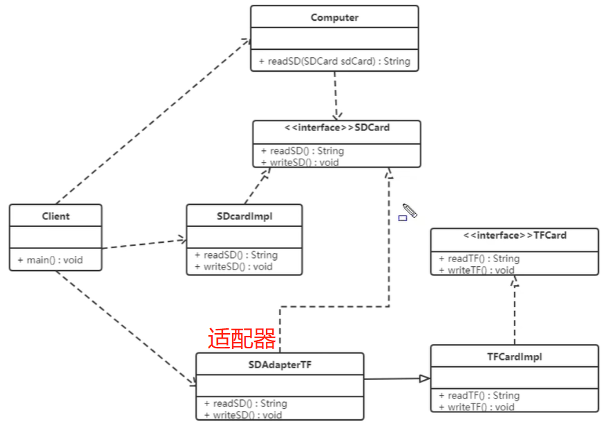

* 适配器类：继承TF实现类，实现CDCard接口
~~~java
public class CDAdapterTF extends TFCardImpl implements CDCard{
    // adapter 读取 TFRead
    @Override
    public String CDRead() {
        System.out.println("adapter read TFcard");
        String msg = TFread();
        return msg;
    }

    // CDWrite 写入 TFwrite
    @Override
    public void CDWrite(String msg) {
        TFwrite(msg);
    }

    @Override
    public String TFread() {
        return super.TFread();
    }

    @Override
    public void TFwrite(String msg) {
        super.TFwrite(msg);
    }
}
~~~

* 缺点
~~~text
类适配器模式违背了合成复用原则，类适配器是客户类有一个接口规范的情况下可用，反之不可用。
~~~

###对象适配器模式

* 实现方式
~~~text
对象适配器模式可采用将现有组件引入适配器类中，该类同时实现当前系统的业务接口
~~~

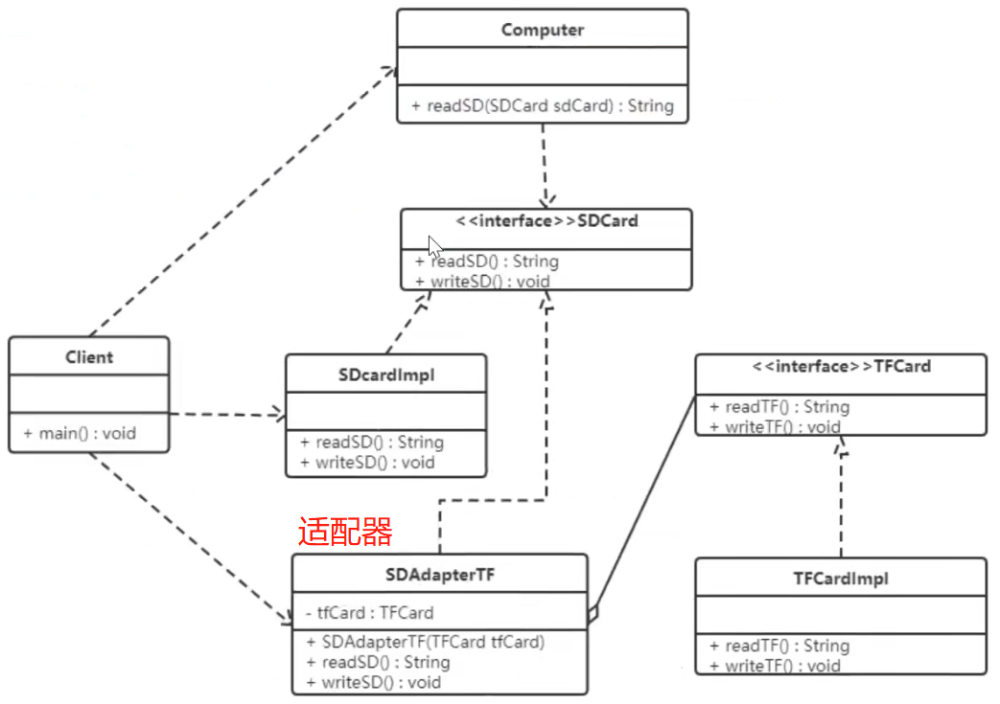

* 适配器继承目标接口，聚合客户类
~~~java
public class CDAdapterTF  implements CDCard {

    // 直接关联被适配类
    private TFCard tfCard;

    // 通过构造函数传入具体需要适配的被适配类对象  
    public CDAdapterTF(TFCard tfCard){
        this.tfCard = tfCard;
    }

    // adapter 读取 TFRead
    @Override
    public String CDRead() {
        System.out.println("adapter read TFcard");
        String msg = tfCard.TFread();
        return msg;
    }

    // CDWrite 写入 TFwrite
    @Override
    public void CDWrite(String msg) {
        tfCard.TFwrite(msg);
    }
}
~~~

* 调用
~~~java
public class Client {
    public static void main(String[] args) {

        Computer computer = new Computer();
        //读取cd卡中数据
        String MSG = computer.readCD(new CDCardImpl());
        System.out.println("msg: " + MSG);

        //电脑读取TF卡

        //类适配器模式
        //String mag2 = computer.readCD(new CDAdapterTF());
        //System.out.println("TFcard msg: " + mag2);

        //对象适配器模式
        CDAdapterTF cdAdapterTF = new CDAdapterTF(new TFCardImpl());
        String msg = cdAdapterTF.CDRead();
        System.out.println(msg);

        //写入TF卡
    }
}
~~~

* 注意
~~~text
还有一个适配器模式是接口适配器模式，当不希望实现一个接口中所有的方法时，可以创建一个抽象类 Adapter，实现所有方法。而此时我们只需要继承该抽象类即可
~~~

* 适用场景
~~~text
以前开发的系统存在满足新系统功能需求的类，但其接口同新接口的接口不一致
使用第三方提供的组件，但组件接口定义和自己要求的接口定义不同
~~~

## 装饰者模式 (Facade)

* 定义
~~~text
指在不改变现有对象结构的情况下，动态的给该对象添加一些职责（即添加其额外功能）的模式
~~~

* 结构
~~~text
抽象构件角色（Component）：定义一个抽象接口以规范准备接收附加责任的对象
具体构建角色（Concrete Component）：实现抽象构建，通过装饰角色为其添加一些职责

抽象装饰角色（Decorator）：继承或实现抽象构件，并包含具体构件的实例，可以通过其子类扩展具体构件的功能
具体装饰角色（Concrete Decorator）：实现抽象装饰的相关方法，并给具体构件对象添加附加的责任
~~~

* 例：快餐店

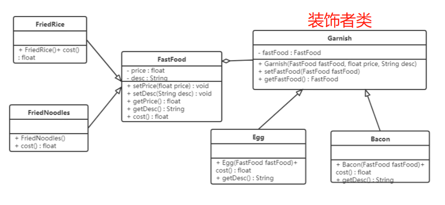

* 抽象构件者
~~~java
@Data
@AllArgsConstructor
@NoArgsConstructor
public abstract class FastFood {

    private float price;//价格
    private String desc;//描述

    /**
     * 计算金额方法
     * */
    public abstract float cost();
}
~~~

* 抽象装饰者，继承、聚合了 抽象构件角色
~~~java
public abstract class Garnish extends FastFood{

    //声明快餐类类型的变量
    private FastFood fastFood;

    //全参
    public Garnish(float price, String desc, FastFood fastFood) {
        super(price, desc);
        this.fastFood = fastFood;
    }

    public FastFood getFastFood() {
        return fastFood;
    }

    public void setFastFood(FastFood fastFood) {
        this.fastFood = fastFood;
    }
}
~~~

* 具体装饰者
~~~java
public class Egg extends Garnish{

    public Egg(FastFood fastFood){
        super(1,"鸡蛋",fastFood);
    }

    //计算总价
    @Override
    public float cost() {
        return getPrice() + getFastFood().cost();
    }

    @Override
    public String getDesc() {
        return super.getDesc() + getFastFood().getDesc();
    }
}
~~~

* 客户端
~~~java
public class Client {
    public static void main(String[] args) {

        //点分炒饭
        FastFood food = new FriedRice();
        System.out.println(food);

        //点份炒饭加鸡蛋
        food = new Egg(food);
        System.out.println(food.cost() + " " + food.getDesc());

        //点份炒饭加鸡蛋和培根
        food = new Bacon(food);
        System.out.println(food.cost() + " " + food.getDesc());
    }
}
~~~

* 好处
~~~text
1.装饰者模式可以带来比继承更加灵活的扩展功能，使用更加方便，可以通过组合不同的装饰者对象获取具有不同行为状态的多样性结果。
    装饰者模式比继承具有更好的扩展性，完美的遵循开闭原则，继承是静态的附加责任，装饰者则是动态的附加责任。
2.装饰者和被装饰者独立发展，不会相互耦合，装饰者模式继承的替代模式，装饰者模式可以动态扩展一个实现类的功能
~~~

* 使用场景
~~~text
1.当不能采用继承的方式对系统进行扩展或者采用继承不利于系统扩展和维护时，不能采用继承主要分为两类：
    a.第一类是系统中存在大量独立的扩展，为支持每一种组合将产生大量的子类，使得子类呈爆炸式增长
    b.第二类是因为类定义不能继承（如被final修饰）
2.在不影响其他对象的情况下，以动态、透明的方式给单个对象添加职责
3.当对象的功能要求可以动态的添加，也可以动态的撤销
~~~

## 桥接模式

## 外观模式

## 组合模式

## 享元模式

# 行为型模式

* 概述
~~~text
1.行为型模式用于描述程序在运行时复杂的流程控制，即描述多个类或对象之间怎样互相协作共同完成单个对象都无法完成的任务，它涉及算法和对象间职责分配
    行为型模式分为类行为型模式和对象行为型模式。前者采用继承机制在类间分派行为，后者采用组合或聚合的在对象间分配行为。
2.由于组合关系或聚合关系比继承关系耦合度低，满足”合成复用原则“，所以对象行为模式比类行为模式具有更大的灵活性
~~~

## 观察者模式 (Observer)

* 定义
~~~text
又被称为 发布-订阅模式（Publish-Subscribe），他定义了一种 一对多 的依赖关系，让多个 观察者对象 同时监听某一 主题对象。
这个主题对象在状态变化时，会通知所有的观察者对象，使他们能够自动更新自己。
~~~

* 结构
~~~text
1.抽象主题（抽象被观察者，Subject）：抽象主题角色把所有观察者对象保存在一个集合中，每个被观察者都可以有任意数量的观察者，抽象主题提供一个接口，可以增加或删除观察者对象
2.具体对象（具体被观察者，ConcreteSubject）：该角色将有关状态存入具体观察者对象，在具体主题的内部状态发生改变时，给所有注册过的观察者发送通知。

3.抽象观察者（观察者的抽象类，Observer）：定义了一个更新接口，使得在得到主题更改通知时更新自己
4.具体观察者（ConcreteObserver）：实现抽象观察者定义的更新接口，使得在得到主题更改通知时更新自己的状态
~~~

* 例：用户订阅公众号

~~~text
在使用微信公众号时，大家都有这样的体验，当你关注的公众号中有新内容更新时，它就会推送给关注公众号的微信用户端。
我们使用观察者模式来模拟这样的场景，微信用户就是观察者，公众号就是被观察者，多个用户订阅一个公众号。
~~~

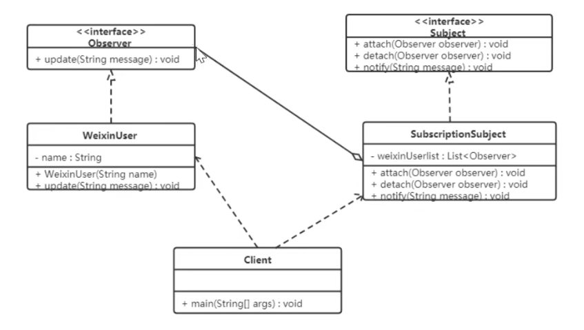

* 优点
~~~text
1.降低了目标和观察者之间的耦合关系，两者之间是抽象耦合关系
2.被观察者发送通知，所有注册的观察者都能收到信息（广播机制）
~~~

* 缺点
~~~text
1.如果观察者越来越多，耗时也就越长
2.如果被观察者有循环依赖的话，被观察者发送通知会使观察者循环调用，导致系统奔溃
~~~

* 使用场景
~~~text
1.对象间存在 一对多 关系，一个对象的状态发生改变会影响其他对象
2.当一个抽象模型有两个方面，其中一个方面依赖另外一个方面
~~~

## 策略模式 (Strategy)

* 定义
~~~text
该模式定义了一系列算法，并将每个算法封装起来，使他们可以互相替代，且算法的变化不会影响使用算法的客户。策略模式属于
对象行为模式，它通过对算法进行封装，把使用算法的责任和算法的实现分割开来，并委派给不同的对象对这些算法进行管理
~~~

* 结构
~~~text
抽象策略类（Strategy）：这是一个抽象角色，通常由一个接口或抽象类实现。此角色给出所有的具体策略类所需的接口
具体策略类（Concrete Strategy）：实现了抽象策略定义的接口，提供了具体的算法实现或行为
环境类（Context）：持有一个策略类的引用，最终给客户端调用
~~~

* 例：促销活动
~~~text
一家百货公司在定年度的促销活动，针对不同的节日（春节、中秋、国庆）推出不同的促销活动，由销售员将促销活动展示给客户
~~~

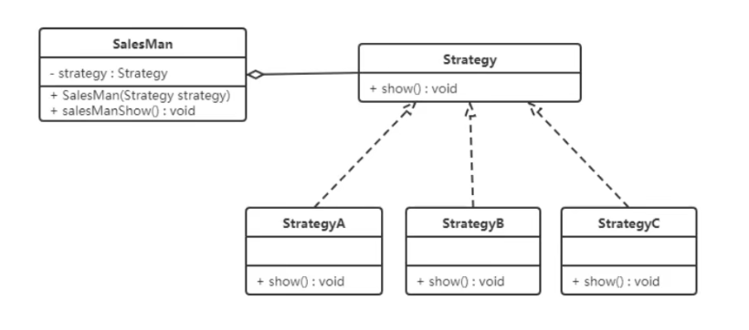

## 模板方法模式 (Template Method)

## 命令模式

## 职责链模式

## 状态模式

## 中介者模式

## 迭代器模式

## 访问者模式

## 备忘录模式

## 解释器模式

