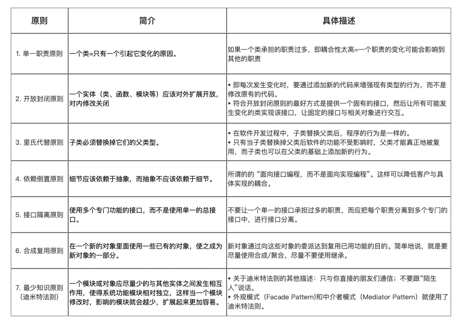
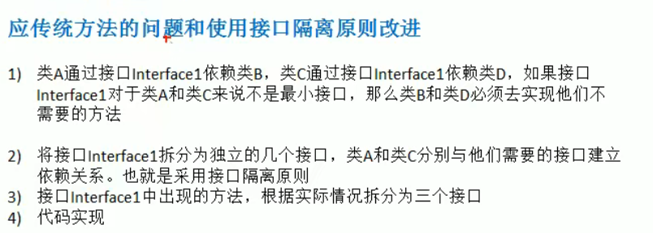

# 设计模式七大原则

* 原则 principle

* 设计模式的目的

~~~text
软件开发一直面临 耦合性、聚合性，可扩展性，复用性等挑战，如何让软件具有更好的

1、代码复用性（即：相同功能的代码，不用多次编写）
2、可读性（便于阅读和理解）
3、可扩展性（方便添加新需求，可维护性强）
4、可靠性（增加的功能对原有的功能不影响）
5、低耦合 高内聚 特征
~~~

## 单一职责 原则

* 单一职责

* 举例
~~~java
public class test03 {
    public static void main(String[] args) {

        Vehicle3 ve = new Vehicle3();
        ve.runAir("飞机");
        ve.runRoad("汽车");
        ve.runWriter("游艇");
    }
}

/**
 * 方式3 在类级别 并没有遵循 单一职责原理 只是对方法进行增加
 *      在方法级别 遵循 单一职责原理
 *
 * */
class Vehicle3{
    public void runRoad(String s){
        System.out.println(s + " 在公路上跑");
    }

    public void runAir(String s){
        System.out.println(s + " 在天上飞");
    }

    public void runWriter(String s){
        System.out.println(s + " 在水里游");
    }

}
~~~

* 总结

## 接口隔离 原则

## 依赖倒转 原则

*案例

~~~java
/**
 * 问题：如果我们获取的对象是 短信 微信等，则需要新增类，同时Person也要重载方法
 *
 * 解决：引入一个抽象接口 IReceiver，表示接收者，这样Person类与接口IReceiver发生依赖，
 *      因为短信、微信属于接收的范围，他们可以各自实现IReceiver接口就ok，符合依赖倒转
 */
public class Test01 {
    public static void main(String[] args) {

        Person person = new Person();
        person.getInfo(new Email());

    }
}

class Person{
    public void getInfo(Email email){
        System.out.println(email.send());
    }
}

class Email{
    public String send(){
        return "Email 发送消息";
    }
}
~~~

* 优化

~~~java
public class Test02 {
    public static void main(String[] args) {

        Person2 person = new Person2();
        person.getInfo(new Email2());
        person.getInfo(new Weixin());

    }
}

//定义接口
interface IReceiver {
    String getInfo();
}

//定义实现类 Email
class Email2 implements IReceiver{

    @Override
    public String getInfo() {
        return "Email 发送消息";
    }
}

//定义实现类 Weixin
class Weixin implements IReceiver{

    @Override
    public String getInfo() {
        return "Weixin 发送消息";
    }
}

//定义Person类与接口IReceiver发生依赖
class Person2 {
    public void getInfo(IReceiver iReceiver){
        System.out.println(iReceiver.getInfo());
    }
}
~~~

### 依赖关系传递的三种方式

~~~text
1、接口传递
2、构造器传递
3、set方法传递
~~~

* 接口传递
~~~java
public class Test03 {
    public static void main(String[] args) {
        C c = new C();
        B b = () ->{
            System.out.println("testB 被自定义实现");
        };
        c.testA(b);
    }
}

interface A {
    void testA(B b);
}

interface B {
    //正在被实现的方法
    void testB();
}

class C implements A {
    @Override
    public void testA(B b) {
        b.testB();
    }
}
~~~

* 构造器传递
~~~java
public class Test04 {
    public static void main(String[] args) {

        B2 b2 =() ->{
            System.out.println("B2 接口实现 testB2方法 ");
        };
        C2 c2 = new C2(b2);
        c2.testA2();

    }
}

interface A2 {
    void testA2();
}

interface B2 {
    //要实现的类
    void testB2();
}

class C2 implements A2 {

    private B2 b2;

    //构造器
    public C2(B2 b2) {
        this.b2 = b2;
    }

    @Override
    public void testA2() {
        this.b2.testB2();
    }
}

~~~

* set方法传递
~~~java
public class Test05 {
    public static void main(String[] args) {

        //用于扩展的类
        B3 b3 =() ->{
            System.out.println("B3 接口实现 testB3方法 ");
        };
        C3 c3 = new C3();
        c3.setB3(b3);
        c3.testA3();
    }
}

interface A3 {
    void testA3();
}

interface B3 {
    //要实现的类
    void testB3();
}

class C3 implements A3 {

    private B3 b3;

    //set方法
    public void setB3(B3 b3) {
        this.b3 = b3;
    }

    //重写方法
    @Override
    public void testA3() {
        this.b3.testB3();
    }
}
~~~

## 里式替换 原则

* 优化前
~~~java
public class test01 {
    public static void main(String[] args) {

        A a = new A();
        int a1 = a.add(1, 2);

        B b = new B();
        int a2 = b.add(1, 2);

        System.out.println(a1);
        System.out.println(a2);
    }

}

class A {

    public int add(int n,int m){
        return n+m;
    }
}

//B继承A，重写方法
class B extends A {

    @Override
    public int add(int n, int m) {
        return n-m;
    }
}
~~~

*优化后
~~~java
public class test02 {
    public static void main(String[] args) {

        B1 b1 = new B1();
        B1 b2 = new B1();
        int i1 = b1.add(10, 1);//调用父类加法方法
        int i2 = b2.addA1(10, 1);//调用A1减法方法

        System.out.println(i1);
        System.out.println(i2);
    }

}

//Fu基类 加法
class Fu{

    public int add(int m,int n){
        return n+m;
    }
}

//A1重写 为减法
class A1 extends Fu{
    @Override
    public int add(int m, int n) {
        return m-n;
    }
}

//B1不重写，可以用父类方法，但也想用A1方法
class B1 extends Fu{

    private A1 a1 = new A1();

    @Override
    public int add(int m, int n) {
        return super.add(m, n);
    }

    public int addA1(int a,int b){
        return this.a1.add(a,b);
    }
}
~~~

## 开闭 原则

~~~java
public class Test01 {
    public static void main(String[] args) {

        Use use = new Use();
        use.useFa(new A());

    }
}

//调用类 使用方（修改关闭）
class Use{
    //根据基类调用子类
    public void useFa(Father f){
            f.show();
    }
}

//基类 c抽象类
abstract class Father{
    int type;
    public abstract void show();

}

//子类 A
class A extends Father{

    @Override
    public void show() {
        System.out.println("子类A 实现父类方法 show()");
    }
}

//子类 B
class B extends Father{

    @Override
    public void show() {
        System.out.println("子类B 实现父类方法 show()");
    }
}

//子类 扩展类 提供方（扩展开放）
class K extends Father{

    @Override
    public void show() {
        System.out.println("子类B 实现父类方法 show()");
    }
}
~~~

## 迪米特 原则

## 合成复用 原则

# UML类图

## 依赖关系（产生关系）
~~~text
只要再类中用到了对方，就产生依赖关系

表示方式：虚线箭头
~~~

## 泛化关系（继承）
~~~text
泛化关系就是继承关系，属于依赖关系的特例

表示方式：用实线空心箭头表示
~~~

## 实现关系（接口实现）
~~~text
类实现接口属于实现关系，也是依赖关系的特例

表示方式：用虚线空心三角形箭头表示，实现类指向接口
~~~

## 关联关系（一对多 多对多）

## 聚合关系（整体和部分可分）

## 组合关系（整体和部分不可分）

# 设计模式开始

# 创建型模式

## 单例模式

### 饿汉式（静态变量）

~~~java
public class Test01 {
    public static void main(String[] args) {

        A instance1 = A.getInstance();
        A instance2 = A.getInstance();

        System.out.println(instance1 == instance2);//true

    }
}

class A{

    //构造器私有化，确保不能通过 new 实例化对象
    private A(){}

    //static修饰 在类加载时创建本类的实例对象
    private static final A a = new A();

    //提供公有静态方法，让外界获取该对象
    public static A getInstance(){
        return a;
    }
}
~~~

* Runtime

~~~java
public class Runtime {
    private static Runtime currentRuntime = new Runtime();
    
    public static Runtime getRuntime() {
        return currentRuntime;
    }
    
    private Runtime() {
    }

}
~~~

### 饿汉式（静态代码块）

~~~java
public class Test02 {
    public static void main(String[] args) {

        A1 instance = A1.getInstance();
    }
}

class A1{

    //构造器私有化
    private A1(){}

    //声明 本类类型 变量
    private static A1 a1;

    //静态代码块 赋值
    static {
        a1 = new A1();
    }

    //静态方法 用于外界获取本类对象
    public static A1 getInstance(){
        return a1;
    }
}
~~~

### 懒汉式（线程不安全）

~~~java
/**
 * 懒汉式一 把创建实例化对象放在静态方法中 线程不安全 符合懒加载
 * */
public class Test01 {
    public static void main(String[] args) {

        A instance = A.getInstance();
        System.out.println(instance);
    }
}

class A {

    //构造器 私有化
    private A(){}

    //声明 该类类型的变量
    private static A a;

    //提供公有静态方法 将该类对象赋值给变量
    public static A getInstance(){
        if (a == null){
            a = new A();
        }
        return a;
    }
}
~~~

### 懒汉式（线程安全，同步方法）

~~~java
/**
 * 懒汉式二 把静态代码块用 synchronized 修饰，做成同步方法，线程安全
 * 
 * 问题：每次执行getInstance的时候都需要同步，效率太低
 *      其实只需要在第一次加载的时候实例化对象，后面只需要调用该对象；
 * */
public class Test01 {
    public static void main(String[] args) {

        A instance = A.getInstance();
        System.out.println(instance);
    }
}

class A {

    //构造器 私有化
    private A(){}

    //实例化A
    private static A a;

    //提供公有静态方法
    public static synchronized A getInstance(){
        if (a == null){
            a = new A();
        }
        return a;
    }
}
~~~

### 懒汉式（线程不安全，同步代码块）

### 双重检查锁

~~~java
public class Test01 {
    public static void main(String[] args) {
        A instance = A.getInstance();
    }
}

class A {

    private A(){}

    private static volatile A a;

    /**
     * 双重检查锁
     *
     * 1、第一次多个线程通过第一个if判断，其中一个线程走同步代码块，a==null，赋值实例对象
     * 2、第一个线程走完，其他线程判断同步代码块的第二个if，a!=null
     * 3、再有线程调用，走第一个if就会判断为 a!=null，也就不用走同步代码块
     *
     * 结论：解决线程安全，懒加载问题，同时也保证效率
     * */
    public static A getInstance(){
        if (a == null){
            synchronized (A.class){
                if (a == null){
                    a = new A();
                }
            }
        }
        return a;
    }
}
~~~

### 静态内部类

~~~java
public class Test01 {
    public static void main(String[] args) {

        A instance = A.getInstance();
        System.out.println(instance);
    }
}

class A {

    private A(){}

    /**
     * 静态内部类
     * 1、类加载时不会被实例化
     * 2、第一次调用静态内部类中的静态属性，进行类的初始化，JVM会保证线程安全
     *
     * 结论：即保证 懒加载 线程安全 效率高
     * */
    private static class AInstance{
        private static final A INSTANCE = new A();
    }

    //静态方法，方法静态内部类中实例化对象
    public static A getInstance(){
        return AInstance.INSTANCE;
    }
}
~~~

### 枚举

~~~java
public class Test01 {
    public static void main(String[] args) {
        A instance = A.INSTANCE;
        A instance1 = A.INSTANCE;
        System.out.println(instance == instance1);
        System.out.println(instance.hashCode());
        System.out.println(instance1.hashCode());

    }
}

enum A{ //枚举类
    INSTANCE;//属性
    public void say(){
        System.out.println("hello");
    }
}
~~~

* 单例总结

### 破坏单例模式

* 通过序列化破坏单例模式

~~~java
public class Test02 {
    public static void main(String[] args) throws Exception{

        //写数据
//        writeObjectToFile();

        //读 两次读取出的对象不同
        readObjectFromFile();
        readObjectFromFile();
    }

    //向文件中写数据
    public static void writeObjectToFile() throws Exception {
        //获取单例对象
        A instance = A.getInstance();
        //创建输出流
        ObjectOutputStream oos = new ObjectOutputStream(new FileOutputStream("C:\\Users\\13717\\Desktop\\A.txt"));
        //写
        oos.writeObject(instance);
        //释放资源
        oos.close();
    }

    //读出文件中数据
    public static void readObjectFromFile() throws Exception {
        //输入流
        ObjectInputStream ois = new ObjectInputStream(new FileInputStream("C:\\Users\\13717\\Desktop\\A.txt"));
        //读
        A a  = (A) ois.readObject();
        System.out.println(a);
        ois.close();
    }
}
~~~

* 解决
~~~text
在类添加 readResolve()，在反序列化时被反射调用，如果定义该方法，就会返回该方法的返回值，不会返回新new出来的对象
~~~

~~~java
class A implements Serializable {

    private A(){}

    private static class AInstance{
        private static final A INSTANCE = new A();
    }

    //静态方法，方法静态内部类中实例化对象
    public static A getInstance(){
        return AInstance.INSTANCE;
    }

    //当进行反序列化时，会自动调用该方法，将静态内部类的变量返回
    public Object readResolve() {
        return AInstance.INSTANCE;
    }
}
~~~

* 反射方式破解单例问题

~~~java
import org.omg.PortableInterceptor.INACTIVE;

class A implements Serializable {

    private A() {

        /**
         * 反射破解单例模式需要添加的代码
         * */
        if (INACTIVE == null){
            throw new RuntimeException();
        }
    }

    private static class AInstance {
        private static final A INSTANCE = new A();
    }

    //静态方法，方法静态内部类中实例化对象
    public static A getInstance() {
        return AInstance.INSTANCE;
    }

}

~~~

## 工厂模式

### 简单工厂模式

* 简单工厂模式介绍
~~~text
简单工厂模式又叫静态方法模式（因为工厂类定义了一个静态方法）
现实生活中，工厂是负责生产产品的；同样在设计模式中，简单工厂模式我们可以理解为负责生产对象的一个类，称为 工厂类

模式组成：抽象产品（接口或抽象类）、具体产品（实现类）、工厂类
~~~

* 解决的问题
~~~text
将 类实例化的操作 与 使用对象的操作 分开，让使用者不用知道具体参数就可以实例化出所需要的 产品 类，从而避免了在客户端代码中显式指定，实现了解耦
~~~

* UML类图

* 结合实际情况
~~~text
一个工厂生产产品，推出几款产品
~~~

* 使用步骤

~~~text
创建抽象产品类 & 定义具体产品的公共接口；
创建具体产品类（继承抽象产品类） & 定义生产的具体产品；
创建工厂类，通过创建静态方法根据传入不同参数从而创建不同具体产品类的实例；
外界通过调用工厂类的静态方法，传入不同参数从而创建不同具体产品类的实例
~~~

1. 创建抽象产品类，定义具体产品的公共接口

~~~java
abstract class Product{
    public abstract void Show();
}
~~~

2. 创建具体产品类（继承抽象产品类），定义生产的具体产品
~~~java
//具体产品类A
class  ProductA extends  Product{

    @Override
    public void Show() {
        System.out.println("生产出了产品A");
    }
}

//具体产品类B
class  ProductB extends  Product{

    @Override
    public void Show() {
        System.out.println("生产出了产品C");
    }
}

//具体产品类C
class  ProductC extends  Product{

    @Override
    public void Show() {
        System.out.println("生产出了产品C");
    }
}
~~~

3. 创建工厂类，通过创建静态方法从而根据传入不同参数创建不同具体产品类的实例
~~~java
class  Factory {
    public static Product getInstance(String ProductName){
//工厂类里用switch语句控制生产哪种商品；
//使用者只需要调用工厂类的静态方法就可以实现产品类的实例化。
        switch (ProductName){
            case "A":
                return new ProductA();

            case "B":
                return new ProductB();

            case "C":
                return new ProductC();

            default:
                return null;

        }
    }
}
~~~

4. 客户端通过调用工厂类的静态方法，传入不同参数从而创建不同具体产品类的实例
~~~java
//客户端
public class Client {
    public static void main(String[] args){
        Factory mFactory = new Factory();

        //客户要产品A
        try {
        //调用工厂类的静态方法 & 传入不同参数从而创建产品实例
            mFactory.Manufacture("A").Show();
        }catch (NullPointerException e){
            System.out.println("没有这一类产品");
        }
    }
}
~~~

* 优点
~~~text
将创建对象的过程与使用对象的工作分开，使用者不必关心类对象如何创建，实现了解耦
把初始化实例对象放到工厂里进行，使代码更容易维护。 更符合面向对象的原则 & 面向接口编程，而不是面向实现编程
~~~

* 缺点
~~~text
工厂类集中了所有实例（产品）的创建逻辑，一旦这个工厂不能正常工作，整个系统都会受到影响
违背 开放闭原则，一旦添加新产品就不得不修改工厂类的逻辑，这样就会造成工厂逻辑过于复杂
~~~

* 应用场景
~~~text
客户如果只知道传入工厂类的参数，对于如何创建对象的逻辑不关心时
当工厂类负责创建的对象（具体产品）比较少时
~~~

### 工厂方法模式

* 定义
~~~text
工厂方法模式，又称工厂模式、多态工厂模式和虚拟构造器模式，通过定义工厂父类负责定义创建对象的公共接口，而子类则负责生成具体的对象

将类的实例化（具体产品的创建）延迟到工厂类的子类（具体工厂）中完成，即由子类来决定应该实例化（创建）哪一个类
~~~

* 解决的问题
~~~text
简单工厂模式的缺点：工厂一旦需要生产新产品就需要修改工厂类的逻辑，违背了 开闭原则

之所以可以解决简单工厂的问题，是因为工厂方法模式把具体产品的创建推迟到工厂类的子类（具体工厂）中，此时工厂类不再负责所有产品的创建，
而只是给出具体工厂必须实现的接口，这样工厂方法模式在添加新产品的时候就不修改工厂类逻辑而是添加新的工厂子类，符合开放封闭原则，克服了简单工厂模式中缺点
~~~

1. 创建抽象产品类
~~~java
abstract class Product{
    public abstract void show();
}
~~~

2. 创建具体产品类（继承抽象产品类）
~~~java
//具体产品A类
class  ProductA extends  Product{
    @Override
    public void show() {
        System.out.println("生产出了产品A");
    }
}

//具体产品B类
class  ProductB extends  Product{

    @Override
    public void show() {
        System.out.println("生产出了产品B");
    }
}
~~~

3. 创建抽象工厂类
~~~java
abstract class Factory{
    public abstract Product getInstance();
}
~~~

4. 创建具体工厂类（继承抽象工厂类）
~~~java
//工厂A类 - 生产A类产品
class  FactoryA extends Factory{
    @Override
    public Product Manufacture() {
        return new ProductA();
    }
}

//工厂B类 - 生产B类产品
class  FactoryB extends Factory{
    @Override
    public Product Manufacture() {
        return new ProductB();
    }
}
~~~

5. 客户端通过调用具体工厂类的方法
~~~java
//生产工作流程
public class Client {
    public static void main(String[] args){

        //客户要产品A 通过工厂A 得到产品A对象
        FactoryA factoryA = new FactoryA();
        //通过方法getInstance() 得到产品A对象
        Product instance = factoryA.getInstance();
        instance.show();
    }
}
~~~

* 优点
~~~text
更符合开闭原则：新增一种产品时，只需要增加相应的具体产品类和相应的工厂子类即可
在保留了简单工厂的封装优点的同时，让扩展变得简单，让继承变得可行，增加了多态性的体现
~~~ 

* 缺点
~~~text
添加新产品时，除了增加新产品类外，还要提供与之对应的具体工厂类，系统类的个数将成对增加，在一定程度上增加了系统的复杂度；同时，有更多的类需要编译和运行，会给系统带来一些额外的开销；
由于考虑到系统的可扩展性，需要引入抽象层，在客户端代码中均使用抽象层进行定义，增加了系统的抽象性和理解难度，且在实现时可能需要用到DOM、反射等技术，增加了系统的实现难度。
虽然保证了工厂方法内的对修改关闭，但对于使用工厂方法的类，如果要更换另外一种产品，仍然需要修改实例化的具体工厂类；
一个具体工厂只能创建一种具体产品
~~~

* 总结
~~~text
当一个类不知道它所需要的对象的类时
在工厂方法模式中，客户端不需要知道具体产品类的类名，只需要知道所对应的工厂即可；
当一个类希望通过其子类来指定创建对象时
在工厂方法模式中，对于抽象工厂类只需要提供一个创建产品的接口，而由其子类来确定具体要创建的对象，利用面向对象的多态性和里氏代换原则，在程序运行时，子类对象将覆盖父类对象，从而使得系统更容易扩展。
将创建对象的任务委托给多个工厂子类中的某一个，客户端在使用时可以无须关心是哪一个工厂子类创建产品子类，需要时再动态指定，可将具体工厂类的类名存储在配置文件或数据库中。
~~~

### 抽象工厂模式

* 定义
~~~text
提供一个创建一系列相关或相互依赖对象的接口，而无须指定它们具体的类；具体的工厂负责实现具体的产品实例

抽象工厂模式与工厂方法模式最大的区别：抽象工厂中每个工厂可以创建多种类的产品；而工厂方法每个工厂只能创建一类
~~~

* 模式组成

1. 创建抽象工厂类
~~~java
abstract class Factory{
    public abstract Product ManufactureContainer();
    public abstract Product ManufactureMould();
}
~~~

2. 创建抽象产品族类
~~~java
abstract class AbstractProduct{
    public abstract void Show();
}
~~~

3. 创建抽象产品类
~~~java
//容器产品抽象类
abstract class ContainerProduct extends AbstractProduct{
    @Override
    public abstract void Show();
}

//模具产品抽象类
abstract class MouldProduct extends AbstractProduct{
    @Override
    public abstract void Show();
}

~~~

4. 创建具体产品类
~~~java
//容器产品A类
class ContainerProductA extends ContainerProduct{
    @Override
    public void Show() {
        System.out.println("生产出了容器产品A");
    }
}

//容器产品B类
class ContainerProductB extends ContainerProduct{
    @Override
    public void Show() {
        System.out.println("生产出了容器产品B");
    }
}

//模具产品A类
class MouldProductA extends MouldProduct{

    @Override
    public void Show() {
        System.out.println("生产出了模具产品A");
    }
}

//模具产品B类
class MouldProductB extends MouldProduct{

    @Override
    public void Show() {
        System.out.println("生产出了模具产品B");
    }
}
~~~

5. 创建具体工厂类
~~~java
//A厂 - 生产模具+容器产品
class FactoryA extends Factory{

    @Override
    public Product ManufactureContainer() {
        return new ContainerProductA();
    }

    @Override
    public Product ManufactureMould() {
        return new MouldProductA();
    }
}

//B厂 - 生产模具+容器产品
class FactoryB extends Factory{

    @Override
    public Product ManufactureContainer() {
        return new ContainerProductB();
    }

    @Override
    public Product ManufactureMould() {
        return new MouldProductB();
    }
}
~~~

6. 客户端通过实例化具体的工厂类
~~~java
//生产工作流程
public class AbstractFactoryPattern {
    public static void main(String[] args){
        FactoryA mFactoryA = new FactoryA();
        FactoryB mFactoryB = new FactoryB();
        //A厂当地客户需要容器产品A
        mFactoryA.ManufactureContainer().Show();
        //A厂当地客户需要模具产品A
        mFactoryA.ManufactureMould().Show();

        //B厂当地客户需要容器产品B
        mFactoryB.ManufactureContainer().Show();
        //B厂当地客户需要模具产品B
        mFactoryB.ManufactureMould().Show();

    }
}
~~~

* 优点
~~~text
降低耦合
抽象工厂模式将具体产品的创建延迟到具体工厂的子类中，这样将对象的创建封装起来，可以减少客户端与具体产品类之间的依赖，从而使系统耦合度低，这样更有利于后期的维护和扩展

符合开-闭原则
新增一种产品类时，只需要增加相应的具体产品类和相应的工厂子类即可

~~~

* 缺点
~~~text
抽象工厂模式很难支持新种类产品的变化
这是因为抽象工厂接口中已经确定了可以被创建的产品集合，如果需要添加新产品，此时就必须去修改抽象工厂的接口，这样就涉及到抽象工厂类的以及所有子类的改变，这样也就违背了“开发——封闭”原则
~~~

* 应用场景

~~~text
一个系统不要求依赖产品类实例如何被创建、组合和表达的表达，这点也是所有工厂模式应用的前提。
这个系统有多个系列产品，而系统中只消费其中某一系列产品
系统要求提供一个产品类的库，所有产品以同样的接口出现，客户端不需要依赖具体实现。
~~~

## 原型模式

* 概述
~~~text
用一个已经创建的实例作为原型，通过复制该原型对象来创建一个和原型对象相同的新对象
~~~

## 建造者模式

# 结构性模式

## 代理模式

## 适配器模式

## 装饰者模式

## 桥接模式

## 外观模式

## 组合模式

## 享元模式

# 行为型模式

## 模板方法模式

## 策略模式

## 命令模式

## 职责链模式

## 状态模式

## 观察者模式

## 中介者模式

## 迭代器模式

## 访问者模式

## 备忘录模式

## 解释器模式

