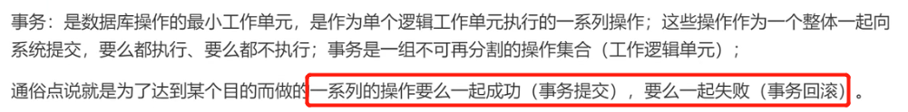

# spring

 

# bean实例化

*  现在一般用注解方式自动装配bean对象

## bean实例化 模拟

* 定义DAO
~~~java
public class UserDao {
    public void test(){
        System.out.println("UserDao类");
    }
}
~~~

* 定义dao的bean标签
~~~xml
<?xml version="1.0" encoding="UTF-8"?>
<beans>
    <bean id="userDao" clazz="com.zh.dao.UserDao"></bean>
    <bean id="userService" clazz="com.zh.service.UserService"></bean>
</beans>
~~~

* 定义Bean实体类，用于存放id和class属性
~~~java
/**
 * @description: Bean属性对象，用来存放配置文件中的bean标签和class属性值
 */
@Data
@AllArgsConstructor
@NoArgsConstructor
public class MyBean {
    private String id;
    private String clazz;
}
~~~

* 定义一个工厂接口 BeanFactory 和抽象方法 getBean()，用于获取bean的实例化对象
~~~java
//工厂模式：自定义工具类
public interface MyFactory {
    //通过id属性值获取实例化对象
    public Object getBean(String id);
}
~~~

* 定义工厂接口实现类 MyClassPathXmlApplication，实现MyFactory工厂接口
~~~java
/**
 *  工厂接口实现类
 * 1. 通过构造器的形参传递要解析的配置文件
 * 2. 解析配置文件，得到对应的bean标签的 id与class的属性值，并设置到对应的bean对象中，存放到List集合
 * 3. 遍历List集合，得到每个Bean对象，得到class属性对应的实例化对象，并设置到map中，通过id实例化bean对象
 * 4. 通过getBean方法，从map对象中通过id获取指定value，value就是实例化的对象
 */
public class MyClassPathXmlApplication implements MyFactory{

    //定义map对象，用来存放id属性与对应class属性实例化好的bean对象
    private Map<String,Object> beanMap = new HashMap<>();

    //定义List集合，用来存放myBean对象（myBean是用来存放bean标签的id和对应的class属性值）
    private List<MyBean> beanList = null;

    /**
     * 有参构造
     * 1. 通过构造器的形参传递要解析的配置文件名
     *
     * */
    public MyClassPathXmlApplication(String fileName) {

        /*解析配置文件方法*/
        parseXml(fileName);

        /*得到实例化对象*/
        instanceBean();
    }
    
    /**
     * 2. 解析配置文件，得到对应的bean标签的id与class的属性值，并设置到对应的bean对象中，存放到List集合
     *
     * */
    private void parseXml(String fileName) {

        try {
            //得到解析器
            SAXReader reader = new SAXReader();
            //得到配置文件对应的URL
            URL url = this.getClass().getClassLoader().getResource(fileName);
            //解析配置文件，得到Document对象
            Document document = reader.read(url);
            //XPath 使用路径表达式来选取 XML文档中的节点或节点集；定义XPath语法，获取beans标签下的所有子元素bean标签
            XPath xPath = document.createXPath("beans/bean");
            //通过xpath语法，得到对应的bean标签，返回Element集合
            List<Element> elementList = xPath.selectNodes(document);
            //判断集合是否为空
            if (elementList != null && elementList.size() > 0){
                //实例化List集合
                beanList = new ArrayList<>();
                //遍历Element集合，得到Element对象，得到对应的属性值
                for (Element element : elementList) {
                    String id = element.attributeValue("id");
                    String clazz = element.attributeValue("clazz");
                    //将id、clazz放入MyBean对象
                    MyBean myBean = new MyBean(id, clazz);
                    beanList.add(myBean);
                }
            }

        } catch (DocumentException e) {
            e.printStackTrace();
        }
    }
    /**
     * 3. 遍历List集合，得到每个Bean对象，得到class属性对应的实例化对象，并设置到map中，通过id实例化bean对象
     *
     * */
    private void instanceBean() {
        try {
            //判断beanList是否为空，并遍历
            if (beanList != null && beanList.size() > 0){
                for (MyBean myBean : beanList) {
                    String id = myBean.getId();
                    String clazz = myBean.getClazz();
                    //通过反射，实例化指定class属性值对应的Bean对象
                    Object object = Class.forName(clazz).newInstance();
                    //将id值与实例化好的bean对象，设置到map中
                    beanMap.put(id,object);
                }
            }
        }catch (Exception e){
            e.printStackTrace();
        }

    }

    /**
     * 4. 通过getBean方法，从map对象中通过id获取指定value，value就是实例化的对象
     *
     * */
    @Override
    public Object getBean(String id) {
        //通过id，从map对象获取对应的实例对象
        Object object = beanMap.get(id);
        return object;
    }
}
~~~

* 客户端
~~~java
public class com.zh.starter.Starter {
    public static void main(String[] args) {

        //得到spring上下文环境，ApplicationContext接口代表SpringIOC容器，负责实例化、配置和组装Bean
        BeanFactory ac = new ClassPathXmlApplicationContext("spring.xml");
        //得到被实例化的对象
        UseService us = (UseService) ac.getBean("useService");
        us.test1();
    }
}
~~~

## bean实例化（三种方式）

### 默认无参构造器

~~~text
在xml配置文件中，配置bean标签，id表示需要实例化的bean对象id，class表示类路径

注意：使用默认无参构造器创建时，空构造方法必须存在，否则创建失败
得到spring上下文环境，ApplicationContext 或 BeanFactory接口代表SpringIOC容器，并负责实例化、配置和组装Bean
~~~

~~~xml
<bean id="useService" class="com.zh.service.UseService"></bean>
~~~

* 客户端 获取实例化对象
~~~java
BeanFactory ac = new ClassPathXmlApplicationContext("spring.xml");
UseService us = (UseService) ac.getBean("useService");
us.test1();
~~~

### 静态方法 了解

~~~text
当我们指定Spring使用静态工厂方法创建Bean对象时，Spring将先解析配置文件，并根据配置文件指定的信息，通过反射调用静态工厂类的静态工厂方法，并将该静态方法的返回值作为Bean实例。
在这个过程中，Spring不再负责创建Bean实例，Bean实例是由用户提供的静态工厂方法提供的。
~~~

* 定义静态工厂类，里面有一个静态方法，返回值类型为bean对象
~~~java
public class StaticFactory {
    /**
     *@描述 定义静态方法，返回需要实例化的Bean对象
     */
    public static AccountService accountService(){
        return new AccountService();
    }
}
~~~

~~~text
class：静态工具类路径
factory-method：返回的bean实例化对象
~~~
~~~xml
<!--静态工厂实例化 加载Bean对象-->
<bean id="accountService" class="com.zh.factory.StaticFactory" factory-method="accountService"/>
~~~

### 实例化工厂 了解

* 与静态工厂实例化区别
~~~text
工厂方法为非静态方法
需要配置工厂bean，并在业务bean中配置factory-bean，factory-method属性
~~~

* 定义工厂类，返回bean实例化对象
~~~java
public class InstanceFactory {
    public UseService useService(){
        return new UseService();
    }
}
~~~

* xml文件实例化，以com.zh.factory.InstanceFactory为例

~~~xml

<!--定义实例化工厂bean，引用bean 指定工厂方法（方法为非静态）-->
<bean id="instanceFactory" class="com.zh.factory.InstanceFactory"></bean>
<bean id="useService" factory-bean="instanceFactory" factory-method="useService"></bean>
~~~

# 依赖注入 DI

## 手动注入

### set方法注入

* 定义Dao
~~~java
public class TypeDao {

    public void test1() {
        System.out.println("TypeDao...");
    }
}
~~~

* 定义Service，service层定义Dao类型变量，提供set方法，手动注入bean对象
~~~java
public class TypeService {

    //bean对象
    private TypeDao typeDao;

    /**
     * set方法注入，需要给属性字段提供set方法
     * */
    public void setTypeDao(TypeDao typeDao) {
        this.typeDao = typeDao;
    }

    public void test() {
        System.out.println("TypeService....业务类");
        typeDao.test1();
    }
}
~~~

* 对应spring02.xml配置
~~~xml
<?xml version="1.0" encoding="UTF-8"?>
<beans xmlns="http://www.springframework.org/schema/beans"
       xmlns:xsi="http://www.w3.org/2001/XMLSchema-instance"
       xsi:schemaLocation="http://www.springframework.org/schema/beans http://www.springframework.org/schema/beans/spring-beans.xsd">

    <bean id="typeDao" class="com.zh.dao.TypeDao"/>
    <bean id="typeService" class="com.zh.service.TypeService">
        <!--set方法注入，通过property属性实现set方法注入-->
        <property name="typeDao" ref="typeDao"/>
    </bean>
</beans>
~~~

### 构造器注入（循环依赖）

~~~text
构造器注入 存在 循环依赖 的问题（两个bean对象互相注入），最好使用set方法注入

从源码解决 通过三级缓存解决 循环依赖
~~~

* service类定义 带参构造器
~~~java
public class TypeService {

    //bean对象
    private TypeDao typeDao;
    
    /**
     * 构造器注入
     * */
    public TypeService(TypeDao typeDao) {
        this.typeDao = typeDao;
    }
    
    /**
     * set方法注入，需要给属性字段提供set方法
     * */
    public void setTypeDao(TypeDao typeDao) {
        this.typeDao = typeDao;
    }
    public void test() {
        System.out.println("TypeService....业务类");
        typeDao.test1();
    }
}
~~~

* xml配置文件的bean标签内添加 constructor-arg 构造函数标签
~~~xml
<?xml version="1.0" encoding="UTF-8"?>
<beans xmlns="http://www.springframework.org/schema/beans"
       xmlns:xsi="http://www.w3.org/2001/XMLSchema-instance"
       xsi:schemaLocation="http://www.springframework.org/schema/beans http://www.springframework.org/schema/beans/spring-beans.xsd">

    <bean id="typeDao" class="com.zh.dao.TypeDao"/>
    
    <bean id="typeService" class="com.zh.service.TypeService">
        <!--构造函数注入bean对象-->
        <constructor-arg name="typeDao" ref="typeDao"/>
    </bean>
</beans>
~~~

## 自动注入

* 注解方式注入bean
~~~text
对于bean的注入，除了使用xml配置外，可以使用注解配置。注解的配置，可以简化配置文件，提高开发速度，使程序看上去更加简洁。
对于注解的解释，Spring对于注解的解释有专门的解释器，对定义的注解进行解析，实现对应bean对象的注入。通过反射技术实现。
~~~

### @Resource
~~~text
默认会根据bean标签的 id属性值（属性名称） 查找，如果属性名称未找到，会根据类型（class）查找

如果注入的是接口，接口只有一个实现类时，能正常注入；如果接口有多个实现类，则需要使用name属性设置对应id值
~~~

* xml文件配置（UserDao01 UserDao02 实现IUserDao接口）
~~~xml
<bean id="userDao01" class="com.zh.dao.UserDao01"/>
<bean id="userDao02" class="com.zh.dao.UserDao02"/>
~~~

* service层配置
~~~java
@Resource(name = "userDao02")
private IUserDao iUserDao;
~~~

### @Autowired
~~~text
默认通过 类型（Class） 查找Bean对象，与属性字段的名称无关

属性可以提供set方法，也可以不提供set方法，注解可以声明在属性级别或set方法级别

可以添加 @Qualifier 结合使用，通过value属性值查找bean对象（value属性值必须设置，且值要与bean标签的id属性值对应）
~~~

* service层定义 bean对象别名
~~~java
    //bean对象
    @Autowired
    @Qualifier("td") //id属性值对应
    private TypeDao typeDao;
~~~

* xml文件配置
~~~xml
<bean id="td" class="com.zh.dao.TypeDao"/>
~~~

## IOC扫描器（自动实例化）

* 扫描器说明
~~~text
作用：对bean对象统一进行管理，简化开发配置，提高开发效率

1. 设置自动化扫描的范围
    如果bean对象未在指定包范围，即使声明了注解，也无法实例化

2. 使用指定的注解（声明在类级别）  bean对象的id属性默认是：类的首字母小写
    DAO层：@Repository
    Service层：@Service
    Controller：@Controller
    任意类：@Component
~~~

* 在xml配置 自动扫描IOC的bean对象
~~~xml
    <!--开启自动扫描，设置扫描包的范围-->
    <context:component-scan base-package="com.zh"/>
~~~

# bean作用域

## singleton 单例模式
~~~text
默认情况下，Spring容器中加载Bean对象都是单例作用域
Spring容器在启动时会实例化bean对象，并将对象设置到单例缓存池中，下次获取时直接从缓存池中得到
~~~

~~~xml
<bean id="typeDao" class="com.zh.dao.TypeDao" scope="singleton" lazy-init="false"/>
~~~

* 懒加载
~~~text
lazy-init属性，表示懒加载，默认为false，即Spring容器启动时实例化
如果为true，表示容器在启动时不会自动实例化这个Bean对象，而是在程序调用时才会去实例化
~~~

* 验证懒加载
~~~xml
<!--
添加init-method属性，当该bean对象被实例化时调用的方法

lazy-init=“true” 开启懒加载
-->

<bean id="typeDao" class="com.zh.dao.TypeDao" scope="singleton" init-method="test1" lazy-init="true"/>
~~~

当bean对象typeDao被初始化时，init-method后面定义的方法就会被调用

* lazy-init属性默认为false的好处?
~~~text
可以提前发现配置的潜在问题
Bean对象存在于缓存中，使用时不用再去实例化bean，加快程序运行效率
~~~

## prototype 原型作用域
~~~text
Spring容器启动时会实例化bean对象，不会将对象放到单例缓存池中，每次请求都会重新创建一个新的Bean对象
~~~

~~~xml
<!--原型作用域-->
<bean id="typeDao" class="com.zh.dao.TypeDao" scope="prototype" lazy-init="false"/>
~~~

* 原型作用域，实例化两次bean对象，获得两个bean对象

# bean生命周期

~~~text
在Spring中，Bean的生命周期包括Bean的 实例化、属性赋值、初始化、销毁
~~~

* bean初始化两种方式
~~~text
方式一：bean标签内 用 init-method 定义初始化方法
方式二：实现 初始化bean接口（InitializingBean），重写里面的方法（afterPropertiesSet()）
~~~

### bean初始化 方式一

* 在bean标签配置 init-method属性 来指定初始化时调用的方法
~~~xml
<!--通过init-method属性指定初始化方法-->
<bean id="typeDao" class="com.zh.dao.TypeDao" scope="singleton" init-method="test1" lazy-init="true"/>
~~~

~~~java
public class TypeDao {
    //定义初始化时被调用的方法
    public void test1() {
        System.out.println("TypeDao...");
    }
}
~~~

* xml配置文件 bean标签

### bean初始化 方式二

* 实现 import org.springframework.beans.factory.InitializingBean 接口

~~~java
public class TypeDao implements InitializingBean {

    @Override
    public void afterPropertiesSet() throws Exception {
        System.out.println("实现 InitializingBean 初始化Bean ，重写afterPropertiesSet方法，初始化Bean");
    }
}
~~~

### bean调用

* 使用bean工厂（BeanFactory） 或 应用上下文（ApplicationContext）
~~~java
//得到spring上下文环境
BeanFactory beanFactory = new ClassPathXmlApplicationContext("spring04.xml");

ApplicationContext applicationContext = new ClassPathXmlApplicationContext("spring04.xml");
~~~

* ApplicationContext 接口间接继承 BeanFactory

### bean销毁
~~~text
bean标签内指定销毁方法
~~~

* bean标签添加 destroy-method 属性，指定销毁方法
~~~xml
<!--bean对象销毁方法 destroy-method-->
<bean id="typeDao" class="com.zh.dao.TypeDao" destroy-method="destroy"/>
~~~

* 通过调用AbstractApplicationContext接口的close方法销毁bean对象
~~~java
AbstractApplicationContext aac = new ClassPathXmlApplicationContext("spring04.xml");
aac.close();
~~~

# spring Task 定时任务

~~~text
方式一、在配置文件的 task标签 定义定时任务

方式二、在配置文件中 开启定时任务驱动，定时任务类上添加 @Scheduled 注解
~~~

* cron 时间表达式
~~~xml
<?xml version="1.0" encoding="UTF-8"?>
<beans xmlns="http://www.springframework.org/schema/beans"
       xmlns:xsi="http://www.w3.org/2001/XMLSchema-instance"
       xmlns:task="http://www.springframework.org/schema/task"
       xsi:schemaLocation="http://www.springframework.org/schema/beans
       http://www.springframework.org/schema/beans/spring-beans.xsd
       http://www.springframework.org/schema/task
       http://www.springframework.org/schema/task/spring-task.xsd">
    
        <!--定义定时任务-->
        <task:scheduled-tasks>
            <task:scheduled ref="taskJob" method="job1" cron="0/2 * * * * ?"/>
            <task:scheduled ref="taskJob" method="job2" cron="0/5 * * * * ?"/>
        </task:scheduled-tasks>

        <!--开启定时任务驱动，spring识别 @Scheduled 注解-->
        <task:annotation-driven/>
</beans>
~~~

* 定义定时任务类
~~~java
@Component //将该对象交给IOC容器进行实例化
public class TaskJob {

    public void job1(){
        System.out.println("job1时间："+new SimpleDateFormat("yyyy-MM-dd HH:mm:ss").format(new Date()));
    }

    public void job2(){
        System.out.println("job2时间："+new SimpleDateFormat("yyyy-MM-dd HH:mm:ss").format(new Date()));
    }
}
~~~

* 定义在定时类方法上
~~~java
@Component //将该对象交给IOC容器进行实例化
public class TaskJob02 {

    @Scheduled(cron="0/2 * * * * ?")
    public void job1(){
        System.out.println("job01时间："+new SimpleDateFormat("yyyy-MM-dd HH:mm:ss").format(new Date()));
    }

    @Scheduled(cron="0/5 * * * * ?")
    public void job2(){
        System.out.println("job02时间："+new SimpleDateFormat("yyyy-MM-dd HH:mm:ss").format(new Date()));
    }
}
~~~

# 动态代理

* 代理模式
~~~text
为某一个对象（目标类）提供一个代理（代理类），用来控制这个对象的访问。目标类和代理类有一个共同的父类或父接口。代理类会对请求做预处理、过滤，将请求分配给指定对象

代理模式在java开发中是一种比较常见的设计模式。设计目的旨在为服务类和客户类之间插入其他功能，插入的功能对于调用者是透明的，起到伪装控制的作用。

如住房的例子：客户、中介、房东；对应于代理模式中即：客户类、代理类、目标类（委托类）
~~~

* 代理模式设计原则
~~~text
代理类 和 目标类 具有相似的行为（共有）
代理类 增强 目标类的行为
~~~

## 静态代理

~~~text
某个对象提供一个代理，代理角色固定，以控制对这个对象的访问。代理类和委托类有共同的父类或父接口，这样在任何使用委托类对象的地方都可以用代理对象替代。
代理类负责请求的预处理、过滤，将请求分派给委托类处理、以及委托类执行完请求后的后续处理。
~~~

* 静态代理 提供父类或父接口
~~~java
public interface RentHouse {

    public void toRentHouse();
}
~~~

* 目标类
~~~java
public class You implements RentHouse{
    @Override
    public void toRentHouse() {
        System.out.println("目标对象，租到房子");
    }
}
~~~

* 代理类
~~~java
/**
 * 1. 实现行为
 * 2. 增强目标对象行为
 * */
public class AgencyProxy implements RentHouse{

    //目标对象
    private RentHouse rentHouse;
    //有参构造函数，传入目标对象
    public AgencyProxy(RentHouse rentHouse) {
        this.rentHouse = rentHouse;
    }

    @Override
    public void toRentHouse() {
        System.out.println("中介找房");
        rentHouse.toRentHouse();
        System.out.println("中介收钱");
    }
}
~~~

* 测试类
~~~java
public class com.zh.starter.StarterProxy {
    public static void main(String[] args) {
        AgencyProxy proxy = new AgencyProxy(new You());
        proxy.toRentHouse();
    }
}
~~~

* 测试结果
  

## 动态代理

~~~text
相比于静态代理，动态代理在创建代理对象上更加灵活，动态代理类的字节码在程序运行时，由Java反射机制动态产生。
它会根据需要，通过反射机制在程序运行期，动态的为目标对象创建代理对象，无需程序员手动编写源码。动态代理不仅简化了编程工作，
而且提高了软件系统的可扩展性，因为反射机制可以生成任意类型的动态代理类。代理的行为可以代理多个方法，即满足产生需要的同时又达到代码通用的的目的。
~~~

* 动态代理特点
~~~text
1. 目标对象不固定
2. 在应用程序执行时动态创建目标对象
3. 代理对象会增强目标对象的行为
~~~

### JDK动态代理 

~~~text
需要使用JDK动态代理的类，必须要有接口实现
~~~

* newProxyInstance

~~~text
Proxy类是专门完成代理的操作类，可以通过此类为一个或多个接口动态地生成实现类，此类提供了如下操作方法
~~~

~~~java
public static Object newProxyInstance(ClassLoader loader,Class<?>[] interfaces,InvocationHandler h)
~~~

* 理解

~~~text
返回一个指定接口的代理类的实例方法调用分派到指定的调用处理程序，（返回代理对象）

    loader：一个ClassLoader对象，定义了由哪个ClassLoader对象来对生成的代理对象加载
    
    interfaces：一个Interface对象的数组，表示的是我将要给我需要代理的对象提供一组什么接口，如果我提供了一组接口给它，
        那么这个代理对象就宣称实现了该接口（多态），这样我就能调用这组接口中的方法
        
    h：一个InvocationHandler接口，表示代理实例的调用处理程序实现的接口。每个代理实例都具有一个关联的调用处理程序。对代理实例调用方法时，
        将对方法调用进行编码并将其指派到它的调用处理程序的 invoke 方法（传入InvocationHandler接口）
~~~

1. 定义RentHouse接口和两个抽象方法
~~~java
public interface RentHouse {

    public void toRentHouse();

    public String toRentHouse2(String name);
}
~~~

2. 定义目标类，实现接口，重写方法
~~~java
public class You implements RentHouse{
    @Override
    public void toRentHouse() {
        System.out.println("目标对象，租到房子");
    }

    @Override
    public String toRentHouse2(String name) {
        System.out.println(name+"目标对象，租到房子");
        return "result01";
    }
}
~~~

3. 定义JDK动态 代理类
~~~java
public class JdkDynamicProxy {

    //目标对象
    private Object target;
    
    //带参构造传递目标对象
    public JdkDynamicProxy(Object target) {
        this.target = target;
    }

    /**
     * 得到代理对象
     * */
    public Object getProxy(){
        Object object = null;
        /**
         * 通过调用Proxy代理类中的静态方法 newProxyInstance()，得到代理对象
         * */

        //定义了由哪个ClassLoader对象来生成的代理对象进行加载
        ClassLoader classLoader = this.getClass().getClassLoader();
        //要代理的对象提供一组什么接口
        Class[] interfaces = target.getClass().getInterfaces();
        
        //一个InvocationHandler接口，表示代理实例的调用处理程序实现的接口
        InvocationHandler invocationHandler = new InvocationHandler() {
            /**
             * 注：当代理对象被调用时 invoke方法会被调用一次
             * 
             * Object 代理对象
             * Method 目标对象方法
             * Object[] 目标方法需要的参数
             * */
            @Override
            public Object invoke(Object proxy, Method method, Object[] args) throws Throwable {
                System.out.println(method.getName());//toRentHouse
                System.out.println(args.length);
                System.out.println(args[0]);
                System.out.println("invoke...调用");

                /**
                 *  反射 invoke方法 调用目标对象方法
                 *  方法名.invoke(对象,方法需所需参数)
                 * */
                Object result = method.invoke(target, args);

                System.out.println("result："+result);
                return result;
            }
        };

        //调用方法，得到代理对象
        object = Proxy.newProxyInstance(classLoader, interfaces, invocationHandler);

        return object;
    }
}
~~~

4. 测试类
~~~java
public class com.zh.starter.StarterJdkDynamicProxy {
    public static void main(String[] args) {
        //目标对象有返回值
        RentHouse target2 = new You();
        //动态代理类对象
        JdkDynamicProxy jdkDynamicProxy2 = new JdkDynamicProxy(target2);
        //得到代理对象
        RentHouse object2 = (RentHouse) jdkDynamicProxy2.getProxy();
        //代理对象调用
        object2.toRentHouse2("张三");

    }
~~~

5. 结果

### CGLIB 动态代理

~~~text
继承思想，代理类是目标类的子类，代理类对目标类中的方法进行重写

JDK的动态代理机制只能代理实现了接口的类，而不能实现接口的类就不能使用JDK的动态代理，CGLIB是针对类来实现代理的，
它的原理是对指定的目标类生成一个子类，并覆盖其中方法实现增强，但因为采用的是继承，所以不能对final修饰的类进行代理。
~~~

1. 定义没有接口实现的目标类
~~~java
public class User {

    public void toMarry(){
        System.out.println("结婚了");
    }
}
~~~

2. 定义 CglibDynamicProxy 动态代理类
~~~java
public class CglibProxy {

    //目标对象
    private Object target;

    //通过带参构造器 获取目标对象
    public CglibProxy(Object target) {
        this.target = target;
    }

    /**
     * 获取代理对象
     *
     * */
    public Object getProxy(){
        //通过Enhancer对象的create()方法可以生成一个类，用于生成代理对象
        Enhancer enhancer = new Enhancer();
        //设置当前类的父类（将目标类作为代理类父类）
        enhancer.setSuperclass(target.getClass());
        //定义 方法拦截器
        MethodInterceptor interceptor = new MethodInterceptor() {
            /**
             * 代理过程 当代理对象调用方法时 intercept()方法会被执行
             * o 由CGLIB动态生成的代理类实例
             * method 目标方法
             * objects 方法所需要的参数
             * methodProxy 代理对象对方法的引用
             * */
            @Override
            public Object intercept(Object o, Method method, Object[] objects, MethodProxy methodProxy) throws Throwable {
                System.out.println("CGLIB...指定方法执行前");
                Object result = method.invoke(target, objects);
                System.out.println("CGLIB...指定方法执行后");
                return result;
            }
        };

        //设置拦截过程（调用目标对象的方法、增强用户行为）
        enhancer.setCallback(interceptor);

        //生成一个类
        return enhancer.create();
    }
}
~~~

3. 测试
~~~java
public class CglibTest {
    public static void main(String[] args) {
        
        //目标对象
        User user = new User();
        //代理类
        CglibProxy cglibProxy1 = new CglibProxy(user);
        //代理对象
        User user1 = (User) cglibProxy1.getProxy();
        //调用
        user1.toMarry();
    }
}
~~~

4. 测试结果 

# Spring AOP

* 什么是AOP
~~~text
面向切面编程，相比较oop面向对象编程来说，AOP关注的不再是程序代码中某个类，某些方法，而aop考虑的更多是一种面到面的切入，
即层与层之间的一种切入，所以称为切面。
~~~

* AOP能做什么
~~~text
AOP主要应用于日志记录、性能统计、安全控制、事务处理等方面，实现公共功能性的重复使用
~~~

* AOP的特点
~~~text
1. 降低模块与模块之间的耦合度，提高业务代码的聚合度。（高内聚低耦合）
2. 提高代码的复用性
3. 提高系统的扩展性。（高版本兼容低版本）
4. 可以在不影响原有的功能基础上添加新的功能
~~~

* AOP底层和实现
~~~text
动态代理（JDK+CGLIB）
~~~

## AOP基本概念

* Joinpoint 连接点
~~~text
被拦截的每个点，spring中指被拦截到的每一个方法，spring aop一个连接点即代表一个方法的执行
~~~

* Pointcut 切入点
~~~text
对连接点进行拦截的定义（匹配规则定义 规定拦截哪些方法，对哪些方法进行处理），spring有专门的表达式语言定义
~~~

* Advice 通知
~~~text
拦截到每个连接点即（每个方法）后所要做的操作

1. 前置通知 （前置增强）  before()    执行方法前通知
2. 返回通知（返回增强）   afterReturn()   方法正常结束返回后的通知
3. 异常抛出通知（异常抛出增强）   afterThrow()
4. 最终通知     after()     无论方法是否发生异常，均会执行该通知
5. 环绕通知     round()     包围一个连接点（join point）的通知，如方法调用。这是最强大的一种通知类型。环绕通知可以在方法调用前后完成自定义的行为。
                           它也会选择是否继续执行连接点或直接返回它们自己的返回值或抛出异常来结束执行。
~~~

* Aspect 切面
~~~text
切入点与通知的结合，决定了切面的定义，切入点定义了要拦截哪些类的哪些方法，通知则定义了拦截过方法后要做什么，切面则是横切关注点的抽象，
与类相似，类是对物体特征的抽象，切面则是横切关注点抽象。
~~~

* Target 目标对象
~~~text
被代理的目标对象
~~~

* Weave 织入
~~~text
将切面应用到目标对象并生成代理对象的这个过程即为织入
~~~

* Introduction 引入
~~~text
在不修改原有应用程序代码的情况下，在程序运行期为类动态添加方法或者字段的过程称为 引入
~~~

## AOP实现

* 注解方法实现 

1. 添加AOP依赖
~~~xml
<dependency>
  <groupId>org.aspectj</groupId>
  <artifactId>aspectjweaver</artifactId>
  <version>1.9.5</version>
</dependency>
~~~

2. xml配置文件中添加 aop相关命名空间，包括开启AOP自动代理注解
~~~xml
<beans xmlns="http://www.springframework.org/schema/beans"
       xmlns:xsi="http://www.w3.org/2001/XMLSchema-instance"
       xmlns:aop="http://www.springframework.org/schema/aop"
       xsi:schemaLocation="http://www.springframework.org/schema/beans
       http://www.springframework.org/schema/beans/spring-beans.xsd
       http://www.springframework.org/schema/aop
       http://www.springframework.org/schema/aop/spring-aop.xsd">

  <!--开启自动扫描，设置扫描包的范围-->
  <context:component-scan base-package="com.zh"/>

  <!--注解实现：AOP自动代理-->
  <aop:aspectj-autoproxy/>
  
</beans>
~~~

3. 定义一个日志切面类，用于监控AddService类
~~~java
/**
 * 切面是切入点与通知的结合
 *     切入点：定义规则，定义切面要拦截哪些类哪些方法
 *     通知：方法拦截后要做什么事情
 * */
@Component //将类交给IOC容器实例化
@Aspect //声明当前类是一个切面类
public class LogCut {

    /**
     * 定义切入点，通过 @Pointcut()注解 定义规则
     * 注：规则表达式的第一个位置表示方法的修饰范围
     *
     * 1.拦截所有的方法
     *     @Pointcut("execution(* *(..))")
     * 2.拦截所有共有的set方法
     *     @Pointcut("execution(public set*(..))")
     * 3.拦截 com.zh.service 包及其子包下面的所有类和所有方法
     *     @Pointcut("execution(* com.zh.service..*.*(..))")
     * 4.拦截 com.zh.service 包下面的所有类和所有方法
     *     @Pointcut("execution(* com.zh.service.*.*(..))")
     * */
    @Pointcut("execution(* com.zh.service.*.*(..))")
    public void cut(){
        System.out.println("cut...切面方法");
    }

    /**
     * 前置通知，应用在指定切点上，在目标方法执行前执行
     *
     * */
    @Before("cut()")
    public void before(){
//        System.out.println("前置通知...before");
    }

    /**
     * 返回通知，应用在指定切点上，在目标方法（无异常）返回后执行
     * */
    @AfterReturning("cut()")
    public void afterReturn(){
//        System.out.println("后置通知...afterReturn");
    }

    /**
     * 最终通知
     * */
    @After("cut()")
    public void after(){
//        System.out.println("最终通知...after");
    }

    @AfterThrowing(value = "cut()",throwing = "e")
    public void afterThrow(Exception e){
//        System.out.println("异常通知，原因："+e.getMessage());
    }

    /**
     * 环绕通知，需要显式调用对应的方法，否则无法指定方法（pjp.proceed()）
     *
     * */
    @Around("cut()")
    public Object around(ProceedingJoinPoint pjp){

        System.out.println("前置通知");
        Object result = null;

        try {
            result = pjp.proceed();
            System.out.println(pjp.getTarget());
            System.out.println(pjp.getSignature());
            System.out.println("返回通知");
        } catch (Exception e){
            System.out.println("异常通知..."+e.getMessage());
        } catch (Throwable throwable) {
            throwable.printStackTrace();
        } finally {
            System.out.println("最终通知");
        }

        return result;
    }
}
~~~

# spring 事务

* 事务概念

* 例子

## 事务四大特征

## 脏读、幻读、不可重复读

### 脏读（读取未提交数据）
~~~text
指当一个事务正字访问数据，并且对数据进行了修改，而这种数据还没有提交到数据库中，这时，另外一个事务也访问这个数据，然后使用了这个数据。
因为这个数据还没有提交那么另外一个事务读取到的这个数据我们称之为脏数据。依据脏数据所做的操作肯能是不正确的
~~~

### 不可重复读（前后多次读，数据内容不一致）
~~~text
指在一个事务内，多次读同一数据。
在这个事务还没有执行结束，另外一个事务也访问该同一数据，那么在第一个事务中的两次读取数据之间，由于第二个事务的修改 第一个事务两次读到的数据可能是不一样的，
这样就发生了在一个事物内两次连续读到的数据是不一样的，这种情况被称为是不可重复读
~~~

### 幻读（前后多次读，数据数量不一致）
~~~text
一个事务先后读取一个范围的记录，但两次读取的纪录数不同，我们称之为幻象读（两次执行同一条 select 语句会出现不同的结果，第二次读会增加一数据行，并没有说这两次执行是在同一个事务中）
~~~

* 总结
~~~text
不可重复读 的重点在 修改，在同一事务中，同样的条件，第一次读取的数据和第二次读取的 数据不一样（因为中间有其他事务提交了修改）
幻读 的重点在 删除和插入，在同一事务中，同样的条件，第一次读取的记录数第二次读取的 记录数不一致（因为中间有其他事务提交了插入和删除操作）
~~~

## 事务的隔离级别

~~~text
事务的隔离级别也分为四种，由低到高依次分别为：read uncommited（读未提交）、read commited（读提交）、read repeatable（读重复）、serializable（序列化），这四个级别可以逐个解决脏读、不可重复读、幻读这几类问题
~~~

### read uncommitted（未提交读）
~~~text
最低的事务隔离级别，它允许另外一个事务可以看到这个事务未提交的数据
脏读，不可重复读，虚读都有可能发生
~~~

### read committed（提交读）
~~~text
保证一个事物提交后才能被另外一个事务读取。另外一个事务不能读取该事物未提交的数据 避免脏读。
但是不可重复读和虚读有可能发生
~~~

### read repeatable（重复读）
~~~text
这种事务隔离级别可以防止脏读，不可重复读。但是可能会出现幻读。它除了保证一个事务不能被另外一个事务读取未提交的数据之外还避免了不可重复读
~~~

### serializable（序列化）
~~~text
这是花费最高代价但最可靠的事务隔离级别。事务被处理为顺序执行。除了防止脏读，不可重复读之外，还避免了幻象读
~~~

* 总结
~~~text
大多数数据库默认事务隔离级别是 Read Committed（提交读），如Sql Server，Oracle
Mysql默认隔离级别更高，为 Read repeatable（重复读），避免脏读和不可重复读
~~~

# 面试

## Spring是什么?
~~~text
Spring是一个轻量级的IoC和AOP容器框架
~~~

## 七大模块

## 为什么使用Spring？
~~~text
1、方便解耦，简化开发
    通过Spring提供的IoC容器，可以将对象之间的依赖关系交由Spring进行控制，避免硬编码所造成的过度程序耦合

2、AOP编程的支持
    通过Spring提供的AOP功能，方便进行面向切面的编程，如权限控制、事务管理、日志管理等

3、声明式事务的支持
4、方便集成各种优秀框架
~~~

## 什么是AOP，为什么使用AOP？
~~~text
AOP，面向切面编程，就是把可重用的功能提取出来，然后将这些通用功能在合适的时候织入到应用程序中，比如事务管理、权限控制、日志记录、性能统计等
AOP并没有帮助我们解决任何新的问题，它只是提供了一种更好的办法，能够用更少的工作量来解决现有的一些问题，使得系统更加健壮，可维护性更好
~~~

## 什么是Spring的事务管理？
~~~text
 事务就是对一系列的数据库操作（比如插入多条数据）进行统一的提交或回滚操作，如果插入成功，那么一起成功，如果中间有一条出现异常，那么回滚之前的所有操作。
 这样可以防止出现脏数据，防止数据库数据出现问题。开发中为了避免这种情况一般都会进行事务管理。
 Spring的声明式事务通常是指在配置文件中对事务进行配置声明，其中包括了很多声明属性，它是通过Spring Proxy帮你做代理，自己不用额外的写代码，只要在Spring配置文件中声明即可；通常用在数据库的操作里面

Spring中也有自己的事务管理机制，一般是使用TransactionMananger进行管理，可以通过Spring的注入来完成此功能
~~~ 

## BeanFactory 和 ApplicationContext 有什么区别
~~~text
BeanFactory和ApplicationContext是Spring的两大核心接口，都可以当做Spring的容器

1、BeanFactory是Spring里面最底层的接口，是IoC的核心，定义了IoC的基本功能，包含了各种Bean的定义、加载、实例化，依赖注入和生命周期管理。ApplicationContext接口作为BeanFactory的子类，除了提供BeanFactory所具有的功能外，还提供了更完整的框架功能

2、BeanFactory采用的是 懒加载 形式来注入Bean的，只有在使用到某个Bean时(调用getBean())，才对该Bean进行加载实例化。不能提前发现一些存在的Spring的配置问题。
   ApplicationContext，它是在容器启动时，一次性创建了所有的Bean。这样有利于检查所依赖属性是否注入。不足是占用内存空间，当应用程序配置Bean较多时，程序启动较慢。
~~~

## Spring框架中的Bean是线程安全的么？如果线程不安全，那么如何处理？
~~~text
1、对于原型作用域，每次都创建一个新对象，也就是线程之间不存在Bean共享，因此不会有线程安全问题。

2、对于单例作用域的Bean，所有的线程都共享一个单例实例的Bean，因此是存在线程安全问题的。但是如果单例Bean是一个无状态Bean，也就是线程中的操作不会对Bean的成员执行查询以外的操作，那么这个单例Bean是线程安全的。比如Controller类、Service类和Dao等，这些Bean大多是无状态的，只关注于方法本身。
~~~

## Spring如何解决循环依赖？

* 循环依赖问题在Spring中主要有三种情况
~~~text
（1）通过构造方法进行依赖注入时产生的循环依赖问题
（2）通过setter方法进行依赖注入且是在多例（原型）模式下产生的循环依赖问题
（3）通过setter方法进行依赖注入且是在单例模式下产生的循环依赖问题
~~~

* 在Spring中，只有第（3）种方式的循环依赖问题被解决了，其他两种方式在遇到循环依赖问题时都会产生异常。这是因为
~~~text
第一种构造方法注入的情况下，在new对象的时候就会堵塞住了，其实也就是”先有鸡还是先有蛋“的历史难题

第二种setter方法（多例）的情况下，每一次getBean()时，都会产生一个新的Bean，如此反复下去就会有无穷无尽的Bean产生了，最终就会导致OOM问题的出现

Spring在单例模式下的setter方法依赖注入引起的循环依赖问题，主要是通过二级缓存和三级缓存来解决的，其中三级缓存是主要功臣。
解决的核心原理就是：在对象实例化之后，依赖注入之前，Spring提前暴露的Bean实例的引用在第三级缓存中进行存储
~~~

## Spring事务的实现方式和实现原理
~~~text
Spring事务的本质其实就是数据库对事务的支持，没有数据库的事务支持，spring是无法提供事务功能的。
Spring只提供统一事务管理接口，具体实现都是由各数据库自己实现，数据库事务的提交和回滚是通过 redo log 和 undo log实现的。Spring会在事务开始时，根据当前环境中设置的隔离级别，调整数据库隔离级别，由此保持一致
~~~

* Spring事务的种类
~~~text
spring支持 编程式事务管理 和 声明式事务管理 两种方式

编程式事务管理使用 TransactionTemplate

声明式事务管理建立在AOP之上的。其本质是通过AOP功能，对方法前后进行拦截，将事务处理的功能编织到拦截的方法中，也就是在目标方法开始之前启动一个事务，在执行完目标方法之后根据执行情况提交或者回滚事务

声明式事务最大的优点就是不需要在业务逻辑代码中掺杂事务管理的代码，只需在配置文件中做相关的事务规则声明或通过@Transactional注解的方式，
便可以将事务规则应用到业务逻辑中，减少业务代码的污染。唯一不足地方是，最细粒度只能作用到方法级别，无法做到像编程式事务那样可以作用到代码块级别
~~~

* spring的事务传播机制
~~~text
spring事务的传播机制说的是，当多个事务同时存在的时候，spring如何处理这些事务的行为。事务传播机制实际上是使用简单的ThreadLocal实现的，所以，如果调用的方法是在新线程调用的，事务传播实际上是会失效的

~~~

