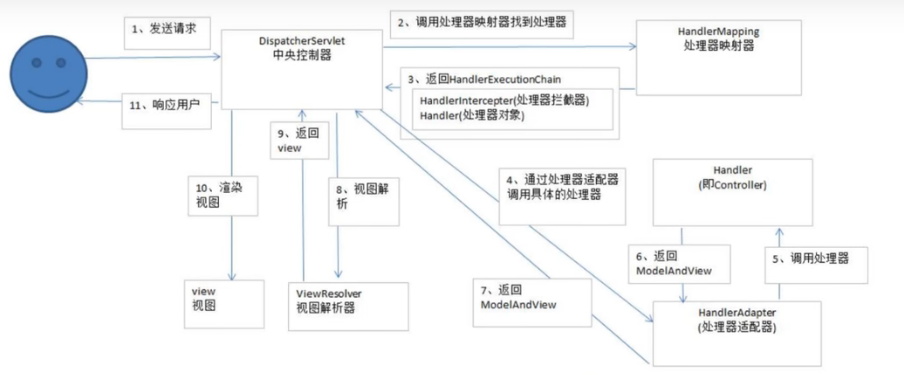

#Spring MVC

~~~text
MVC

模型-视图-控制器（MVC）是一个众所周知的以设计界面应用程序为基础的设计思想。
MVC模式的主要核心思想是将业务逻辑从页面中分离出来，允许它们单独改变而不会互相影响。

Spring MVC

中央处理器是DispatcherServlet；应用控制器拆为 处理器映射器（handler mapping）进行处理器管理，和 视图解析器（View Resolver）进行视图管理；
支持本地化/国际化（Locale）解析以及文件上传等；提供了灵活的数据校验、格式化和数据绑定机制；提供了强大的约定大于配置的契约式编程支持。
~~~

# 请求流程

~~~text
Spring MVC 框架也是基于请求驱动的Web框架，并且使用前端控制器模式（是用来提供一个集中的请求处理机制，所有的请求都将由一个单一的处理程序处理来进行设计，
再根据请求映射规则分发给相应的页面控制器（动作/处理器）进行处理）
~~~

* spring MVC处理请求的流程
~~~text
1. 首先用户发送请求，请求被SpringMVC前端控制器（DispatherServlet）捕获
2. 前端控制器（DispatherServlet）对请求URL解析获取请求URL，根据URL，调用HandlerMapping
3. 前端控制器（DispatherServlet）获得返回的HandlerExecutionChain（包含Handler对象以及Handler对象对应的拦截器）
4. DispatherServlet根据获取的HandlerExecutionChain，选择一个合适的HandlerAdapter。（注：如果成功获得HandlerAdapter后，此时将开始执行拦截器的preHandler()方法）
5. HandlerAdapter根据请求的Handler适配并执行对应的Handler；HandlerAdapter（提取Request中的模型数据，填充Handler入参，开始执行Handler（Controller）。在填充入参的过程中，根据配置，Spring将做一些额外的工作）
    HttpMessageConveter：将请求消息（如JSON、xml等数据）转换成一个对象，将对象转换为指定的响应消息。
        消息转换：对请求参数进行数据转换。如String转换为Integer、Double等数据格式化。
        数据格式化：如将字符串转换为格式化数字或格式化日期等
        数据校验：验证数据的有效性（长度、格式等），验证结果存储到BindingResult或Error中
6. Handler执行完毕后，返回一个ModeAndView（即模型和视图）给HandlerAdapter
7. HandlerAdapter适配器将执行结果ModeAndView返回给前端控制器
8. 前端控制器接收到ModeAndView后，请求对应的视图解析器
9. 视图解析器解析ModeAndView后返回对应View
10. 渲染视图并返回渲染后的视图给前端控制器
11. 最终前端控制器将渲染后的页面响应给用户或客户端
~~~

# 搭建流程

* 文件格式

* web.xml
~~~xml
<?xml version="1.0" encoding="UTF-8"?>
<web-app id="WebApp_ID" version="3.0"
         xmlns="http://java.sun.com/xml/ns/javaee"
         xmlns:xsi="http://www.w3.org/2001/XMLSchema-instance"
         xsi:schemaLocation="http://java.sun.com/xml/ns/javaee
         http://java.sun.com/xml/ns/javaee/web-app_3_0.xsd ">

  <!--编译过滤 utf-8-->
  <filter>
    <description>chr encoding filter</description>
    <filter-name>encodingFilter</filter-name>
    <filter-class>org.springframework.web.filter.CharacterEncodingFilter</filter-class>
    <init-param>
      <param-name>encoding</param-name>
      <param-value>UTF-8</param-value>
    </init-param>
  </filter>
  <filter-mapping>
    <filter-name>encodingFilter</filter-name>
    <url-pattern>/*</url-pattern>
  </filter-mapping>

  <!--servlet请求分发器 （中央控制器）-->
  <servlet>
    <servlet-name>springMVC</servlet-name>
    <servlet-class>org.springframework.web.servlet.DispatcherServlet</servlet-class>
    <!--初始化参数，在servlet类加载时加载的参数-->
    <init-param>
      <param-name>contextConfigLocation</param-name>
      <param-value>classpath:servlet-context.xml</param-value>
    </init-param>
    <!--表示启动容器时初始化该Servlet-->
    <load-on-startup>1</load-on-startup>
  </servlet>
  <servlet-mapping>
    <servlet-name>springMVC</servlet-name>
    <!--拦截器请求，"/"代表拦截所有请求，"*.do"代表拦截所有.do请求-->
    <url-pattern>*.do</url-pattern>
  </servlet-mapping>

</web-app>
~~~

* servlet-context.xml
~~~xml
<!--<?xml version="1.0" encoding="UTF-8"?>-->
<beans xmlns="http://www.springframework.org/schema/beans"
       xmlns:xsi="http://www.w3.org/2001/XMLSchema-instance"
       xmlns:mvc="http://www.springframework.org/schema/mvc"
       xmlns:context="http://www.springframework.org/schema/context"
       xsi:schemaLocation="
       http://www.springframework.org/schema/mvc
       http://www.springframework.org/schema/mvc/spring-mvc.xsd
       http://www.springframework.org/schema/beans
       http://www.springframework.org/schema/beans/spring-beans.xsd
       http://www.springframework.org/schema/context
       http://www.springframework.org/schema/context/spring-context.xsd">

    <!--开启自动扫描，设置扫描包的范围-->
    <context:component-scan base-package="com.zh.springmvc.controller"/>

    <!--使用默认的 Servlet 响应静态文件-->
    <mvc:default-servlet-handler/>

    <!--开启注解驱动-->
    <mvc:annotation-driven/>

    <!--配置视图解析器-->
    <bean class="org.springframework.web.servlet.view.InternalResourceViewResolver" id="internalResourceViewResolver">
        <!--前缀：在web-inf目录的jsp目录下-->
        <property name="prefix" value="/WEB-INF/jsp/"/>
        <!--后缀：以.jsp结尾-->
        <property name="suffix" value=".jsp"/>
    </bean>

</beans>
~~~

# URL映射地址

* @RequestMapping()

~~~java

/**
 * @author zh
 * @date 2022/4/7 14:53
 * @description:说明
 *
 * URL地址映射 @RequestMapping()
 * 1.映射单个地址配置
 * 2.映射多个地址配置
 * 3.设置类路径（作为访问和父路径）
 * 4.请求方式 （GET|POST|PUT|DELETE）
 * 5.参数路径 （@RequestMapping(params="参数名") 访问方式：类路径?参数）
 *
 */
@Controller
/**
 * 映射类路径
 * */
@RequestMapping("Url")
public class UrlController {

    /**
     * 映射一个地址配置
     * */
    @RequestMapping("url01")
    public ModelAndView url01(){

        ModelAndView modelAndView = new ModelAndView();
        modelAndView.addObject("msg","url01方法");

        modelAndView.setViewName("hello");
        return modelAndView;
    }

    /**
     * 映射多个地址配置
     * */
    @RequestMapping({"url02_01","url02_02"})
    public ModelAndView url02(){

        ModelAndView modelAndView = new ModelAndView();
        modelAndView.addObject("msg","url02方法");
        modelAndView.setViewName("hello");
        return modelAndView;
    }

    /**
     * 请求方式 GET
     * */
    @RequestMapping(value = "url03",method = RequestMethod.GET)
    public ModelAndView url03(){

        ModelAndView modelAndView = new ModelAndView();
        modelAndView.addObject("msg","url03方法");
        modelAndView.setViewName("hello");
        return modelAndView;
    }

    /**
     * 参数路径
     * 访问地址：http://localhost:8080/springMVC/Url/url04.do?url
     * */
    @RequestMapping(value = "url04",params = "url")
    public ModelAndView url04(){

        ModelAndView modelAndView = new ModelAndView();
        modelAndView.addObject("msg","url04方法");
        modelAndView.setViewName("hello");
        return modelAndView;
    }
}
~~~

# 参数绑定

~~~java
/**
 * @author zh
 * @date 2022/4/7 15:30
 * @description:说明 参数控制器
 *
 * 1.基本数据类型
 *      @RequestParam(value = "a",defaultValue = "100") 设置别名和默认值
 *
 * 2.包装类型
 *      如果不传递参数，默认为null
 *
 * 3.字符串类型
 * 4.数组类型
 * 
 * 5.List数组
 * 6.Set数组
 * 7.Map
 *
 */
@Controller
public class ParamsController {

    /**
     * 基本数据类型
     * */
    @RequestMapping("params01")
    public void params01(int age,double money){
        System.out.println("数据："+age+" "+money);
    }

    @RequestMapping("params02")
    public void params02(@RequestParam(value = "a",defaultValue = "100") int age,@RequestParam(defaultValue = "100.0") double money){
        System.out.println("age："+age+"，money："+money);
    }

    /**
     * 包装类型
     * */
    @RequestMapping("params03")
    public void params03(Integer age,Double money){
        System.out.println("age："+age+"，money："+money);
    }

    /**
     * 字符串类型
     * */
    @RequestMapping("params04")
    public void params04(String age){
        System.out.println("age："+age);
    }

    /**
     * 数组类型
     * */
    @RequestMapping("params05")
    public void params05(Double[] age){
        System.out.println("age："+age);
        for (Double s : age) {
            System.out.println("age："+s);
        }
    }

    /**
     * JavaBean类型
     * */
    @RequestMapping("params06")
    public void params06(User user){
        System.out.println("user："+user);
    }
}
~~~

# 请求转发和重定向

~~~text
请求转发：

1. 地址不发生改变，以forward：开头
2. 请求转发到页面或者控制器
3. 方法有两种返回方式：

    返回ModelAndView对象
    返回视图名字符串
    
注： 默认会从视图解析器设置的路径下查找

重定向：

1.地址发生改变，以 redirect：开头
    ...

注： 默认会从根目录（webapp）下查找视图
~~~

~~~java
@Controller
public class JumpController {

    /**
     * 请求转发 到页面
     *  使用forward：页面，此时会从项目的根路径（webapp目录）下查找指定页面
     *  如果传递参数，在页面中可以通过 ${param.参数名} el表达式获取对应参数值
     * */
    @RequestMapping("test01")
    public ModelAndView test01(String name){

        ModelAndView modelAndView = new ModelAndView();
        modelAndView.addObject("msg","请求转>>>");

        //设置视图，默认请求转发
        modelAndView.setViewName("forward:index.jsp?name="+name);
        return modelAndView;
    }

    /**
     * 请求转发 到控制器
     * forward：控制器映射地址，请求到控制器映射方法上
     *
     * */
    @RequestMapping("test02")
    public ModelAndView test02(String name){

        ModelAndView modelAndView = new ModelAndView();
        modelAndView.addObject("msg","请求转发>>>");

        //设置视图，默认请求转发
        modelAndView.setViewName("forward:hello");
        return modelAndView;
    }

    /**
     * 请求转发
     *      返回视图名字符串
     *      默认会从视图解析器设置的路径下查找（WEB-INF/jsp目录下查找）
     * 常用对象可以设置到方法的形参中，直接使用
     * */
    @RequestMapping("test03")
    public String test03(HttpServletRequest request){

        //设置数据模型
        request.setAttribute("msg","请求转发03");

        //默认访问路径是 WEB-INF/jsp
        //return "test01";

        //退回到webapp根目录，或者 "forward:index"
//        return "/../../index";
        return "forward:index.jsp";
    }

    /**
     * 重定向
     *      默认从项目根目录查找资源
     *      可以传递参数，传递中文参数无法获取，需要使用 RedirectAttributes对象设置
     *              redirectAttributes.addAttribute("name","张三");
     * */
    @RequestMapping("test04")
    public ModelAndView test04(RedirectAttributes redirectAttributes){

        ModelAndView modelAndView = new ModelAndView();
        //重定向中数据模型获取不到
        modelAndView.addObject("msg","重定向>>>");

        //设置中文参数
//        redirectAttributes.addAttribute("name","张三");

        //设置视图
        //modelAndView.setViewName("redirect:index.jsp");

        //重定向到控制器
        modelAndView.setViewName("redirect:hello");
        return modelAndView;
    }

    /**
     * 重定向 到页面
     *      默认到根目录下查找
     *      返回页面字符串
     *
     * */
    @RequestMapping("test05")
    public String test05(HttpServletRequest request){
        return "redirect:index.jsp";
    }

}
~~~

# 设置请求域

* 五种请求域方式
~~~text
1. ModelAndView 对象设置     addObject("key","value")
        
2. HttpServletRequest 对象设置   setAttribute("key","value")
        
3. Model 对象  addAttribute("key","value")
        
4. ModelMap 对象
        
5. Map 对象    put("key","value")

6. HttpSession  setAttribute("key","value")   
~~~

~~~java
@Controller
public class DataController {

    /**
     * ModelAndView addObject("key","value")
     *
     * */
    @RequestMapping("data01")
    public ModelAndView test01(){

        ModelAndView modelAndView = new ModelAndView("data");
        //设置请求域 数据模型
        modelAndView.addObject("msg","通过 ModelAndView 对象设置请求域");

        return modelAndView;
    }

    /**
     * HttpServletRequest setAttribute("key","value")
     * HttpSession setAttribute("key","value")
     **/
    @RequestMapping("data02")
    public String test02(HttpServletRequest httpServletRequest, HttpSession session){
        //设置请求域 数据模型
        httpServletRequest.setAttribute("msg","通过 HttpServletRequest 对象设置请求域");
        session.setAttribute("msg","通过 HttpServletRequest 对象设置请求域");
        return "data";
    }
}
~~~

# 传递JSON 

~~~text
 @ResponseBody
      默认控制器中方法的返回值是会去找对应的视图页面，如果想要返回数据，需要将返回的结果转换成字符串响应（转换成JSON字符串）
      放在方法前
      
 @RequestBody
      要求传递过来一个JSON格式的字符串
      放在参数前
~~~

~~~java
@Controller
@RequestMapping("json")
public class JsonController {

    /**
     * 返回json数据
     * */
    @RequestMapping("index")
    @ResponseBody
    public /*@ResponseBody*/ User index(){
        User user = new User();
        user.setId(1);
        user.setName("张三");
        return user;
    }

    @RequestMapping("index02")
    @ResponseBody
    public User index02(@RequestBody User user){
        return user;
    }
}
~~~

~~~html
<%@ page contentType="text/html;charset=UTF-8" language="java" %>
<html>
<head>
    <title>Title</title>
</head>
<body>
    <%--引用百度在线jqery依赖包--%>
    
    
</body>
</html>
~~~

# 拦截器

~~~text
SpringMVC中的 Interceptor 拦截器也是相当重要和有用的，它的主要作用是 拦截用户的请求并进行相应处理。比如通过它来进行
权限认证，或者判断用户是否登录等操作。对于SpringMVC拦截器有两种：

实现接口：org.springframeword.web.servlet.HandlerInterceptor

继承适配器：org.springframeword.web.servlet.handler.HandlerInterceptorAdapter
~~~

* 实现接口 HandlerInterceptor
~~~java
/**
 * @author zh
 * @date 2022/4/13 10:59
 * @description:说明 拦截器实现 方式一（实现接口） HandlerInterceptor
 *  preHandle方法 表示 在目标方法（Handler）执行前 执行
 *      如果返回true，表示执行目标方法，false则不执行
 *  postHandle 在目标方法（Handler）执行后，视图生成前 执行
 *  afterCompletion 在目标方法（Handler）执行后，视图生成后 执行
 */
public class MyInterceptor01 implements HandlerInterceptor {

    /**
     * 在目标方法（Handler）执行前 执行
     *      如果返回true，表示执行目标方法，false则不执行
     * */
    @Override
    public boolean preHandle(HttpServletRequest request, HttpServletResponse response, Object handler) throws Exception {

        System.out.println("MyInterceptor01 --> preHandle方法 表示 在目标方法（Handler）执行前 执行");

//        return HandlerInterceptor.super.preHandle(request, response, handler);
        return true;
    }

    /**
     * 在目标方法（Handler）执行后，视图生成前 执行
     *
     * */
    @Override
    public void postHandle(HttpServletRequest request, HttpServletResponse response, Object handler, ModelAndView modelAndView) throws Exception {

        System.out.println("MyInterceptor01 --> postHandle 在目标方法（Handler）执行后，视图生成前 执行");
//        HandlerInterceptor.super.postHandle(request, response, handler, modelAndView);
    }

    /**
     * 在目标方法（Handler）执行后，视图生成后 执行
     *
     * */
    @Override
    public void afterCompletion(HttpServletRequest request, HttpServletResponse response, Object handler, Exception ex) throws Exception {

        System.out.println("MyInterceptor01 --> afterCompletion 在目标方法（Handler）执行后，视图生成后 执行");

//        HandlerInterceptor.super.afterCompletion(request, response, handler, ex);
    }
}
~~~

* 非法访问拦截

* LoginAccessInterceptor 登录拦截器

~~~java
/**
 * @author zh
 * @date 2022/4/13 13:35
 * @description:说明 非法请求拦截器 用户登录
 * 用户添加、修改、删除（需要登录，需要拦截访问判断是否登录）
 */
public class LoginAccessInterceptor implements HandlerInterceptor {
    @Override
    public boolean preHandle(HttpServletRequest request, HttpServletResponse response, Object handler) throws Exception {

        //通过request对象获取session对象
        HttpSession session = request.getSession();
        //获取session作用域中的信息
        User user = (User) session.getAttribute("user");
        //判断对象是否为空（不为空，表示登录状态；否则为未登录状态）
        if (user == null){
            //未登录状态，跳转到登录页面
            response.sendRedirect(request.getContextPath()+"/login.jsp");
            return false;
        }

        //登录状态，允许执行下去
        return true;
    }
}
~~~

* 控制层

~~~java
/**
 * @author zh
 * @date 2022/4/13 11:41
 * @description:说明 拦截器实例 非法访问拦截
 *  用户登录 （无须登录，不需要拦截）
 *  用户添加、修改、删除（需要登录，需要拦截访问判断是否登录）
 */
@Controller
@RequestMapping("user")
public class UserController {

    @RequestMapping("login")
    public String login(HttpServletRequest httpServletRequest, HttpSession session){
        //请求域
        httpServletRequest.setAttribute("msg","用户登录");

        //如果用户执行了登录状态，则设置用户信息到session作用域中（如果session作用域中的信息不为空，则表示登录状态，否则为未登录状态）
        User user = new User();
        user.setId(1);
        user.setName("admin");
        session.setAttribute("user",user);
        return "success";
    }

    @RequestMapping("add")
    public String add(HttpServletRequest httpServletRequest){
        httpServletRequest.setAttribute("msg","用户add");
        return "success";
    }
    @RequestMapping("update")
    public String update(HttpServletRequest httpServletRequest){
        httpServletRequest.setAttribute("msg","用户update");
        return "success";
    }
    @RequestMapping("delete")
    public String delete(HttpServletRequest httpServletRequest){
        httpServletRequest.setAttribute("msg","用户delete");
        return "success";
    }
}
~~~

